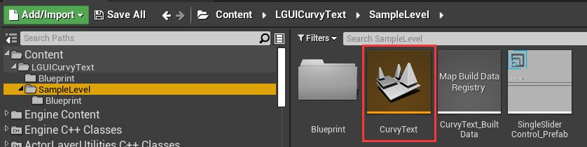
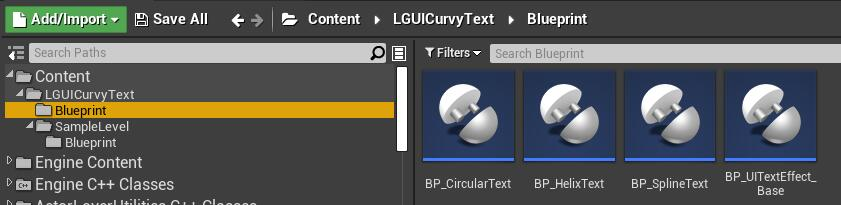
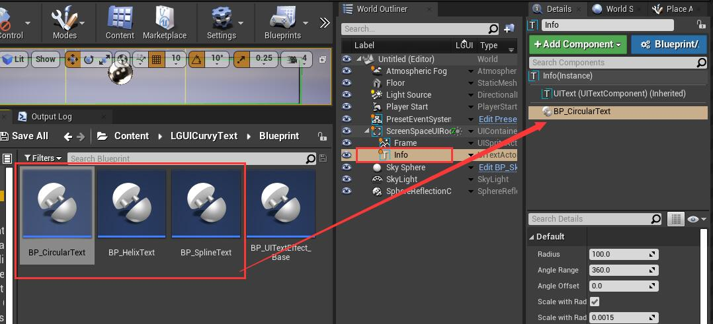
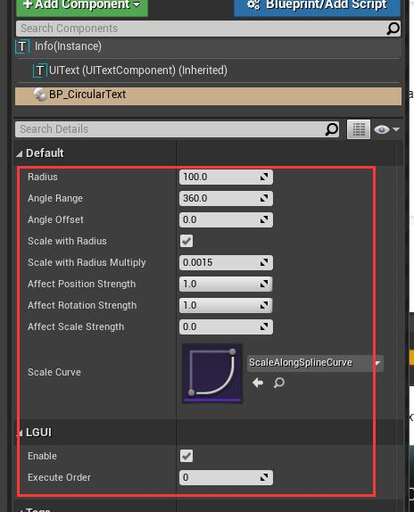
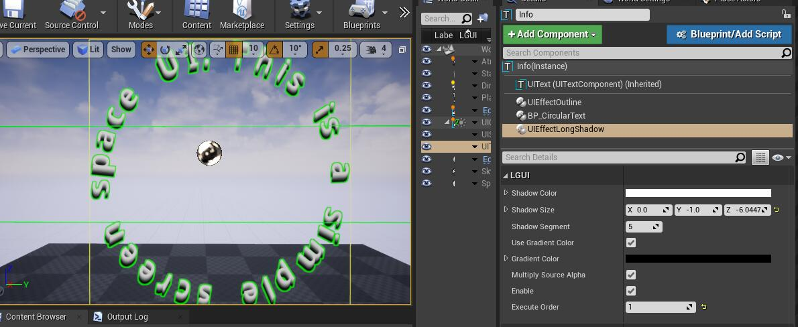
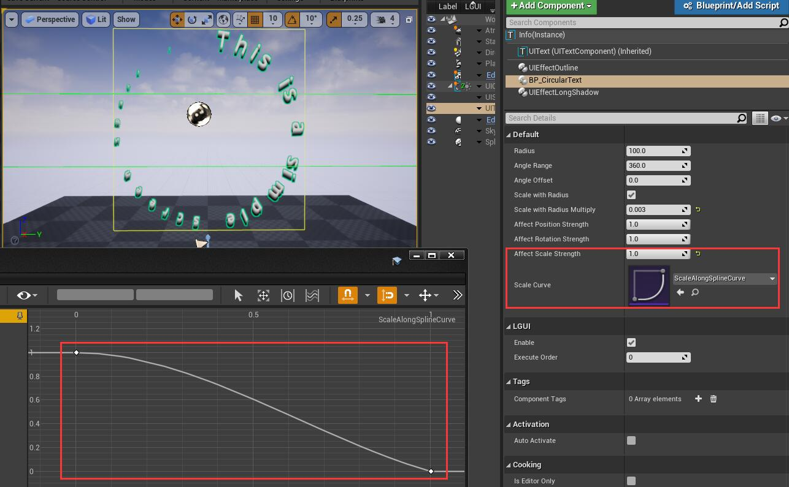
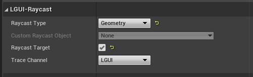

## Introduction
This is Curvy-Text effect made for LGUI of UnrealEngine.
**[This content need LGUI plugin version 3.1 and upwards.](https://www.unrealengine.com/marketplace/en-US/product/92c868e93e1d4dd596f87b200102f0cf?lang=en-US)**

### Setup
1. Install newest **[LGUI](https://www.unrealengine.com/marketplace/en-US/product/92c868e93e1d4dd596f87b200102f0cf?lang=en-US)** plugin from EpicLauncher.
2. Open map **SampleLevel/CurvyText** and hit Play, this map contains all these effects

3. Open folder **Blueprint** and see how these effects work in blueprints.

4. The above examples can be copied and modified according to your needs, but the premise is that you already have basic blueprint and LGUI knowledge, and understand how to use this plugin.

### Useage
1. You can select a LGUI's UIText and drag any of these effect and drop on the UIText actor's component stack

2. Then change the parameters and make the effects you want

3. You can combine these effects with any other LGUI's build-in effects just by add them to the component stack, just be careful with the **Execute Order** property which defines the order of these effects

4. These is a parameter called **Scale Curve**, it is define how the characters will be scaled along with the spline/circle/helix, and the parameter **Affect Scale Strength** can control the weight of the scale

5. Tip here, if you want to interact your curved text with actual geometry (default is just the UIText's rect area), you can select the UIText and change **Raycast Type** to **Geometry**, and don't foget to check **Raycast Target**
