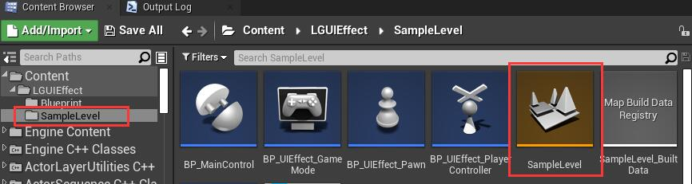
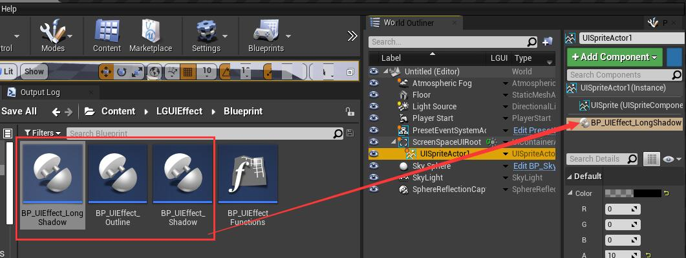
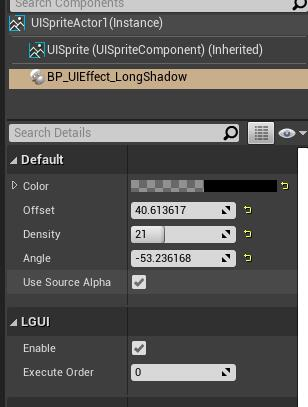

## Introduction
This is preset blueprint implemented effects made for LGUI of UnrealEngine.
**[This content need LGUI plugin version 3.1 and upwards.](https://www.unrealengine.com/marketplace/en-US/product/92c868e93e1d4dd596f87b200102f0cf?lang=en-US)**

### Setup
1. Install newest **[LGUI](https://www.unrealengine.com/marketplace/en-US/product/92c868e93e1d4dd596f87b200102f0cf?lang=en-US)** plugin from EpicLauncher.
2. Open map **SampleLevel/SampleLevel** and hit Play, this map contains all these effects

3. Open folder **Blueprint** and see how these effects work in blueprints.

4. The above examples can be copied and modified according to your needs, but the premise is that you already have basic blueprint and LGUI knowledge, and understand how to use this plugin.

### Useage
1. You can select a LGUI's UIText/UISprite/UITexture, then drag any of these effect and drop on the UI actor's component stack

2. Then change the parameters and make the effects you want
