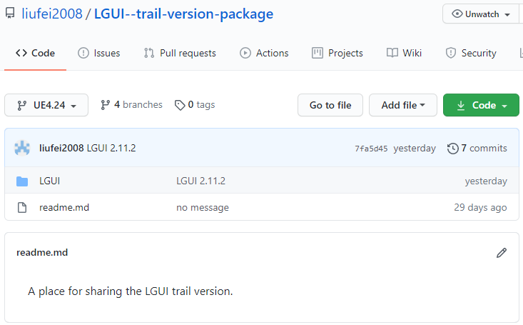
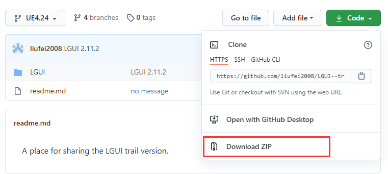
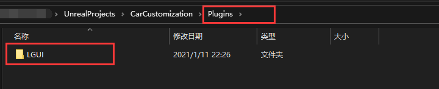

## Install

#### 1. Install from UE4 MarketPlace (full source code).

Visit page https://www.unrealengine.com/marketplace/en-US/product/lgui-lex-gui-3d-ui-system-for-ue4 :
    

After install complete, create an empty project. Open plugins menu and check LGUI "Enabled" (restart engine may needed).

#### 2. Get trial version from github (no source code).

Visit page https://github.com/liufei2008/LGUI--trail-version-package :
    

Click left top branch button and choose your desired UnrealEngine version:
    

Then click "Download ZIP" button:
    

Create an empty project(trial version only support **Blueprint** project). In the project folder, create "Plugins" folder, and unzip the zip file you just downloaded in the "Plugins" folder. Should be like this:
    
    

#### 3. If LGUI is installed correctly, then a "LGUI Tools" button should appear on the menu bar:**

*See Next [HelloWorld](../HelloWorld/index.md)* | *[MainPage](../../index.md)*