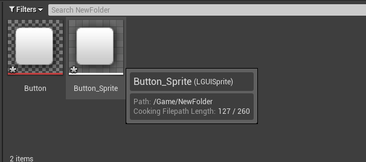
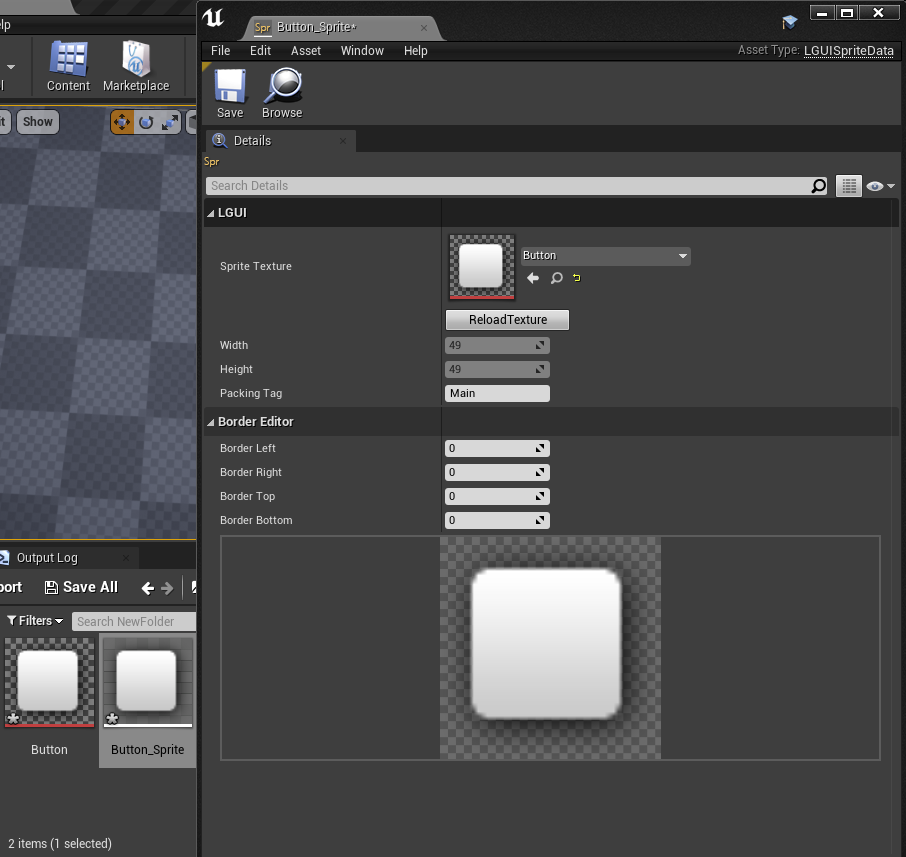
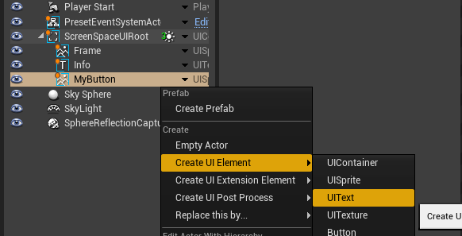
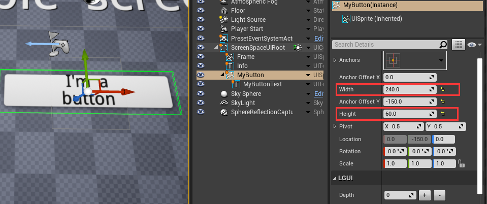
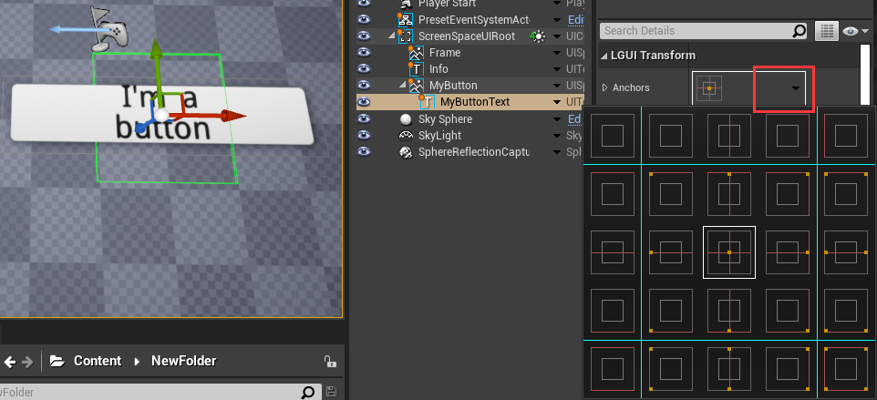
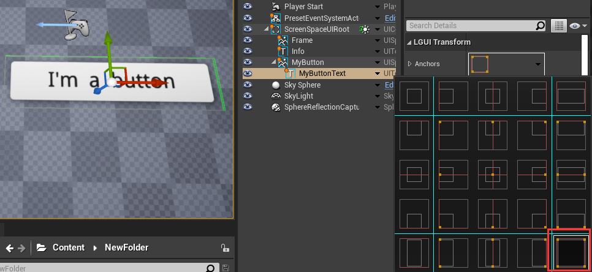
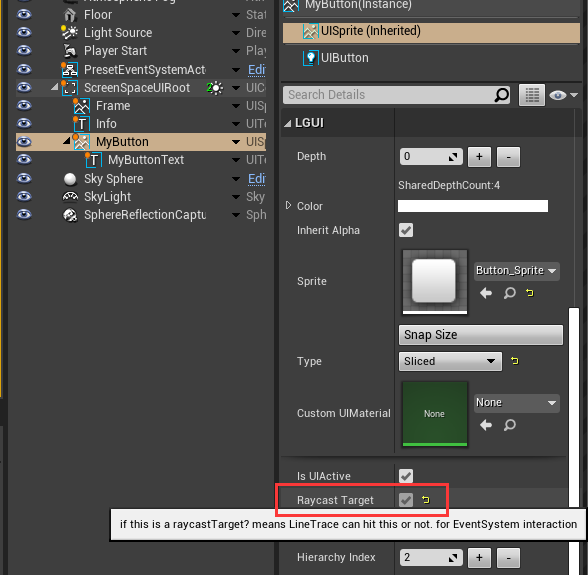
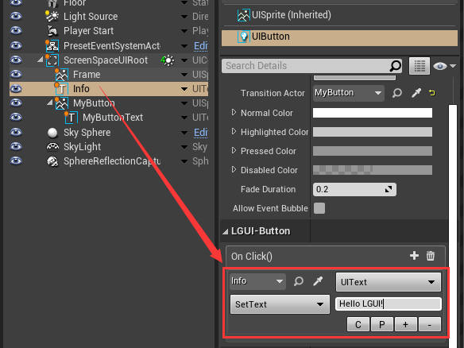

## Custom Button
In this section, we will learn how to customize our button using UISprite.
Before this, you should follow [HelloWorld](../HelloWorld/index.md) section to create a default button.
The default button is a little ugly, we can use a nicer looking texture instead. 

#### 1. Prepare a sprite texture.
Use photoshop or any other app to create a image, or use this image:

Drag the image to UE4 content folder, name it to "Button":

#### 2. Create UISpriteData.
Select "Button" asset, right click on it and choose "LGUISprite"->"Create Sprite":

Then a LGUISpriteData asset named "Button_Sprite" will be created:

Double click on "Button_Sprite" and open a UISpriteDataEditor:

Change "Border Left" and "Border Top" to 14, "Border Right" and "Border Bottom" to 15:

Close the UISpriteDataEditor.

#### 3. Prepare a LGUI ScreenSpaceUI.
Follow the [HelloWorld](../HelloWorld/index.md) section to create a base ScreenSpaceUI:

#### 4. Create UISprite and UIText.
Select "ScreenSpaceUIRoot" actor, right click on the arrow button and choose "Create UI Element"->"UISprite", this will create a UISprite actor:

Rename the created UISprite actor to "MyButton":

Select "MyButton" actor, drag "Button_Sprite" asset to "Sprite" property, see the change in viewport:

Select "MyButton" actor, right click on the arrow and choose "Create UI Element"->"UIText", this will create a UIText actor:

Rename the created UIText actor to "MyButtonText", and change "Depth" to 1, "Color" to black, "Text" to "I'm a button", "Size" to 24, "Font Style" to "Bold":

#### 5. Adjust button size.
Select "MyButton" actor, change "Width" to 240, "Height" to 60:

Select "MyButtonText" actor, click on the down arrow in "Anchors", then a AnchorSelector will popup:

Hold "Ctrl" button on keyboard and click the right bottom button in AchorSelector, see change in viewport:

#### 6. Add UIButton component.
Select "MyButton" actor, click "+Add Component" and add a "UIButton" component:

Select "UIButton" component you just created, change the "Transition" to "ColorTint":

Click on the left arrow of "Transition", this will expand the transition area:

Drag "MyButton" actor to "Transition Actor":

#### 7. Enable RaycastTarget.
Select "MyButton" actor, select "UISprite(Inherited)" component, click "Show Advanced" arrow button:

Check "Raycast Target" property:

#### 8. Add button event:
Select "MyButton" actor, select "UIButton" component, find the "On Click()" property and click the "+" button:

Set the event like this:

#### 9. Play and click the button
Now hit play and move your mouse over the button, then click the button, see the change in viewport:

*See Prev [HelloWorld](../HelloWorld/index.md)* | *See Next [LGUIFont](../Font/index.md)* | *[MainPage](../../index.md)*