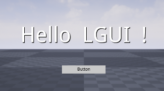
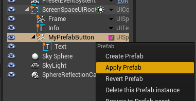

# Get started with LGUI

## Sections

<h3><a href="Install/index.md">Install</a></h3>

Install from marketplace or github

<h3><a href="HelloWorld/index.md">HelloWorld</a></h3>

All start from "Hello World"

<h3><a href="CustomButton/index.md">CustomButton</a></h3>

Customize our button use UISprite and UIText

<h3><a href="Font/index.md">UIFont</a></h3>

Create custom font

<h3><a href="Prefab/index.md">Prefab</a></h3>

Use prefab to store UI as asset, and reuse it

<h3><a href="Interaction/index.md">Interaction</a></h3>

ScreenSpaceInteraction, WorldSpaceInteraction

<!--  -->
<h3><a href="CreateButton/index.md">Create button from scratch</a></h3>

Create a button with basic UI element

