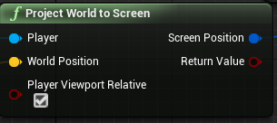
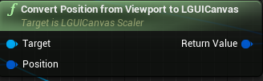

## Project world position to LGUI's screen position
This is useful when we want to create a floating health bar on our character.

The main point is to use two nodes: One is **Project World to Screen**, which is UnrealEngine's default node:

Another is **Convert Position from Viewport to LGUICanvas**, which is provided by LGUICanvasScaler:

|Property:|Functions:|
|:-|:-|
|Target|A reference to LGUICanvasScaler object.
|Position|Input position, which is output from **Project World to Screen** node. 
|Return Value|Result LGUI's screen space position. Note left bottom is zero position, so for UIItem who need to use the result value, should set *Anchors* to *Left Bottom*, and the parent of UIItem should set to full screen size.

We can link these nodes like the screen shot below: 

*Healthbar* is a UIItem represent for a healthbar. 
