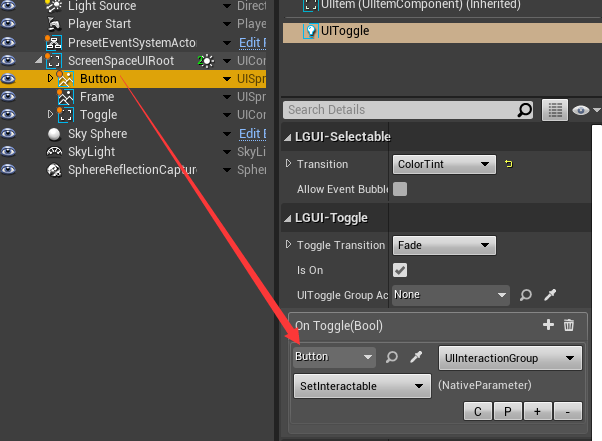

## UIInteractionGroup component

Use UIInteractionGroup component on a UI actor, it can control the children UI actor's interaction capability.  
Lets learn by a sample here, use a UIToggle to control a UIButton, set it interactable or not.  

#### 1. Create a UIToggle and a UIButton.
Move a little bit so they won't overlap. They are all interactable by default.

#### 2. Add UIInteractionGroup component.
Select *Button* actor, in *Details* panel click *Add Component* and select UIInteractionGroup component. (You can check or uncheck *Interactable* parameter to see what happen)

#### 3. Use UIToggle to control it.
Select *Toggle* actor, in *Details* panel select existing *UIToggle* component. In the *On Toggle(Bool)* section, add event and set like image below:

#### 4. Test it.
Now hit play and uncheck the *Toggle*, you will see that the *Button* become transparent:

#### 5. Customize the color of not interactable button.
Select *UIButton* component, expand *Transition* property, and change the *Disabled Color* property to red-transparent:

