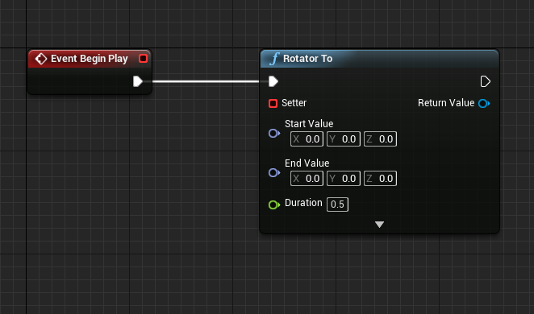
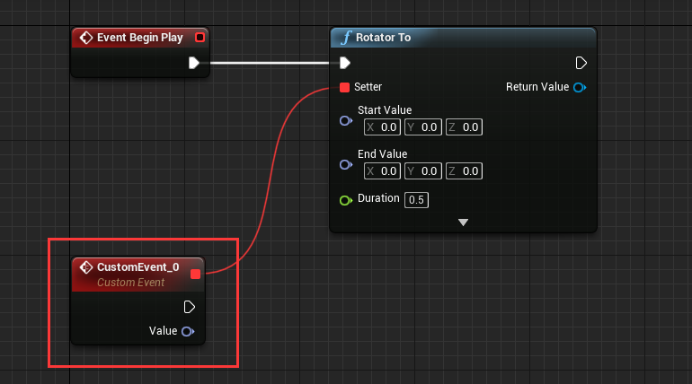

## Create tween for your own
LTween provide common tween functions: "Float To", "Int To", "Vector2 To", "Vector3 To", "Vector4 To", "Color To", "LinearColor To", "Quaternion To", "Rotator To". With these functions, you can even make tween animation with UMG.  

Let's learn by using "Rotator To", use it to rotate a cube.

#### 1. Setup level
Create a new default level, drag a cube to viewport, set mobility to movable, set location to (0, 0, 80):

Create a ActorComponent blueprint, name it "TweenAnimation":

Attach "TweenAnimation" component to cube:

Drag out from "Event Begin Play" and add "Rotator To" node:

#### 2. Setup "Setter" parameters
**"Setter" is LTween's delegate, LTween will calculate interpolated value from "Start Value" and "End Value", and use "Setter" to pass the interpolated value.**

Drag out "Setter" and choose "Add Event"->"Add Custom Event", then a event with value of rotator type will be created:

Setup the "CustomEvent_0" like this:

#### 3. Setup other parameter
Drag out "Root Component" and select "Get Relative Rotation", and connect to start value:

Set "End Value" to (0, 0, 90), "Duration" to 3.0, set delay to 1.0:

Now the setup is complete, hit play to see the animation.