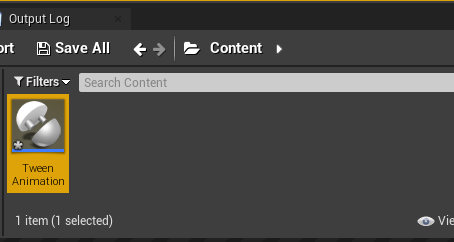
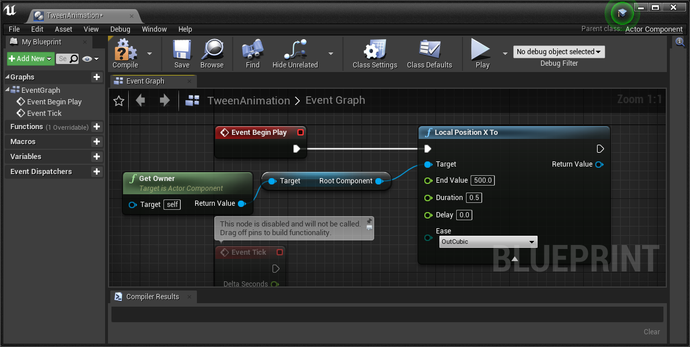
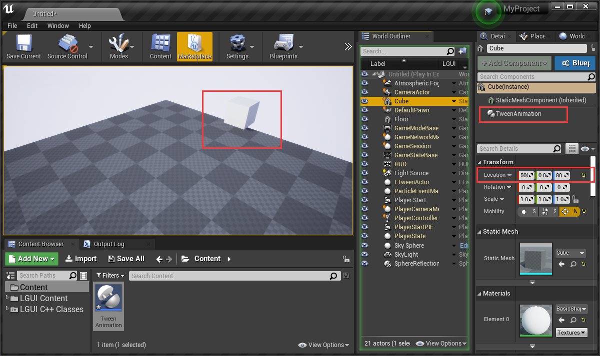
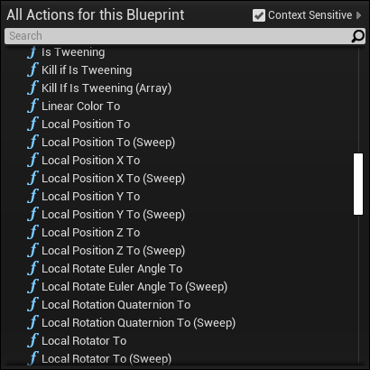
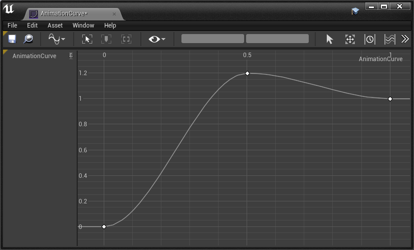
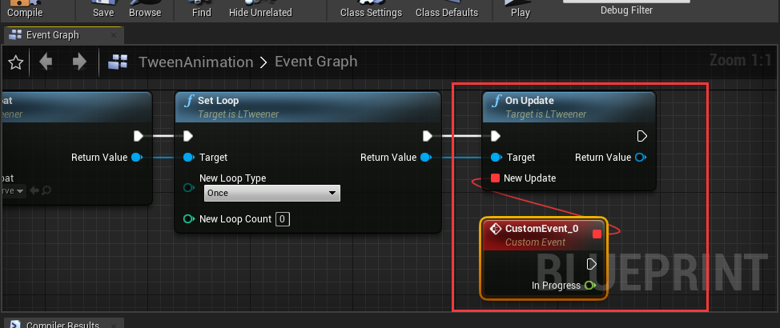
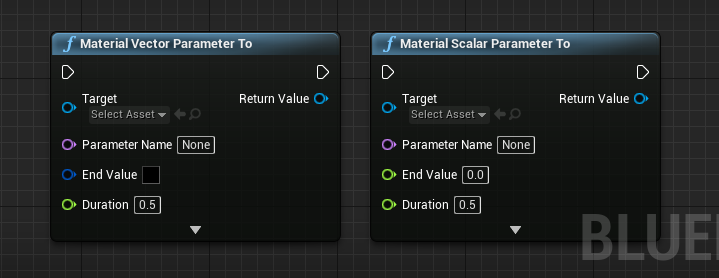

## Use LTween for SceneComponent

#### 1. Move/Rotate/Scale Animation
Create a new default level, drag a cube to viewport, set mobility to movable, set location to (0, 0, 80):

Create a ActorComponent blueprint, name it "TweenAnimation":

Edit the TweenAnimation blueprint like this, this will move the cube's relative location.x to the "EndValue":

Drag the TweenAnimation blueprint to the cube and hit play, the cube will move to (500, 0, 80) in 0.5 seconds:

The animation looks very simple, lets make it a little interesting. Double click to Open TweenAnimation blueprint, change "Duration" to 3.0. Add a "Local Rotator To" node like this:

Hit play, the cube will move and rotate in viewport:

Add a "Local Scale To" node like this, then hit play and see the animation:

You can find other tween functions in "LTween" category:

#### 2. Delay and Ease
Delete "Local Position X To" and "Local Scale To" node, keep "Local Rotator To" node, and set "Delay" to 1.0, hit play (the animation will start after 1 seconds when play):

LTween provides severial ease types, click "Ease" and select the type you want. [This site](https://www.inkfood.com/tween-3d-objects/) could be a good reference about ease functions (image is also from site https://www.inkfood.com/tween-3d-objects/):

  
##### CurveFloat
There is a special ease type called "CurveFloat":

This can let us use a CurveFloat to control our animation.  
The following steps will show you how to do it:
Right click on empty area of Content, choose "Miscellaneous"->"Curve":

Select "CurveFloat" in the popup window:

Name it to "AnimationCurve":

LTween will use horizontal range from 0 to 1, keep that in mind and make the curve to any type you want:

Open "TweenAnimation" blueprint, drag out "Return Value" of "Local Rotator To" node, and add a new node "Set Curve Float", and choose "AnimationCurve" in "New Curve Float", this will make the CurveFloat work:

#### 3. Loop
Loop is one of the most important thing of a tween animation.  
After the "Set Curve Float" node, Drag out "Return Value" and add a new node "Set Loop":

Click "New Loop Type" and you will find 4 options:  
**Once**- No loop  
**Restart**- Each loop cycle restarts from beginning  
**Yoyo**- The tween move forward and backward at alternate cycles  
**Incremental**- Continuously increments the tween at the end of each loop cycle (A to B, B to B+(A-B), and so on)

Don't forget to set "New Loop Count", 0 or 1 means no loop, -1 means infinite loop, change these parameters and hit play.

#### 4. Events
Event function is also a can't-missing feature in tween animation.
LTween provide these events:  
**OnStart**- Execute when animation start (if have delay, then execute after delay)  
**OnUpdate**- Execute every frame if is tweening  
**OnComplete**- Execute when animation complete  
**OnCycleStart**- Exeucte every cycle start when use loop  
**OnCycleComplete**- Exeucte every cycle complete when use loop  
Setup event function is easy. eg OnComplete, drag out the "Return Value" and add new node "On Update", drag out "New Update" and add a custom event, the event will execute as you want:

## Functions
**Pause/Resume**- Pause/Resume this animation  
**Restart**- Restart animation  
**Goto**- Send the tween to the given position in time  
**Kill/KillIfIsTweening**- Kill the tween if the animation already start  
**ForceComplete**- Force complete this animation at this frame, call OnComplete  

## Use LTween for Material

LTween provide "Material Vector Parameter To" and "Material Scalar Parameter To" nodes for "Material Instance Dynamic" objects:

