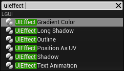
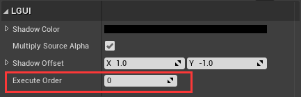
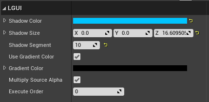
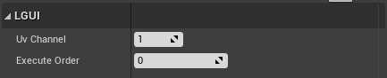

## UIEffect

Select UIRenderable actor(UIText, UISprite, UITexture), add one of these components:  
**UIEffect Shadow**, **UIEffect Long Shadow**, **UIEffect Outline**, **UIEffect Position As UV**, **UIEffect Gradient Color**:

#### Execute Order
Every UIEffect component have *Execute Order* property, this defines the effect execute order when there is multiple UIEffect component in same actor. Lower *Execute Order* will affect earlier than higher one.

#### 1. Shadow
The Shadow component adds a simple outline effect to UIRenderable components such as UIText/UISprite/UITexture. It must be on a actor which have a UIRenderable component.

|Property:|Function:|
|:-|:-|
|Shadow Color|The color of the shadow.
|Multiply Source Alpha|Multiplies the alpha of the UIRenderable onto the alpha of the effect.
|Shadow Offset|The offset of the shadow expressed as a vector.

#### 2. Long Shadow
The Long Shadow component is like Shadow, but give us more control parameters, we can make very smooth shadow, or make it look thickness.

|Property:|Function:|
|:-|:-|
|Shadow Color|The begin color of the shadow.
|Shadow Size|The offset of the shadow expressed as a vector.
|Shadow Segment|More segment will render more smooth shadow, but need more cost.
|Use Gradient Color|Use *Gradient Color* to affect the shadow.
|Gradient Color|Consider this is the end color of the shadow.
|Multiply Source Alpha|Multiplies the alpha of the UIRenderable onto the alpha of the effect.

#### 3. Outline
The Outline component adds a simple outline effect to UIRenderable components such as UIText/UISprite/UITexture. It must be on a actor which have a UIRenderable component.

|Property:|Function:|
|:-|:-|
|Outline Color|The color of the outline.
|Outline Size|The distance of the outline effect horizontally and vertically.
|Multiply Source Alpha|Multiplies the alpha of the UIRenderable onto the alpha of the effect.

#### 4. Position As UV
This will modify selected uv channel, and use position.xy as uv data.

#### 5. Gradient Color
The Gradient Color component can change UIRenderable's color to 2 or four different colors.

|Property:|Function:|
|:-|:-|
|Direction Type|Gradient direction type, the options are *Bottom to Top* and *Top to Bottom" and "Left to Right" and "Right to Left" and "Four Cornor".
|Multiply Source Alpha|Multiplies the alpha of the UIRenderable onto the alpha of the effect.
|Color 1/2/3/4|If *Direction Type* is set to *Four Cornot" then four color will be used as four cornor color, otherwise only *Color 1* and *Color 2* is used for two color. 