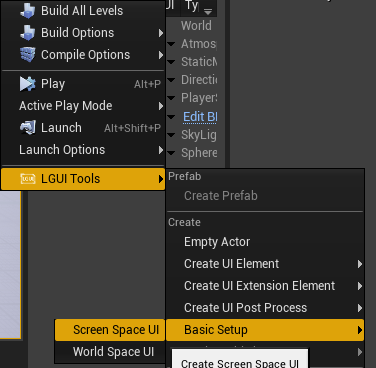
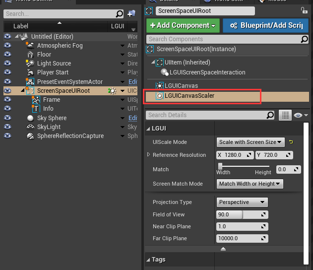

## ScreenSpaceUI

LGUI render ScreenSpaceUI directy to viewport after unreal engine render the world.

#### 1. Create ScreenSpaceUI
Select "LGUI Tools"->"Basic Setup"->"Screen Space UI":

Then a "ScreenSpaceUIRoot" will be created:

Select LGUICanvas component, you will see the "Render Mode" is "Screen Space Overlay":

#### 2. LGUICanvasScaler
There is another important component on "ScreenSpaceUIRoot", is the "LGUICanvasScaler":

You can change parameters in this area make UI fit to different resolutions:

<!-- @toto: show us more about how to fit different resolutions -->

And this area can change camera parameters that render the ScreenSpaceUI:

