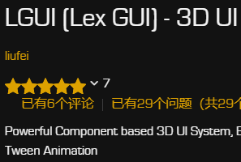
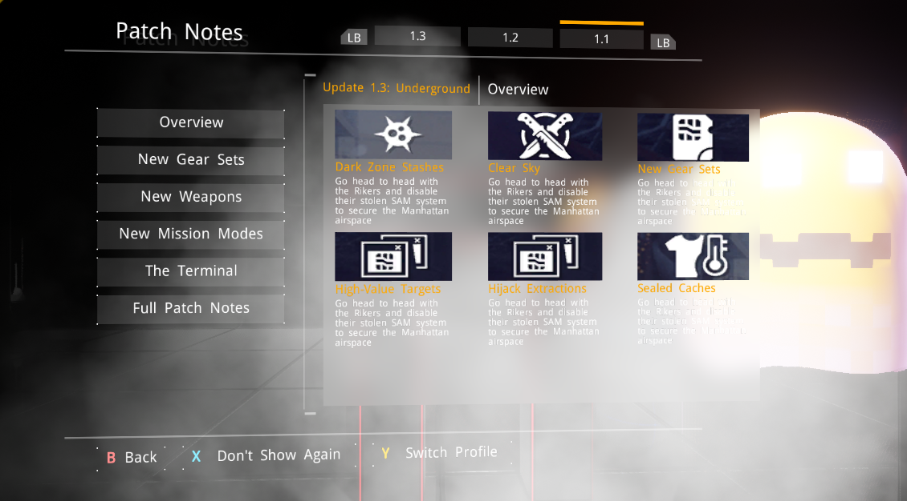
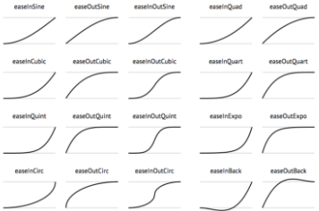
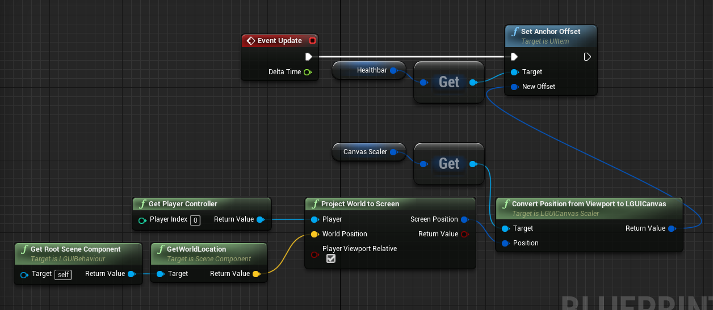

# LGUI Manual

These pages contain information about how to use LGUI.

## Sections

<h3><a href="GetStarted/index.md">Get started and tutorial</a></h3>

Start to use LGUI, component based workflow

<h3><a href="SampleProjects/index.md">Sample Projects</a></h3>

Introduce sample projects, and download these projects from github

<!-- 

<h3><a href="UIElementsAndControls/index.md">UI elements and controls</a></h3>

How to use LGUI's element and controls

 -->

<h3><a href="Rendering/index.md">Rendering</a></h3>

LGUI's rendering framework

<h3><a href="Layout/index.md">Layout</a></h3>

Use Layout to control location and size of UI

<h3><a href="InteractionAndControls/index.md">Interaction and Controls</a></h3>

Interaction and Controls

<!-- 

<h3><a href="LGUIPrefab/index.md">LGUIPrefab</a></h3>

Use LGUIPrefab workflow

<h3><a href="LGUIPointerEvent/index.md">LGUIPointerEvent</a></h3>

LGUIPointerEvent for UI interaction

<h3><a href="LGUIDrawableEvent/index.md">LGUIDrawableEvent</a></h3>

Introduce how to use LGUIDrawableEvent

-->

<h3><a href="LTween/index.md">LTween</a></h3>

LTween for tween animation

## Others

<h3><a href="ReleaseNotes/index.md">ReleaseNotes</a></h3>

ReleaseNotes contains: updates/ new features/ modify/ bug fix

<h3><a href="HowTos/index.md">UI How Tos</a></h3>

UI How Tos

<h3><a href="LGUIBehaviour/index.md">LGUIBehaviour life cycle</a></h3>

LGUIBehaviour life cycle

<h3><a href="LGUIRenderFlow/index.md">LGUI render flow</a></h3>

LGUI render flow

<!-- 

<h3><a href="ThanksTo/index.md">ThanksTo...</a></h3>

Thanks to those guys who helped with this plugin

 -->

## New docs

<h3><a href="LGUIBehaviour/index.md">LGUIBehaviour life cycle</a></h3>

LGUIBehaviour life cycle

<h3><a href="LGUIRenderFlow/index.md">LGUI render flow</a></h3>

LGUI render flow

<h3><a href="HowTos/UpdateTo2.13.0/index.md">Update project to LGUI version 2.13.0</a></h3>

Update project to LGUI version 2.13.0

<h3><a href="HowTos/FindChildByDisplayName/index.md">Find Child by DisplayName</a></h3>

Find Child by DisplayName

<h3><a href="HowTos/CustomMaterial/index.md">Use Custom Material</a></h3>

Use Custom Material

<h3><a href="InteractionAndControls/UIInteractionGroup/index.md">Disable interaction component</a></h3>

Disable interaction component

<h3><a href="HowTos/ProjectWorldToScreen/index.md">Project world position to LGUI's screen position</a></h3>

Project world position to LGUI's screen position

<h3><a href="HowTos/DeprojectScreenToWorld/index.md">Deproject LGUI's screen position to world</a></h3>

Deproject LGUI's screen position to world

<h3><a href="Rendering/CommonEffect/index.md">CommonEffect</a></h3>

Shadow, LongShadow, Outline, PositionAsUV, GradientColor

<h3><a href="Rendering/TextAnimation/index.md">TextAnimation</a></h3>

TextAnimation can make per character animation

<h3><a href="Rendering/UIBackgroundBlur/index.md">UIBackgroundBlur</a></h3>

Blur the background image

<h3><a href="Rendering/UIBackgroundPixelate/index.md">UIBackgroundPixelate</a></h3>

Pixlate the background image

