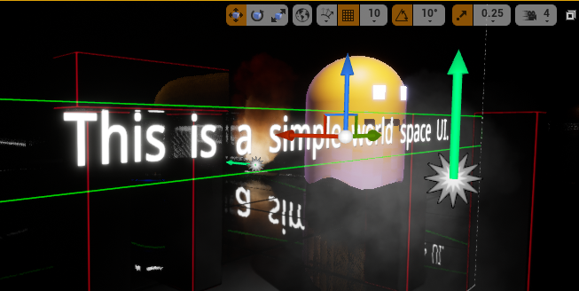
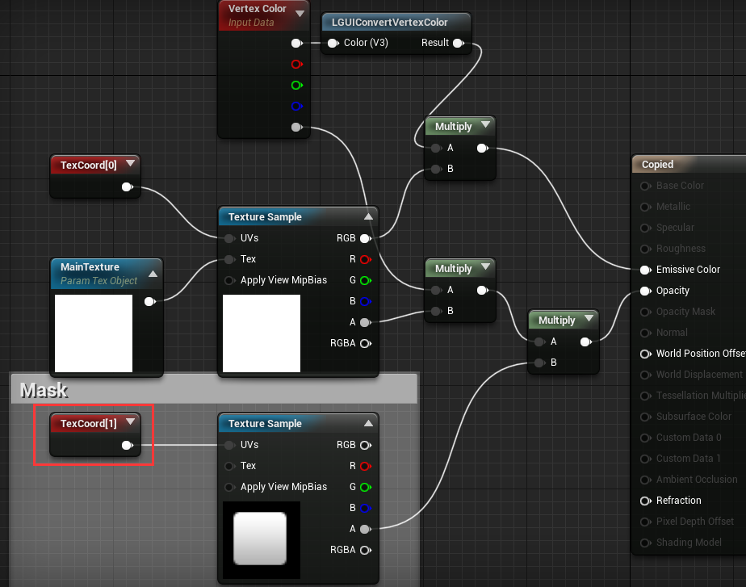
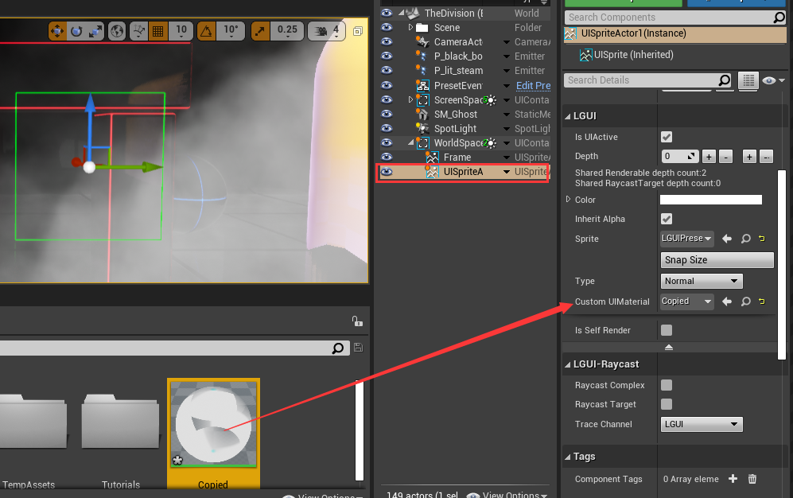

## Use custom material for UI elements
LGUI can use custom material to change the look of our UI elements.  
LGUI support *Surface* material domain.  

#### Examples 1, use a emissive material to make our text glow.  
Note: Glow is a world space post process effect, so only world space UI can do this, and post process setting must enable glow.  
1. First of all, copy material *LGUI_Standard* from *LGUI Content* folder (You may need to check *Show Plugin Content* if it is not visible). And paste it to your project content directory.  
2. Change the material node like the image below:  

3. Select a UIText, and drag the material you just modified to *Custom Material* slot:  

Now the text should look glow:

#### Example 2, use texture to maskout our sprite.  
Note: UISprite render a UISpriteData. UISpriteData contains the info of a small area from a packed atlas texture.  
1. First of all, copy material *LGUI_Standard* from *LGUI Content* folder (You may need to check *Show Plugin Content* if it is not visible). And paste it to your project content directory.  
2. Change the material node like the image below (note the mask texture's *TexCoord[1]*, and don't forget to select a mask texture for *Texture Sample* node):  

3. Select a UISprite, and drag the material you just modifyed to *Custom Material* slot:  

4. Now the UISprite look not right, because we have not tell LGUI to setup the data for *TexCoord[1]*. Select LGUICanvas, in the *Additional Shader Channels* property, check on *UV1*.  
 
Now the result should be good:  

<!-- #### Example 3, rect clip and texture clip. -->
