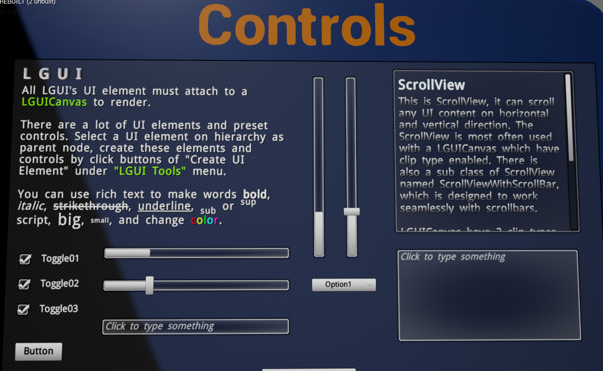
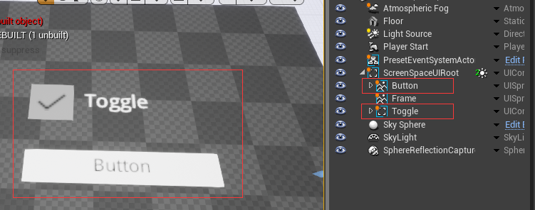

# Interaction and Controls

<!-- ## LGUICanvas -->

<h3><a href="UISelectable/index.md">UISelectable</a></h3>

UISelectable component is the base class for most Interaction components

<h3><a href="UIInteractionGroup/index.md">UIInteractionGroup</a></h3>

UIInteractionGroup component can control if the interaction component can take effect

<h3><a href="UIEventBlocker/index.md">UIEventBlocker</a></h3>

UIEventBlocker component can stop event from bubble up

<h3><a href="UIEventTrigger/index.md">UIEventTrigger</a></h3>

UIEventTrigger component provide all LGUI interaction interface event

