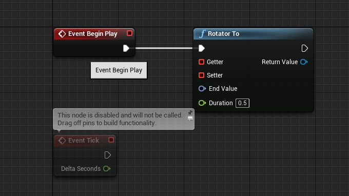
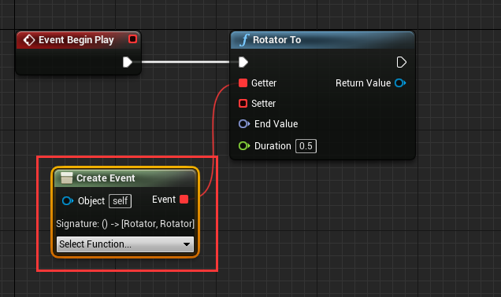
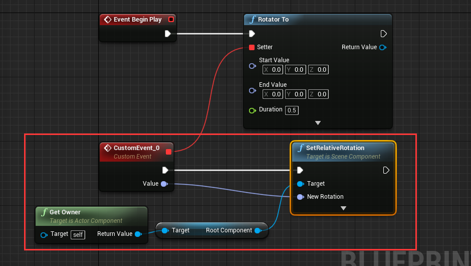
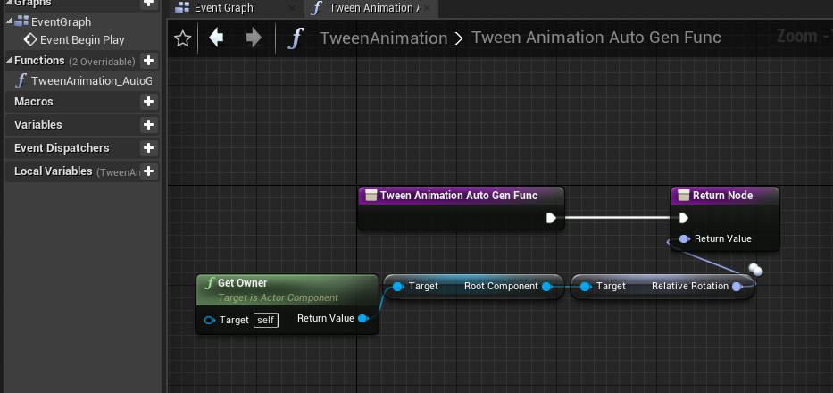
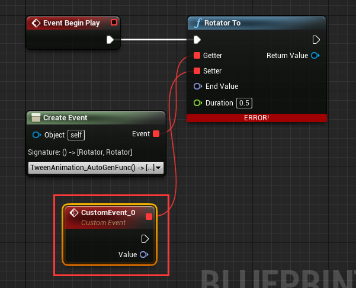
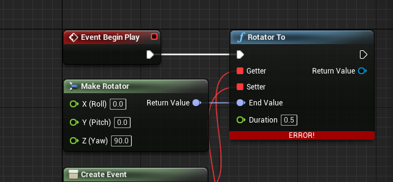
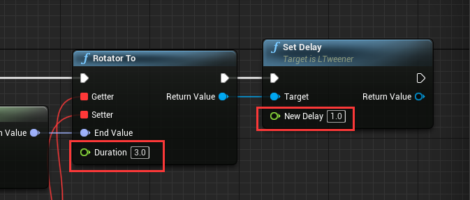

## Create tween for your own
LTween provide common tween functions: "Float To", "Int To", "Vector2 To", "Vector3 To", "Vector4 To", "Color To", "LinearColor To", "Quaternion To", "Rotator To". With these functions, you can even make tween animation with UMG.  

Let's learn by using "Rotator To", use it to rotate a cube.

#### 1. Setup level
Create a new default level, drag a cube to viewport, set mobility to movable, set location to (0, 0, 80):

Create a ActorComponent blueprint, name it "TweenAnimation":

Attach "TweenAnimation" component to cube:

Drag out from "Event Begin Play" and add "Rotator To" node:

See the parameter "Getter" and "Setter" of "Rotator To" node.

#### 2. Setup node with Getter
**"Getter" and "Setter" is LTween's delegate, LTween will use "Getter" to get start value, then calculate result value from start value and "End Value", and use "Setter" to pass the result value.**

Drag out "Getter" and select "EventDispatchers"->"CreateEvent" (since unreal's event cannot have return value, we need to use a function instead):

In "CreateEvent" node, choose "Create a matching function":

That will automatically create a function with return value. Change the function like this:

Back to "Rotator To" node, drag out "Setter" and choose "Add Event"->"Add Custom Event", then a event with value of rotator type will be created:

Setup the "CustomEvent_0" like this:

#### 3. Setup node parameter
Drag out "End Value" from "Rotator To" and choose "Make Rotator", change "Z(Yaw)" to 90:

Set "Duration" to 3.0, set delay to 1.0:

Now the setup is complete, hit play to see the animation.