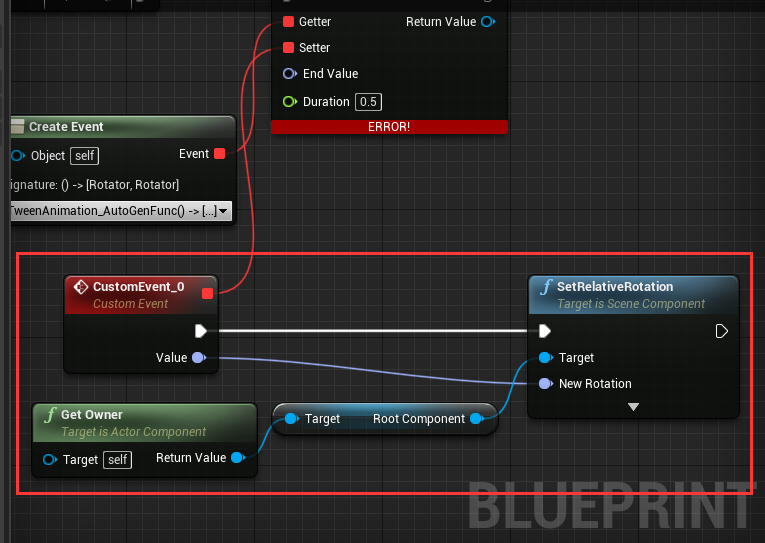

# Use LTween for tween animation

## Sections

<h3><a href="GetStarted/index.md">Get started</a></h3>

Get started with LTween for UnrealEngine's native objects

<h3><a href="LGUI/index.md">LTween for LGUI</a></h3>

LTween for LGUI

<h3><a href="Custom/index.md">Custom tween target</a></h3>

LTween for custom

<h3><a href="Functions/index.md">Some functions</a></h3>

Some functions that LTween provide for your work

