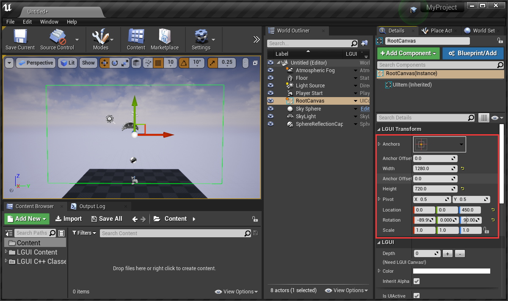
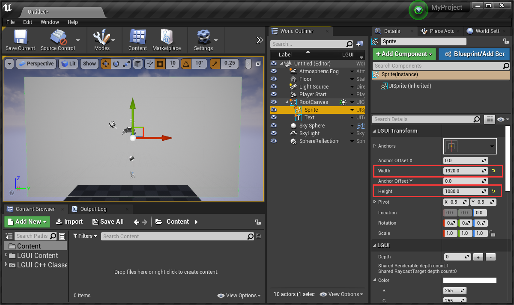
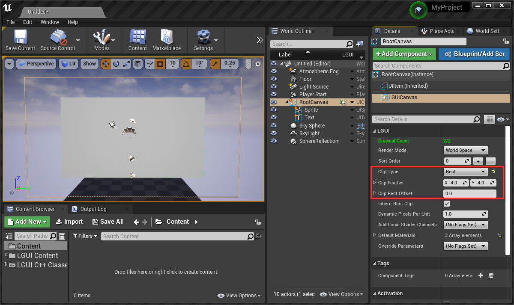
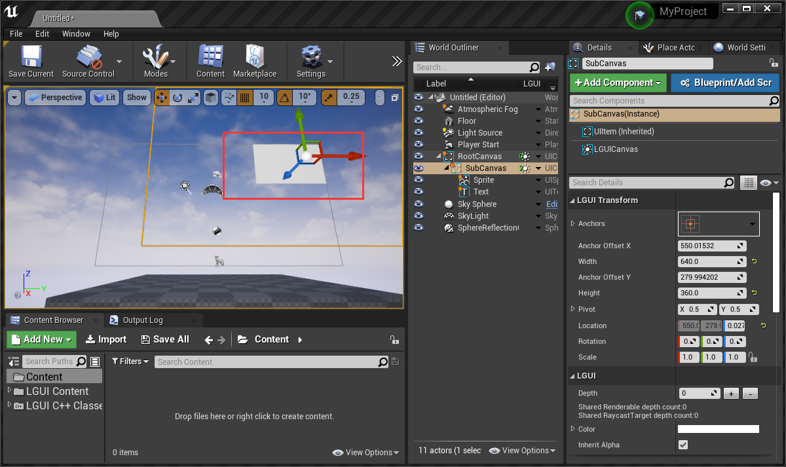
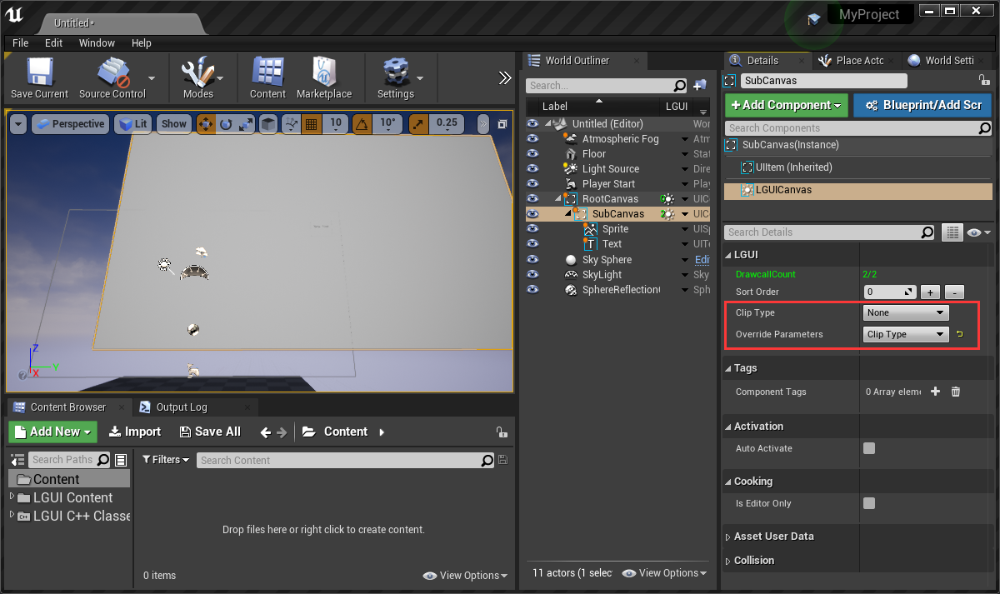
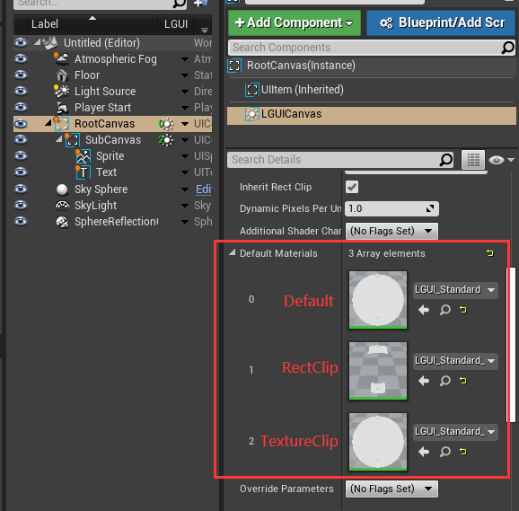

## LGUICanvas

Any UI elements that need render and update must be placed under a LGUICanvas in hierarchy.  
**Draw order of elements**
UI elements in canvas are drawn by order of "Depth" property, which is a property of each UI elements. Larger "Depth" render on top of lower one.    
And there is a "Sort Order" property of LGUICanvas, "Sort Order" always have top priority then "Depth".
  
  
Lets learn by create a UI from scratch.
  
#### 1. Create a LGUICanvas
LGUICanvas must stay on a actor which have a UIItem as RootComponent.
Create a new empty level, drag a UIContainerActor to viewport:

Rename the UIContainer to "RootCanvas", set the "LGUI Transform" parameters like this (rotation:-90,0,90):

Add a LGUICanvas component to "RootCanvas", notice a icon and a "0" appear beside "RootCanvas" in World Outliner:

Move your mouse over the icon, a tooltip will appear:

Right click on the down arrow button and choose "Create UI Element"->"UISprite":

A new UISpriteActor will be created, see a white rectangle appear in viewport, and number of drawcall become 1 in "RootCanvas". Rename the UISpriteActor to "Sprite":

Right click on the down arrow button and choose "Create UI Element"->"UIText":

Rename the UITextActor to "Text", "Color" to black, "Depth" to 1. See "New Text" appear on viewport, and drawcall count become 2:

#### 2. Use rect clip
Select "Sprite", change width to 1920, height to 1080, see the white rectangle exceed canvas area:

Select LGUICanvas component from "RootCanvas" actor, change "Clip Type" to "Rect", see the Sprite being clipped with canvas's rect area:

**LGUICanvas support hierarchy nested RectClip**  
Lets add a sub canvas: create a UIContainer, name it "SubCanvas", add a LGUICanvas component to it. Then drag "Sprite" and "Text" to "SubCanvas" as children, now the hierarchy should be like this:

And the "Sprite" is clipped by "SubCanvas" area:

Change the "SubCanvas" with to 640, height to 360, drag it to see the clip effect:

Select LGUICanvas from "SubCanvas" actor, see the sub canvas parameter is much less than the parent one. Acturally only the top-most canvas can show the full parameters, **sub canvas will automatically inherit parent parameters**.  
But we do have the chance to change sub canvas parameter, by check the "Override Parameters" flags:

If we check "ClipType" flag, then the "ClipType" parameter will appear. Then we can set "None" clip to disable clip:

#### 3. Default Materials
Select LGUICanvas from "RootCanvas", expend "Default Materials" and 3 material appears:

LGUICanvas use these 3 materials to render all UI elements, you can replace any of it with your own implemented material, eg: change shading model to receive light, add emissive glow.