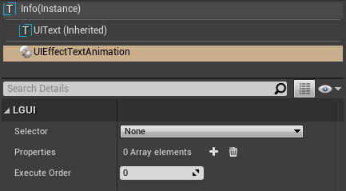
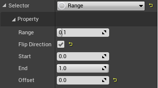
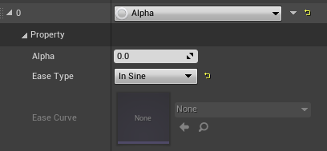
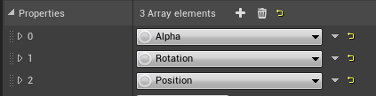

## TextAnimation

Select a UIText actor, add "UIEffectTextAnimation" component:

#### 1. TextAnimation Component

|Property:|Functions:|
|:-|:-|
|Selector|Selector defines the method to select characters in text.
|Properties|Properties defines which property will affect and how it affect.
|Execute Order|See [Common Effect](../CommonEffect/index.md)
Basically we use **Selector** to select range of characters in text, and use **Properties** to change character's property, then use a animation controller to **Play Animation**.  

**Get example from [This Project](https://github.com/liufei2008/LGUI_Tutorial).**
  
#### 2. Selector
*Selector* can collect information about which characters are selected, and 0 to 1 interpolation value from start to end, then provide these informations to *Properties*.  
There are 3 types of Selector: Range, Random, RichTextTag.  

**Range** selector defines start and end range of characters in UIText, and provide 0 to 1 value(for interpolation) from start to end.

|Property:|Functions:|
|:-|:-|
|Start|Start character position from 0 to 1, 0 is first character of text, 1 is last one.
|End|End character position from 0 to 1, 0 is first character of text, 1 is last one.
|Offset|0 means *Properties* will have no effect, 1 means *Properties* have full effect, and middle value is interplation. We can set this "offset" property to make animation.
|Range|*Selector* can provide 0 to 1 value from start to end, but sometime *Properties* effect may look too smooth, so lower this value can let *Properties* effect more sharp.
|Flip Direction|*Selector* can provide 0 to 1 value from start to end when this value is false, if it is true then 1 to 0 from start to end.  

**Random** selector will select characters randomly, and generate random value from 0 to 1 for interpolation.

|Property:|Functions:|
|:-|:-|
|Seed|Random seed.
|Start|Start character position from 0 to 1, 0 is first character of text, 1 is last one.
|End|End character position from 0 to 1, 0 is first character of text, 1 is last one.
|Offset|0 means *Properties* will have no effect, 1 means *Properties* have full effect, and middle value is interplation. We can set this "offset" property to make animation.
  
**RichTextTag** selector can select characters by rich-text custom-tag, and provide 0 to 1 value(for interpolation) from start to end.

|Property:|Functions:|
|:-|:-|
|Range|Like the property in **Range** selector. Lower this value can let *Properties* effect more sharp.
|Tag Name|Custom tag name
|Flip Direction|Like the property in **Range** selector, flip 0-1 to 1-0.
|Offset|0 means *Properties* will have no effect, 1 means *Properties* have full effect, and middle value is interplation. We can set this "offset" property to make animation.
  
#### 3. Properties
*Properties* can use the information that passed from *Selector*, and apply property change to characters.  
There are many types of Properties: Alpha, Color, Position, Rotation, Scale, Position Random, Position Wave... The name is what it functional for.  
  
eg.  
**Alpha** can change transparency of characters.

|Property:|Functions:|
|:-|:-|
|Alpha|Target alpha value, 0-1 range.
|Ease Type|Animation type, same as LTween ease.
|Ease Curve|Only valid if easeType = CurveFloat. Use CurveFloat to control the animation.

**ColorRandom** can generate random color.

|Property:|Functions:|
|:-|:-|
|Seed|Random seed
|Min|Random min
|Max|Random max
|Use HSV|Conver color to HSV(Hue, Saturate, Value) and interpolate, then convert the result back. Interpolate two colors in HSV may look better.

**PositionWave** can use a sin function to generate wave effect for characters.

|Property:|Functions:|
|:-|:-|
|Position|Max position value for sin wave. Sin function generate values from -1 to 1, so the result will be from -position to position.
|Frequency|Higher frequency will generate smaller wavelength.
|Speed|Move speed of the wave.
|Flip Direction|Flip move speed direction of the wave.

We can use **multiple properties** to combine our specific effects, the effects will calculate from top to bottom:

#### 4. PlayAnimation
We can use build-in **LGUIPlayTween** component to control our animation. The key is call function *SetSelectorOffset* on UIEffectTextAnimation component.  

