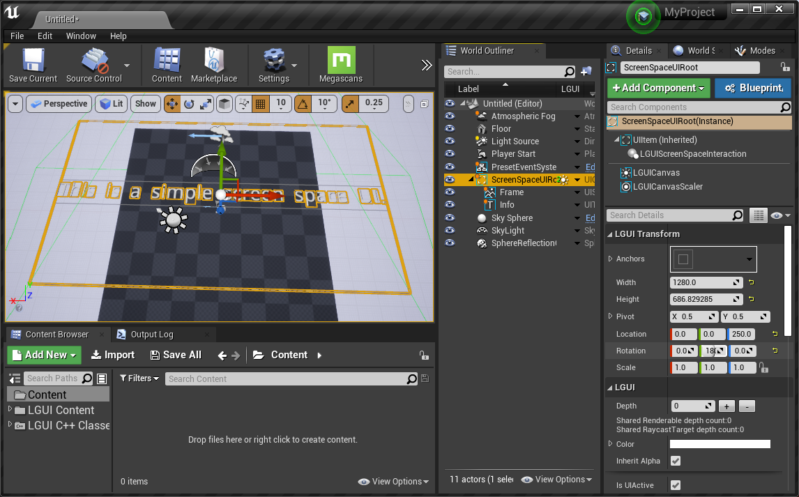
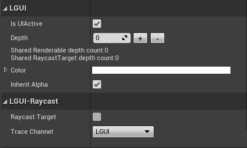
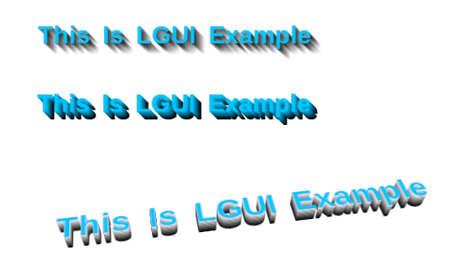

# Introduce LGUI's rendering

## LGUICanvas

<h3><a href="LGUICanvas/index.md">LGUICanvas</a></h3>

LGUICanvas is the key to render and update LGUI's elements

<h3><a href="ScreenSpaceUI/index.md">ScreenSpaceUI</a></h3>

ScreenSpaceUI can render UI elements directly to viewport

<h3><a href="WorldSpaceUI/index.md">WorldSpaceUI</a></h3>

WorldSpaceUI use engine's default render pipeline to render UI elements

## LGUI Transform

<h3><a href="UIItem/index.md">UIItem and UIContainer</a></h3>

UIItem inherit from SceneComponent, and act as a rectangle area. UIContainer is just a actor wrapper for UIItem.

## UIRenderable

<h3><a href="UISprite/index.md">UISprite</a></h3>

UISprite use packed atlas texture to render UI elements

<h3><a href="UITexture/index.md">UITexture</a></h3>

UITexture can directyly render texture

<h3><a href="UIText/index.md">UIText</a></h3>

UIText can render text with font

<h3><a href="UIExtensionElements/index.md">UIExtensionElements</a></h3>

Other renderable UI elements

<h3><a href="RichTextReference/index.md">RichTextReference</a></h3>

Use RichText to make our text look better

## UIEffect

<h3><a href="CommonEffect/index.md">CommonEffect</a></h3>

Shadow, LongShadow, Outline, PositionAsUV, GradientColor

<h3><a href="TextAnimation/index.md">TextAnimation</a></h3>

TextAnimation can make per character animation

## UIPostProcess

<h3><a href="UIBackgroundBlur/index.md">UIBackgroundBlur</a></h3>

Blur the background image

<h3><a href="UIBackgroundPixelate/index.md">UIBackgroundPixelate</a></h3>

Pixelate the background image

