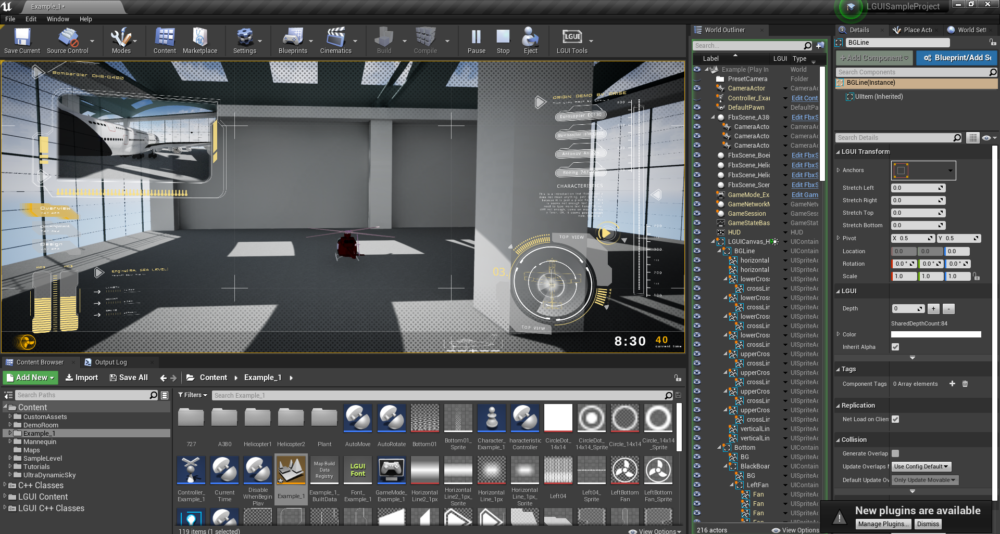

# Sample Projects

#### CarCustomization

Download/Clone from [github](https://github.com/liufei2008/LGUI-Sample--CarCustomization.git).
This is a car customization project.
Features:
* Screen Space 3D UI
* World Space 3D UI
* UI animation

#### Tutorial Projects

Download/Clone from [github](https://github.com/liufei2008/LGUI_Tutorial.git).
This project contains several maps that shows some key features of LGUI.
Features:
* DragDrop
* Layout
* Prefab
* Controller input
* TextAnimation
* "TheDivision" like UI

#### Si-fi UI

Download/Clone from [github](https://github.com/liufei2008/LGUISampleProject.git).