# LGUIEventDelegate

LGUIEventDelegate is a callback method (excuted when the event is triggered), which can serialize and edit inside "Details" panel.  
Basically after setup a LGUIEventDelegate and try to execute it, it will search function receiver object on target actor (function receiver object could be the actor itself or one of component on the actor), find function that match the function name and parameter type, and then call the function with parameter value. And LGUIEventDelegate have built-in cache, means it only do these search things once at the first time it is executed.

## How to use
Create a ActorComponent blueprint class, name it "MyLGUIEventDelegateTest", this component will hold the LGUIEventDelegate and execute it:  
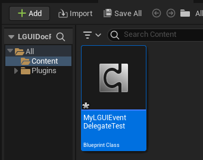

Double click MyLGUIEventDelegateTest to open the blueprint editor, then create a variable of LGUIEventDelegateEmpty type, name it "MyEvent", check on "InstanceEditable", then compile the blueprint:  
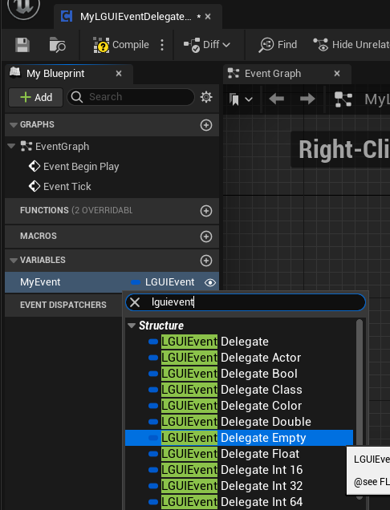

Create another ActorComponent blueprint class, name it "FunctionComponent", this component will provide the function to call by LGUIEventDelegate:  
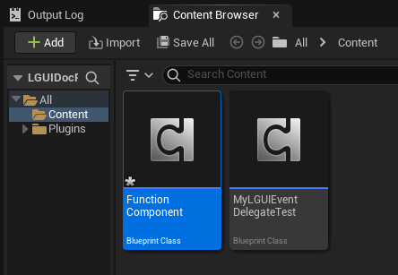

Double click FunctionComponent to open the blueprint editor, add a function with name "TestFunction", add input paramter of type String, link a "Print String" node to the function, then compile the blueprint:  

Create two actor with name "A" and "B", drag MyLGUIEventDelegateTest to actor A, and FunctionComponent to actor B:
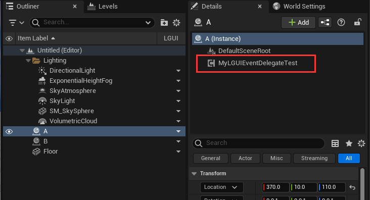

Select MyLGUIEventDelegateTest component on actor A, in the Details panel you will find LGUIEventDelegate "My Event()" that just created, click the "+" button to add a event item:  
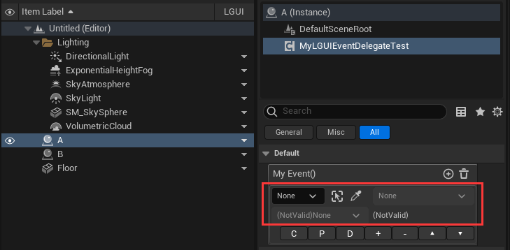

Keep MyLGUIEventDelegateTest component selected, and click the lock icon button on the Details panel to make it locked up, this can let us drag other actor in Outliner:  
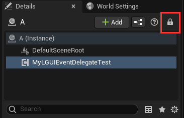

Drag actor B to event parameter:  
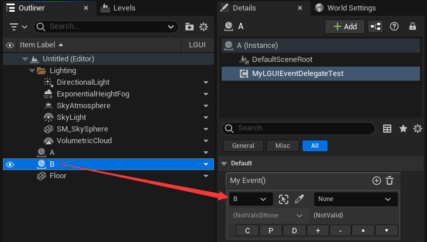

Click component area, it will list all valid components and "(ActorSelf)", select "Function" component because our "TestFunction" is inside FunctionComponent:  
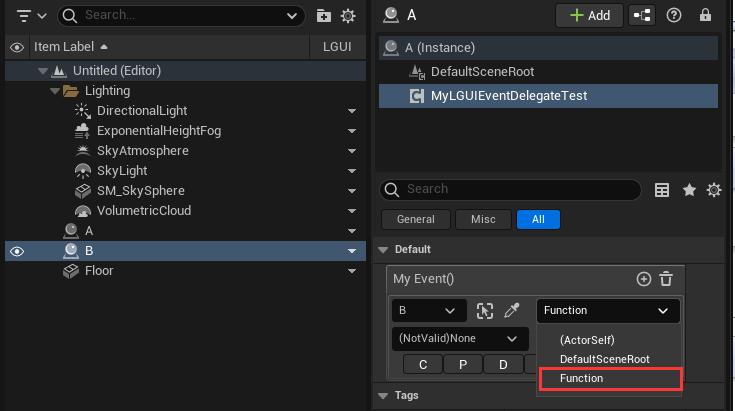

Click function area, it will list all compatible functions, select "TestFunction(String)" which created before:  
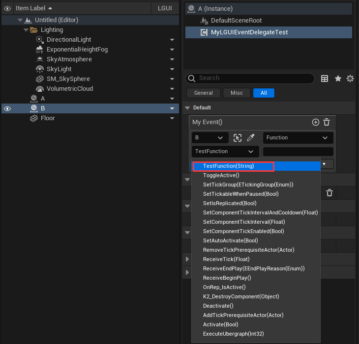

The parameter area now shows a string input field, if we typein something here, when we do execute the "My Event()" LGUIEventDelegate, the string that we typein will convert to a parameter and pass to the executed functon. You can typein anything, for example just typein "I am function parameter":  
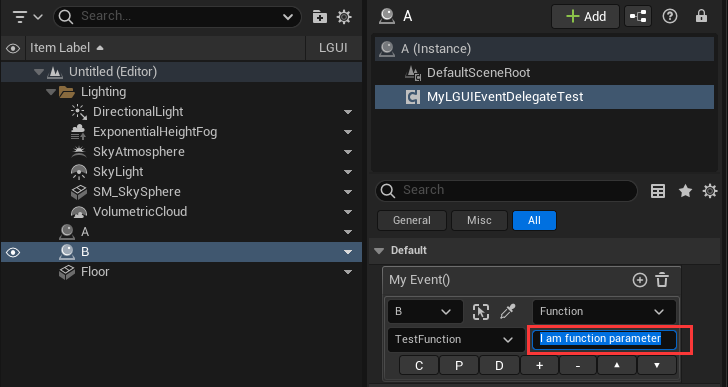

Now the callback method setup is complete, the next step is to execute the "My Event()" LGUIEventDelegate. Double click MyLGUIEventDelegateTest component, in the blueprint editor drag "MyEvent" variable to EventGraph, then drag out a line from "MyEvent" node and select "Execute" node:  
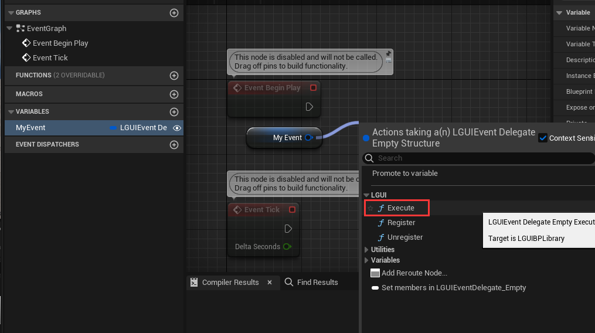

Add a "Delay" node and set "Duration" to 0.5, compile blueprint:  
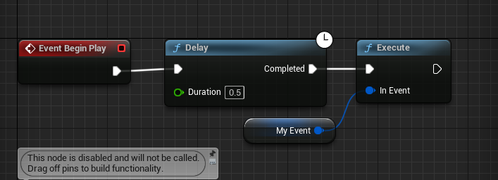

Hit play and you will see a print message "I am function parameter" will show on viewport's left top area:  
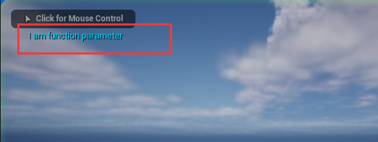

## Tips
The above example is a very simple one, actually LGUIEventDelegate can pass parameter from source event to dest function, just choose LGUIEventDelegateXXX (XXX means parameter type) as your event type. LGUIEventDelegate support a lot of basic data types: *bool float double int8 uint8 int16 uint16 int32 uint32 int64 uint64 vector2 vector3 vector4 color linearColor quaternion string object actor pointerEvent class rotator name text*, some of them is c++ only.  

When you use a LGUIEventDelegateXXX, when select function from list, you may see some function with "(NativeParameter)" (eg. TestFunction(NativeParameter)):  
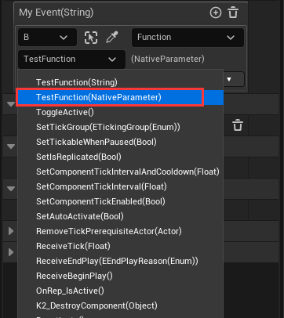
This means the function can receive parameter that passed from LGUIEventDelegate.  
