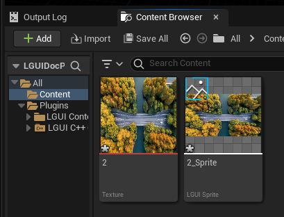
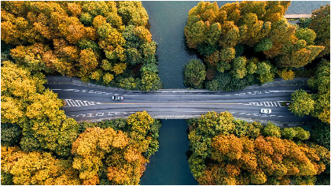
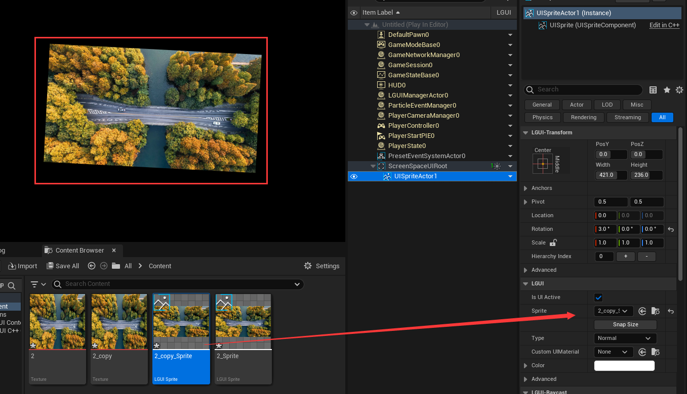

# Anti-aliasing
Aliasing is always happen on geometry's edge, so the key thing of anti-aliasing is to make the geometry's edge "transparent", so the bad looking edge will not be seen.
How to do it? The simplest way is to use a texture on our UI geometry, make the pixel's alpha value to 0 when the pixel is at geometry's edge.
Let's try it.

## Smooth rotated UISprite and UITexture
Under ScreenSpaceUI, create a default UISprite, it use a solid white texture. Rotate it on X axis about 3 degree and hit play, you will see the edge looks terrible:
  

Prepare a image, any image without transparent alpha channel, or use one:  

Import to Content folder, create sprite:  

Drag the sprite to UISpriteActor, hit play and you will see the edge still looks bad:  

Let's cleanup the texture's edge with transparent pixels. Open the source image with PhotoShop (or any other image edit tool), change the canvas size 2 pixels bigger, I change the image size from 419x234 to 421x236, PhotoShop will automatically set the edge pixels to transparent. Now save it as a copy:  

Import the modified image to Content folder, create sprite, drag it to UISpriteActor, hit play, now the edge is much better:  

The same solution for UITexture.

But what if we are not allowed to modify the image pixels? How do we anti-aliasing our existing UISprite or UITexture?

Well there is a workaround, we can use a mask texture to cover the edge of UISprite or UITexture.
The mask texture should be like this:  
  
Import into UnrealEngine and create as a UISprite, the sprite's border should be like this:  
  

The result should look like this:  

