# Use custom material for UI elements
LGUI can use custom material to change the look of our UI elements.  
Note You should use **Surface** material domain in LGUI's material, because LGUI is 3d UI, it still need 3d information.  

#### Examples 1, use a emissive material to make our text glow.  
Note: Glow is a world space post process effect, so only **World Space UE Renderer** can do this, and post process setting must enable glow.  
1. First of all, copy material *LGUI_Base* from *LGUI Content/ Material* folder (You may need to check *Show Plugin Content* if it is not visible), and paste it to your project content directory.  
2. Add some nodes to the material like the image below:  
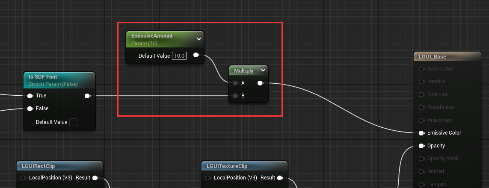
3. Since UIText use SDF as default, so we need to check on "Is SDF Font" Switch Param:  

3. Select a UIText, and drag the material you just modified to *Custom Material* slot:  

Now the text should look glow:

#### Example 2, use texture to maskout our sprite.  
Note: UISprite render a UISpriteData. UISpriteData contains the info of a small area from a packed atlas texture.  
1. First of all, copy material *LGUI_Base* from *LGUI Content/ Material* folder (You may need to check *Show Plugin Content* if it is not visible). And paste it to your project content directory.  
2. Add some nodes to the material like the image below (note the mask texture's *TexCoord[1]*, and don't forget to select a mask texture for *Texture Sample* node):  
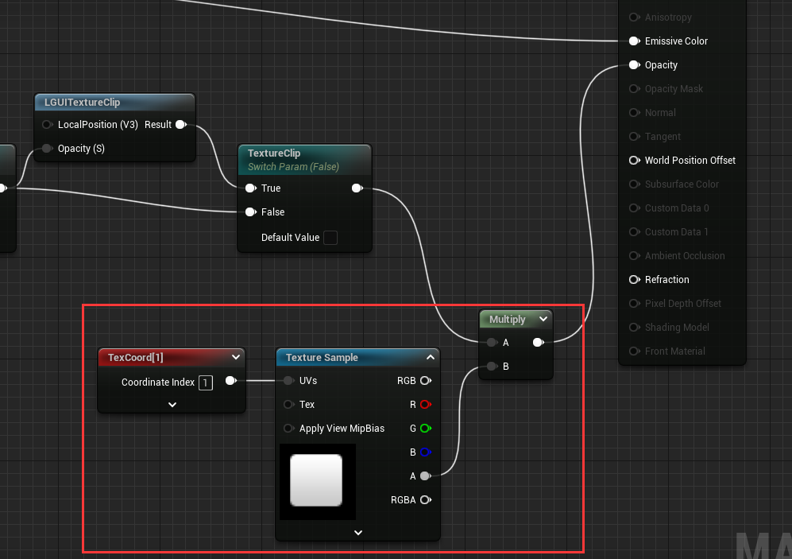
3. Select a UISprite, and drag the material you just modifyed to *Custom Material* slot:  

4. Now the UISprite look not right, because we have not tell LGUI to setup the data for *TexCoord[1]*. Select LGUICanvas component from WorldSpaceUIRoot actor, in the *Additional Shader Channels* property, check on *UV1*.  
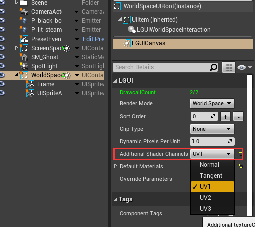 
Now the result should be good:  
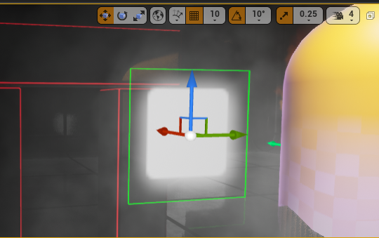
Why use *TexCoord[1]*? Because LGUI provide a common rect 0-1 range for UISprite in *TexCoord[1]*. *TexCoord[0]* is for sprite atlas, which is not 0-1 range.

#### Example 3, use LGUICanvas builtin RectClip and TextureClip in our custom material.
LGUI provide preset material functions **LGUIRectClip** and **LGUITextureClip** for LGUICanvas builtin RectClip and TextureClip, you can find it in "LGUI Content" folder:  

You can use it in any material, the key is use the material function's result as your Opacity input of material. Let's start to do it.  

First create a *World Space UI - UE Renderer*, delete default "Frame" and "Info" node, and create a UISprite actor with name "ClipSprite", change size to 300x300:  
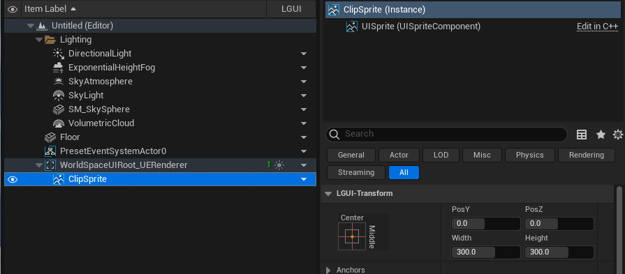

Then create our own material like the image beblow:  
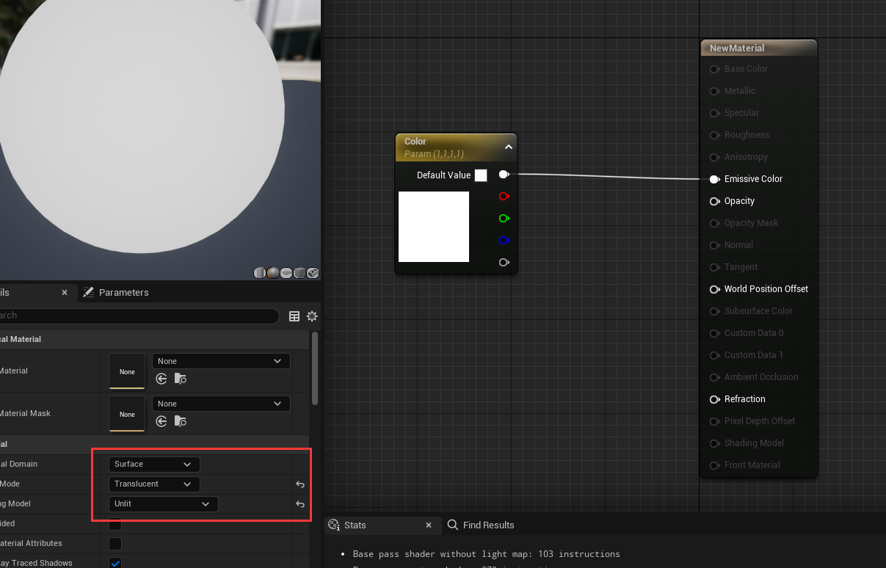

Drag *LGUIRectClip* node to the material and link it:  
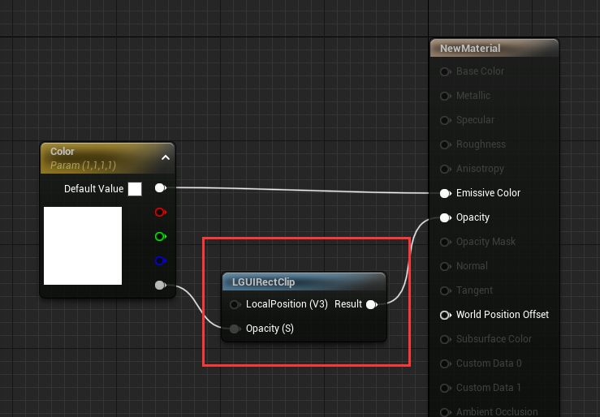

Select LGUICanvas component from WorldSpaceUIRoot actor, change *Clip Type* to *Rect*:  
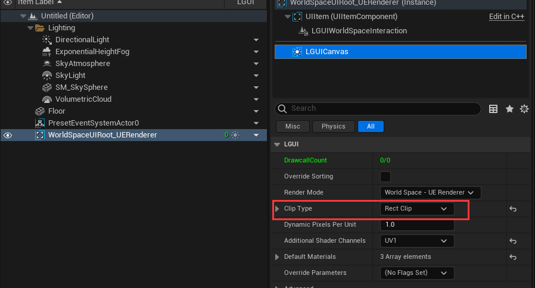

Drag the material to "ClipSprite":  
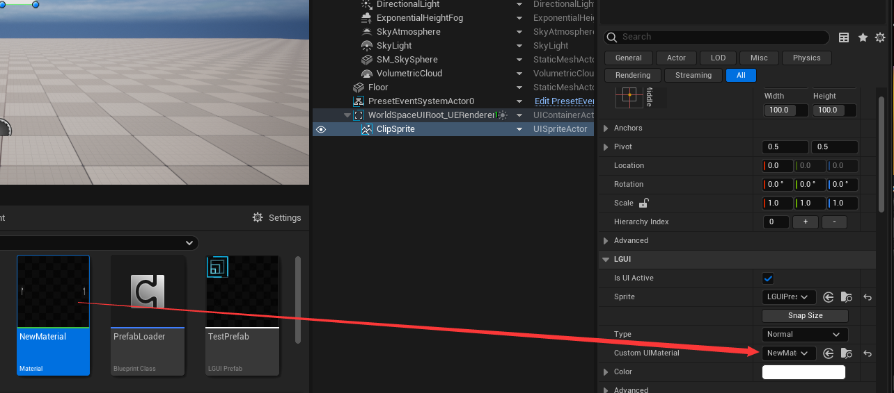

Now drag the UISprite actor to the edge of WorldSpaceUIRoot, see it is clipped:
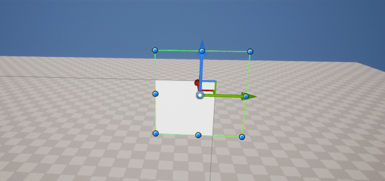
texture-clip is the same thing, just repace the *LGUIRectClip* with node *LGUITextureClip*:
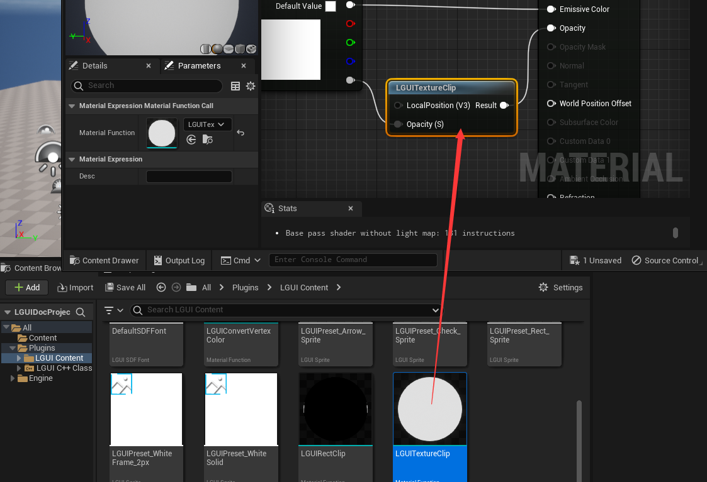
