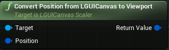
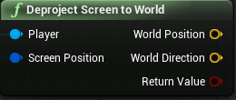

# Deproject LGUI's screen position to world
If we want to use a UIItem to control a actor location on 3d world this is what we want.

The main point is to use two nodes: One is **Convert Position from LGUICanvas to Viewport**, which is provided by LGUICanvasScaler:  
  
|Property:|Function:|
|:-|:-
|Target|A reference to LGUICanvasScaler object.
|Position|Input position in LGUI's screen space. Note left bottom is zero position, so for UIItem who provide this value, should set *Anchors* to *Left Bottom*, and the parent of UIItem should set to full screen size.
|Return Value|Result screen space position, note left top is zero position.

Another is **Deproject Screen to World**, which is UnrealEngine's default node:  
  

We can link these nodes like the screen shot below:  
  
We can use the result *World Position* and *World Direction* to generate line trace. *Control* is a UIBaseActor represent for a screen UI element, *Root* is the ScreenSpaceUIRoot actor which hold the LGUICanvasScaler component.