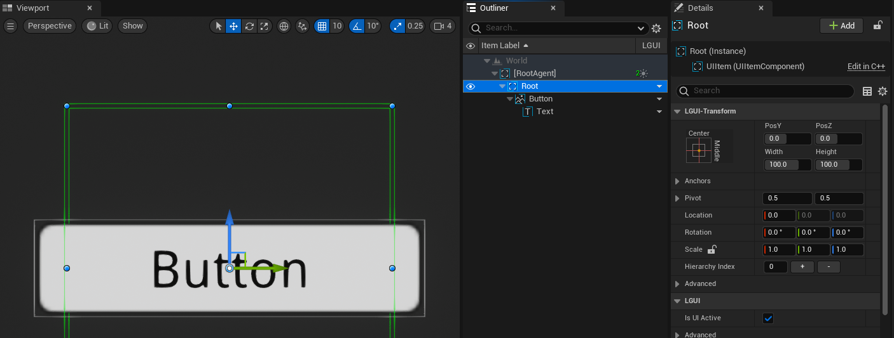
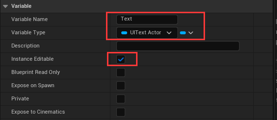
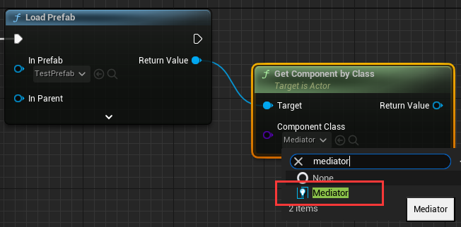
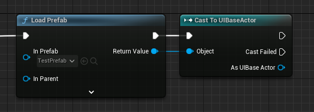

# Get actor or component inside prefab

This is for someone who may not famaliar with prefab workflow.  

We create a UI prefab with name "TestPrefab", inside the prefab should be like this:  
  
"Root" is a UIContainer actor, "Button" is attached to "Root" and "Text" is attached to "Button".
If we want to modify "Text" object, how to get a reference of it?
There are two ways to do it, lets do it step by step.

First we should load it with a ActorComponent, so create a ActorComponent with name "PrefabLoader", then link "LoadPrefab" node to "BeginPlay", and assign our prefab "TestPrefab" to it, this means prefab will be loaded when hit play:  

## Use ActorComponent as mediator
Create another ActorComponent, this time we use LGUILifeCycleBehaviour as base class, name the component "Mediator":  
(it is recommanded to use LGUILifeCycleBehaviour in prefab)  

Add a variable with type "UITextActor", name "Text", and check on "Instance Editable":  

Open "TestPrefab" and drag "Mediator" to "Root" actor:  

Select "Mediator" component on "Root" actor, check on the lock button on "Details" panel, then drag "Text" actor to the variable "Text":  

After apply the prefab, the variable "Text" should successfully save the actor reference.

Open "PrefabLoader" component, drag out "Return Value" from "Load Prefab" node and select "Get Component by Class" node, and select "Mediator" in "Component Class":  

Drag out "Return Value" from "Get Component by Class" node, then you will find the "Text" variable, this is the "Text" actor reference, just do what you need with it:  

## FindChildByDisplayName

In your "PrefabLoader", drag out "Return Value" from "Load Prefab" node and cast it to "UIBaseActor":  

Drag out "As UIBase Actor" and select "Get UIItem" node:  

Drag out "Return Value" from "Get UIItem" node and select "Find Child by Display Name" node, typein "Button/Text" in "In Name" parameter:  

Drag out "Return Value" from "Find Child by Display Name" node and cast it to "UIText":  

The "As UIText" is the object you need.
**NOTE** "FindChildByDisplayName" can only work with LGUI's UI element.  