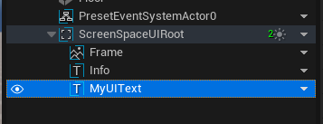
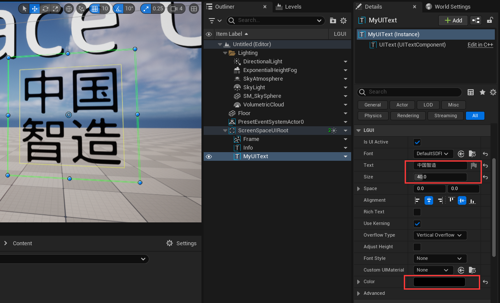

# Use custom font
In this section, we will use a custom font file(ttf, ttc, otf) to create our UIText.
LGUI provides two type of fonts:
 - LGUI Font - Bitmap font, generate different char pixels on texture area when need to render different font size.
 - LGUI SDF Font - Default font type, use signed distance field technique to render, can render smooth character no matter how big the font scale is.

## Prepare a font file.
LGUI use [freetype](./https://www.freetype.org/) to render fonts, so we will use freetype supported format(ttf, ttc, otf). Download a font file or grab one from system fonts directory. I use "华文新魏" from C:/Windows/Fonts:  

Copy the font file to your UnrealEngine project directory (same directory of the .uproject file).

## Create LGUI Font asset.
Right click on the empty area of your content folder, choose "LGUI"->"LGUI SDF Font", that will create a LGUI SDF Font asset:  

Rename the asset to “MyLGUIFont”:

Double click it to open font editor window, click the "..." after "FontSourceFile" property, and choose the font file you just prepared:  

## Create UIText.
Follow the [HelloWorld](./../HelloWorld/index.md) section to create a base screen space UI.

Select "ScreenSpaceUIRoot", and right click the down arrow, choose "Create UI Element"->"UIText":  

Rename the UIText you just created to "MyUIText":  

## Change UIText property.
Select "MyUIText", change "PosZ" to -120, so it will move down a little bit in viewport:  

Select "MyUIText", change "Size" to 40, "Color" to black, typein "中国智造" in the "Text":  

## Use our own font.
**The important part**, select "MyUIText" and drag "MyLGUIFont" to the "Font" property, see the font change in viewport:  

