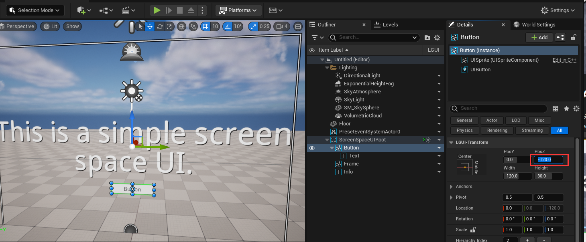
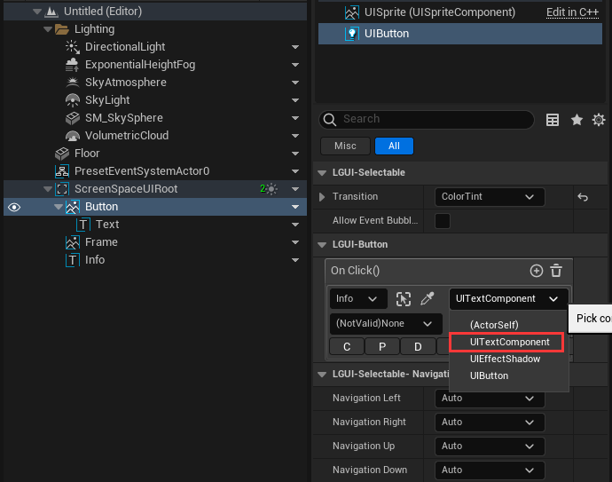
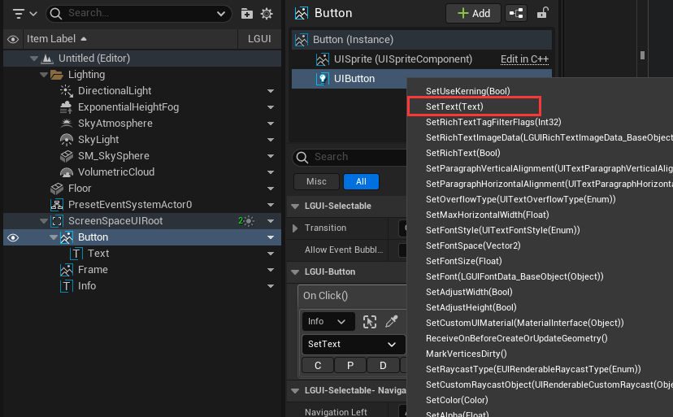
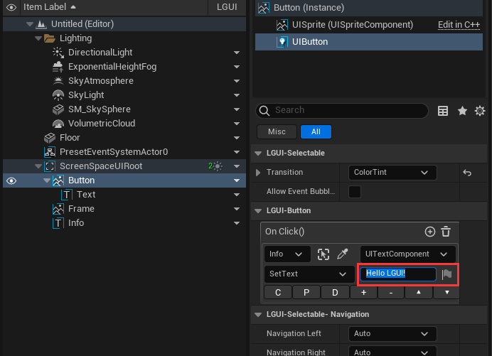
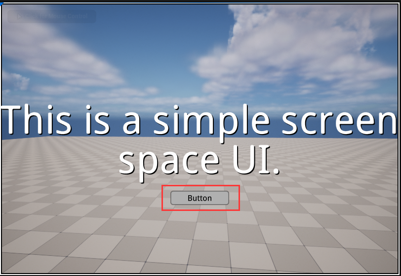

# Hello LGUI
In this section, we will create a simple UI that show "Hello LGUI" step by step.  

## Create Screen Space UI
Create a new default level, click "LGUI Editor Tools"->"Basic Setup"->"Screen Space UI":  

Then a preset screen space UI should appear:  

## Create a button
Select ScreenSpaceUIRoot, right click on the down arrow in the "LGUI" column:  

Click "Create UI Element"->"UIButton":  
 

Then a button will appear in viewport and outliner:  

## Adjust button
Select "Button" in Outliner, change the "PosZ" to -120, this will move the button a little off the center in vertical direction:  

## Add OnClick event
Select "UIButton" component on "Button" actor, find "On Click()" property and click the "+" button:  

The "On Click" is a LGUIEventDelegate (see [LGUIEventDelegate](./../LGUIEventDelegate/index.md) page), it has four parameters(Actor, Component, Function, Parameter):  

In "Actor" parameter, select "Info" object from World Outliner:  

Click "Component" area and select "UITextComponent":  

Click "Function" area and select "SetText(Text)":  

Now the "Parameter" area become a text input block, type in "Hello LGUI":  

Hit Play, then move you mouse to the button, you will see it highlighted:  

Then click the button, you will see the text change:  
    
