# Prefab workflow
In this section, we will learn how to use LGUIPrefab to reuse our UI content.
Basically LGUIPreafb is just a **nested hierarchical actor serialization** tool, it is not limited to UI create, actually you can use it with any actor.  

## Prepare a LGUI ScreenSpaceUI.
Follow the [HelloWorld](./../HelloWorld/index.md) section to create a base ScreenSpaceUI.

## Create a button as prefab source.
Select "ScreenSpaceUIRoot" actor, right click on the down arrow button, and choose "Create UI Element"->"Button":  
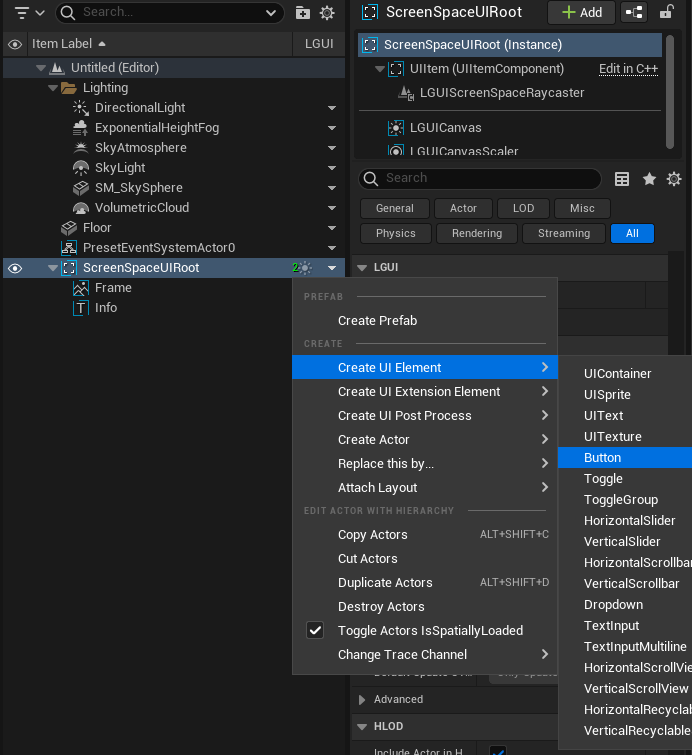

Rename the button actor to "MyPrefabButton", set "PosZ" to -100, "Color" to green:  
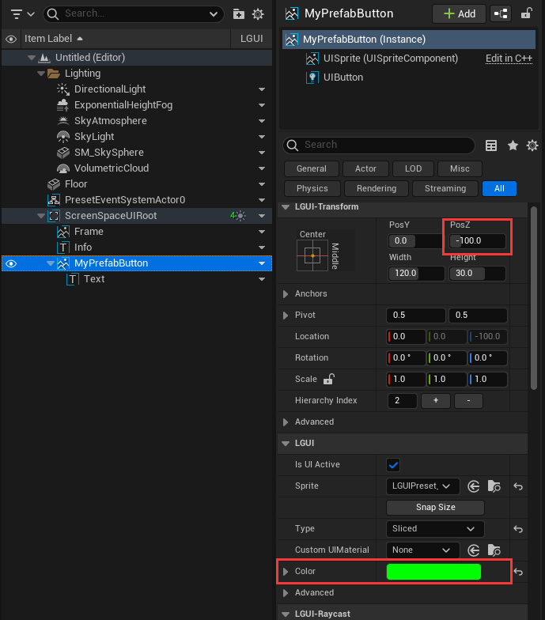

## Create prefab.
Select "MyPrefabButton" actor, right click on the down arrow button, and choose "Create Prefab":  
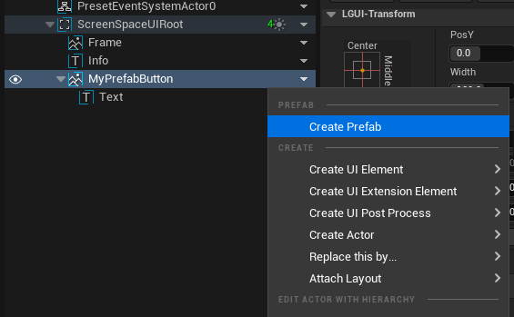

Now a save file window will showup:  
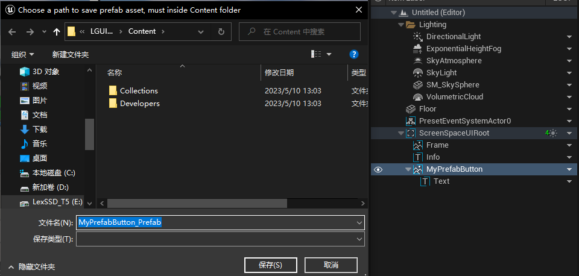

Click "Save" button, then a prefab asset will appear in "Content" folder:  

And notice the "MyPrefabButton" actor in the "Outliner", the down arrow button icon become a prefab icon, and a LGUIPrefabManagerActor appear in "--LGUIPrefabActor--" folder:  
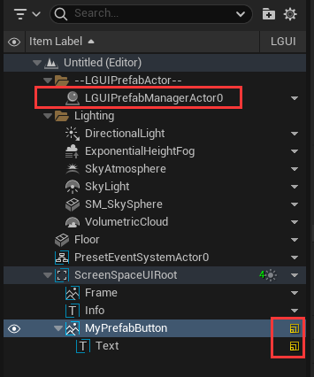

Select "MyPrefabButton" actor, right click on the prefab icon and choose "Destroy Actors", so the "MyPrefabButton" actor and it's children are all destroyed:  
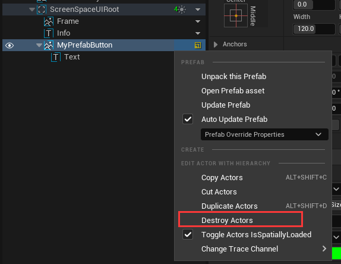

## Reuse prefab in editor.
Select "ScreenSpaceUIRoot" actor, drag "MyPrefabButton_Prefab" asset and drop to anywhre on viewport:  
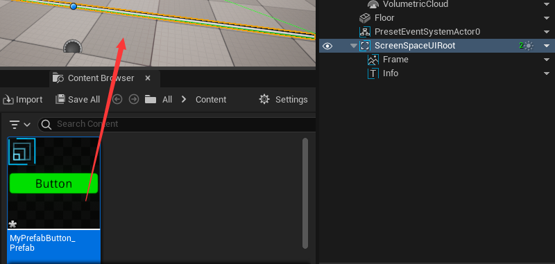

See a "MyPrefabButton" actor is created in viewport and outliner:  
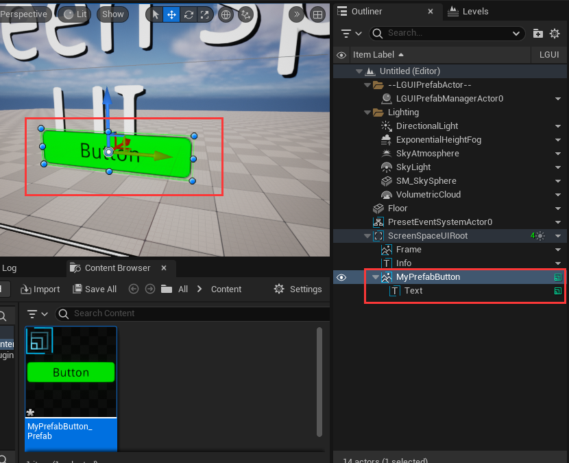

Select "Info" actor, drag "MyPrefabButton_Prefab" asset and drop to anywhre on viewport, then a new "MyPrefabButton" will be created (you may need to move it off to see in viewport):  
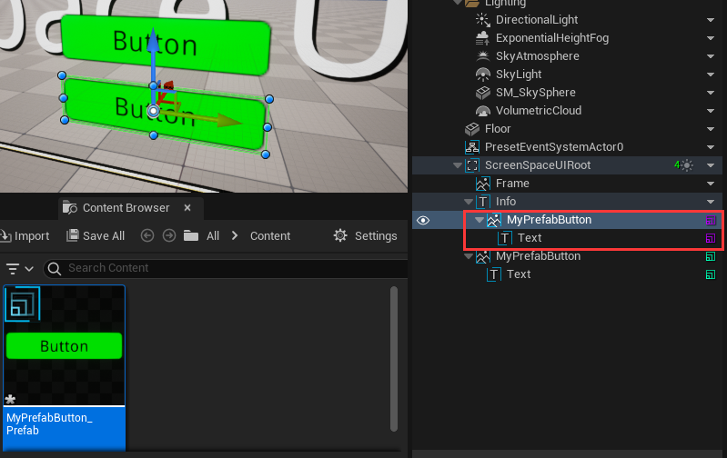

Notice different prefab have different color on prefab icon:  
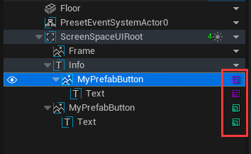

Select both "MyPrefabButton" actor by hold "Ctrl" key and click it, then choose "LGUI Editor Tools"->"Destroy Actors" to destroy both actors and all it's children:  
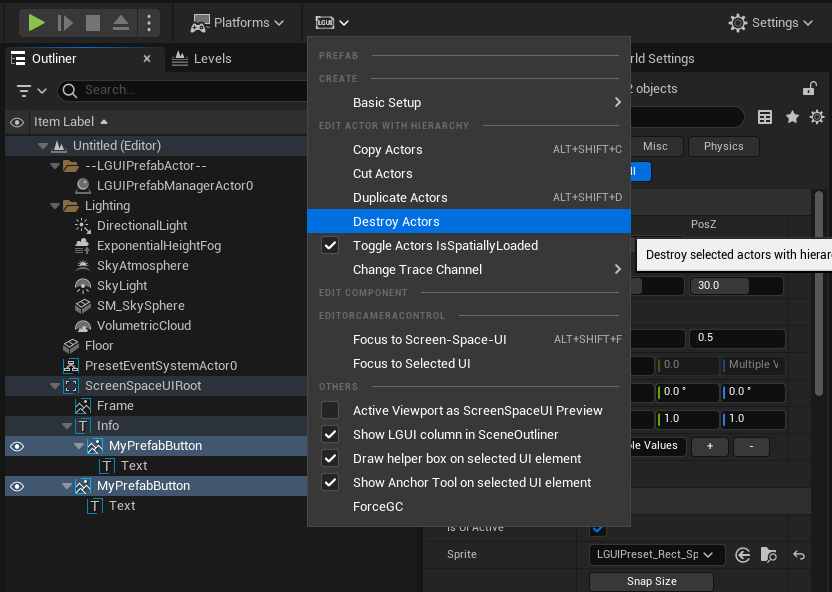

## Reuse prefab in runtime.
Right click in empty area of "Content" and choose "Blueprints"->"BlueprintClass":  

Select "Actor Component":  
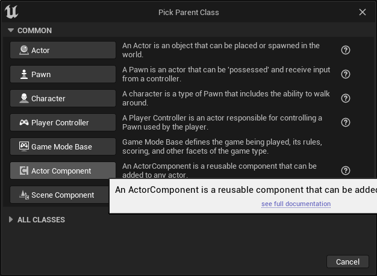

Name the created ActorComponent class to "PrefabLoader":  
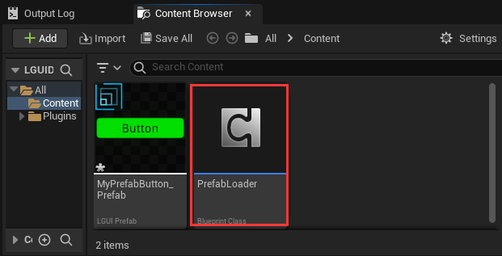

Double click "PrefabLoader" to open blueprint editor:  

Drag out "Event Begin Play" and add a "Load Prefab" node:  

Drag "MyPrefabButton_Prefab" to "In Prefab" of "Load Prefab" node:  
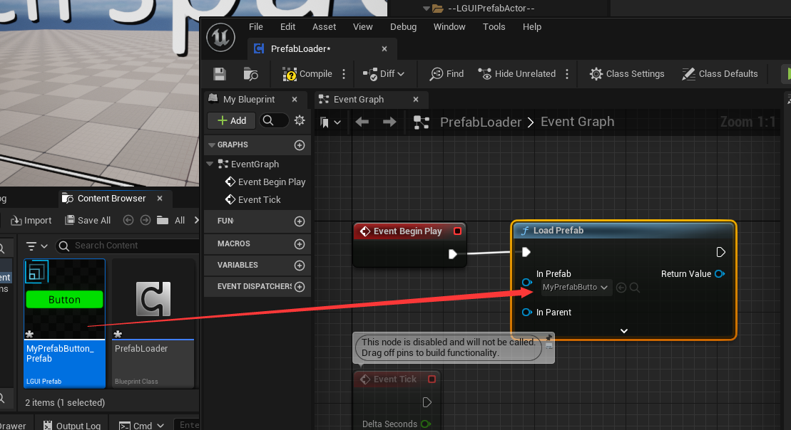

Connect "Get Owner" and "Root Component" node to "In Parent" of "Load Prefab" node:  

Click "Compile" and then close the blueprint editor:  

Select "ScreenSpaceUIRoot" actor in "Outliner", and drag "PrefabLoader" to it's component stack:  
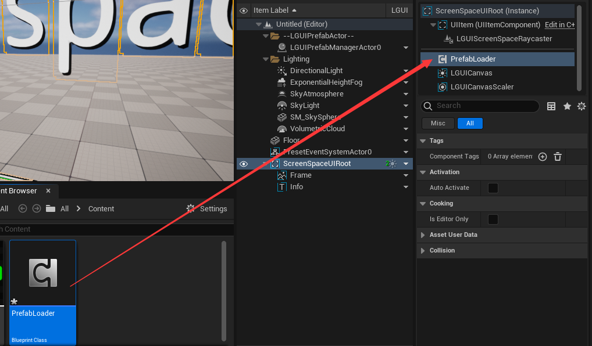

Hit play, you can see a prefab button is created:  

Notice the button's color become white, because it is override by UIButton component, now let's modify the prefab to fix it.

## Modify prefab.
Exit play mode by click stop button. Double click on the "MyPrefabButton_Prefab" to open PrefabEditor:    

Select "MyPrefabButton" actor, select "UIButton" component. UIButton use "ColorTint" on "Transition" property, it will override the TransitionActor's color with "Normal Color":  
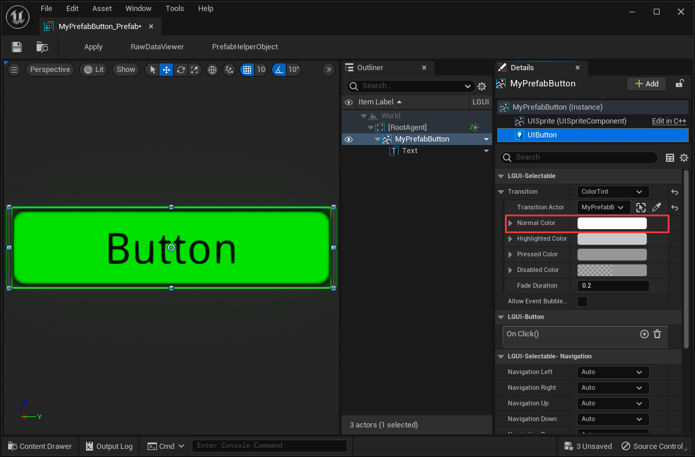

Change the "Normal Color" to red, see the button in viewport become red too:  
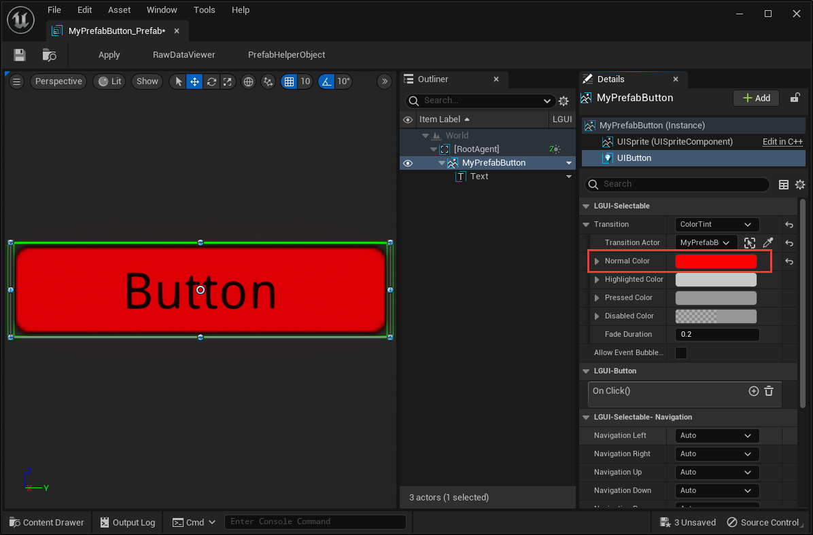

Click the "Apply" button in the left top menu of PrefabEditor, so that the changes will apply to prefab asset:  

Now close PrefabEditor and hit play, see the loaded button have a red color:  

