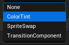
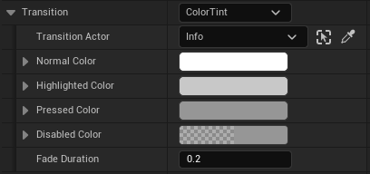
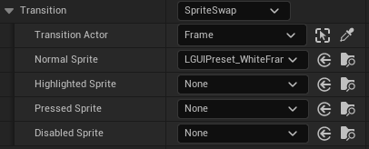
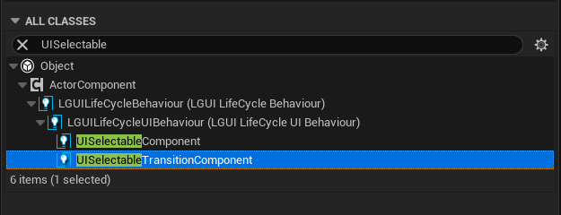
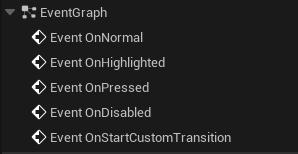

# UISelectable component

UISelectable component is the base class for most Interaction components, and is the key for keyboard/controller input.  

|Property:|Function:
|-|-
|AllowEventBubbleUp|Allow passed-in **LGUI Pointer Event** to pass out? If not, the pointer event just stop here.
|Transition|Within a UISelectable component there are several **Transition Options** depending on what state the UISelectable is currently in. The different states are: normal, highlighted, pressed and disabled.
|Navigation|There are also a number of Navigation Options to control how keyboard navigation of the controls is implemented

## Transition Options
Within a UISelectable component there are several **Transition Options** depending on what state the UISelectable is currently in. The different states are: normal, highlighted, pressed and disabled.  

|Transition Options:|Function:
|-|-
|None|This option is for the button to have no state effects at all.
|Color Tint|Changes the colour of the button depending on what state it is in. It is possible to select the colour for each individual state. It is also possible to set the Fade Duration between the different states. The higher the number is, the slower the fade between colors will be.
|Sprite Swap|Allows different sprites to display depending on what state the button is currently in, the sprites can be customised.
|TransitionComponent|Allows an user implemented UISelectableTransition to behave on the state of the button, the component must exist on TransitionTarget actor in order to use custom transition.
Each Transition option (except None) provides additional options for controlling the transitions. We'll go into details with those in each of the sections below.

### Color Tint

|Property:|Function:
|-|-
|TransitionTarget|The UIBaseRenderable actor used for this UISelectable component.
|Normal Color|The normal color of the control. **This will override target color, not multiply the color value**. So don't panic when TransitionTarget's color change when hit play, just match this NormalColor with your TransitionTarget's color.
|Highlighted Color|The color of the control when it is highlighted
|PressedColor|The color of the control when it is pressed
|DisabledColor|The color of the control when it is disabled
|FadeDuration|The time taken, in seconds, to fade from one state to another

### Sprite Swap

|Property:|Function:
|-|-
|TransitionTarget|The UISprite actor used for this UISelectable component.
|Normal Sprite|Sprite to use when the control is normal
|Highlighted Sprite|Sprite to use when the control is highlighted
|Pressed Sprite|Sprite to use when the control is pressed
|Disabled Sprite|Sprite to use when the control is disabled

### UISelectableTransition component

When transition state change, the following callback event will execute on UISelectableTransition component.
- OnNormal: Called when UISelectable's transition state become normal
- OnHighlighted: Called when UISelectable's transition state become highlighted
- OnPressed: Called when UISelectable's transition state become pressed
- OnDisabled: Called when UISelectable's transition state become disabled
- ReceiveOnStartCustomTransition: This gives us an opportunity to do transition on more state than just provided above, use parameter *InTransitionName* call tell different state. For example, UIToggleComponent use "On"/"Off" for toggle on/off.

Each callback event get a bool parameter *InImmediateSet*, if it is true then you must set properties immediately (mostly for initialize or editor use), if false then you can use a tween animation.