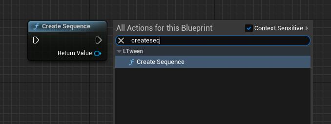
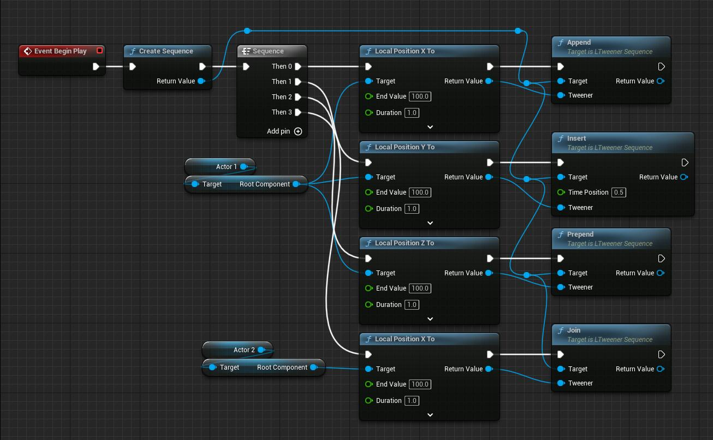

# LTweenerSequence
LTweenerSequence is a tween type that controls a group of other tween animations as a single tween.  

First of all, it is still a tweener, so it inherits normal tweener's all properties and functions. And it has it's own properties and functions too.

## Functions
```c++
/**
 * Adds the given tween to the end of the Sequence.
 * Not support Tweener type: Delay/ DelayFrame/ Virtual.
 * Has no effect if the Sequence has already started.
 */
ULTweenerSequence* Append(UObject* WorldContextObject, ULTweener* tweener);
/**
 * Adds the given interval to the end of the Sequence.
 * Has no effect if the Sequence has already started.
 * @param interval The interval duration
 */
ULTweenerSequence* AppendInterval(UObject* WorldContextObject, float interval);
/**
 * Inserts the given tween at the given time position in the Sequence, automatically adding an interval if needed.
 * Not support Tweener type: Delay/ DelayFrame/ Virtual.
 * Has no effect if the Sequence has already started.
 * @param timePosition The time position where the tween will be placed
 */
ULTweenerSequence* Insert(UObject* WorldContextObject, float timePosition, ULTweener* tweener);
/**
 * Adds the given tween to the beginning of the Sequence, pushing forward the other nested content.
 * Not support Tweener type: Delay/ DelayFrame/ Virtual.
 * Has no effect if the Sequence has already started.
 */
ULTweenerSequence* Prepend(UObject* WorldContextObject, ULTweener* tweener);
/**
 * Adds the given interval to the beginning of the Sequence, pushing forward the other nested content.
 * Has no effect if the Sequence has already started.
 * @param interval The interval duration
 */
ULTweenerSequence* PrependInterval(UObject* WorldContextObject, float interval);
/**
 * Inserts the given tween at the same time position of the last tween added to the Sequence.
 * Note that, in case of a Join after an interval, the insertion time will be the time where the interval starts, not where it finishes.
 * Not support Tweener type: Delay/ DelayFrame/ Virtual.
 * Has no effect if the Sequence has already started.
 */
ULTweenerSequence* Join(UObject* WorldContextObject, ULTweener* tweener);
```
## How to use
### Create a LTweenerSequence
C++:
```c++
auto Sequence = ULTweenBPLibrary::CreateSequence(this);
```
Blueprint:  
Just find **Create Sequence** node under LTween category

### Add other tweener
C++:
```c++
Sequence->Append(this, ULTweenBPLibrary::LocalPositionXTo(Actor1->GetRootComponent(), 100, 1.0f));
Sequence->Insert(this, 0.5f, ULTweenBPLibrary::LocalPositionYTo(Actor1->GetRootComponent(), 100, 1.0f));
Sequence->Prepend(this, ULTweenBPLibrary::LocalPositionZTo(Actor1->GetRootComponent(), 100, 1.0f));
Sequence->Join(this, ULTweenBPLibrary::LocalPositionXTo(Actor2->GetRootComponent(), 100, 1.0f));
```
Blueprint:

### Properties, Events, Functions
**Properties:**
C++:
```c++
Sequence->SetDelay(0.5f);
Sequence->SetEase(LTweenEase::InOutSine);
Sequence->SetLoop(LTweenLoop::Restart, -1);
Sequence->GetLoopCycleCount();
```
Blueprint:

**Events:**
C++:
```c++
Sequence->OnStart([=]{...});
Sequence->OnUpdate([=](float progress){...});
Sequence->OnComplete([=]{...});
Sequence->OnCycleStart([=]{...});
Sequence->OnCycleComplete([=]{...});
```
Blueprint:

**Functions:**
C++:
```c++
Sequence->Pause();
Sequence->Resume();
Sequence->Restart();
Sequence->Goto(0.5f);
```
Blueprint:

