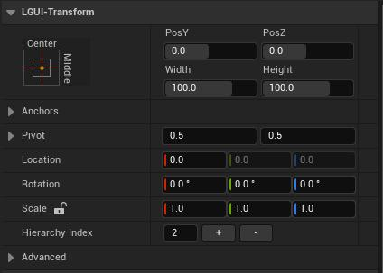
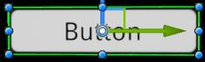
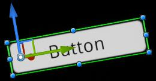
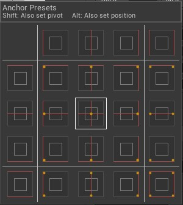
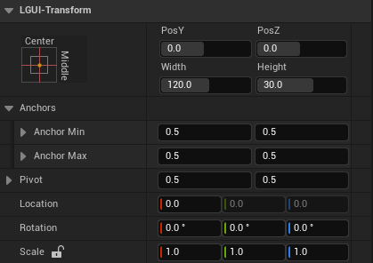

# Basic Layout
In this section we'll look at how you can position UI elements relative to the Canvas and each other. The key is **UIItem** component, consider it as Unity's **RectTransform**.  
**UIContainer** is a actor wrapper of UIItem.

## UIItem
The **UIItem** is the base SceneComponent for all UI elements.  

UIItem have position, rotation, and scale just like regular SceneComponent, but it also have width and height, used to specify the dimensions of the rectangle.  

When select a UI element, some control point should appear in viewport.  

The 8 dots around the rectangle can modify the rectangle's dimensions, the center circle inside the rectangle can modify the rectangle's pivot.

### Pivot
Rotations, size, and scale modifications occur around the pivot so the position of the pivot affects the outcome of a rotation, resizing, or scaling. When click and select the control point of pivot, the pivot of a UIItem can be moved in the viewport.  

### Anchors
UIItem include a layout concept called anchors. If the parent of a UIItem is also a UIItem, the child UIItem can be anchored to the parent UIItem in various ways. For example, the child can be anchored to the center of the parent, or to one of the corners.

In the Details panel, the Anchor Preset button can be found in the upper left corner of the UIItem's LGUI-Transform category. Clicking the button brings up the Anchor Presets dropdown. From here you can quickly select from some of the most common anchoring options. You can anchor the UI element to the sides or middle of the parent, or stretch together with the parent size. The horizontal and vertical anchoring is independent.  

The Anchor Presets buttons displays the currently selected preset option if there is one. If the anchors on either the horizontal or vertical axis are set to different positions than any of the presets, the custom options is shown.

### Anchor and position fields in the Details panel
You can click the Anchors expansion arrow to reveal the anchor number fields if they are not already visible. Anchor Min corresponds to the lower left anchor handle in the viewport, and Anchor Max corresponds to the upper right handle.

The position fields of rectangle are shown differently depending on whether the anchors are together (which produces a fixed width and height) or separated (which causes the rectangle to stretch together with the parent rectangle).  

When all the anchor handles are together the fields displayed are Pos X, Pos Y, Width and Height. The Pos X and Pos Y values indicate the position of the pivot relative to the anchors.

When the anchors are separated the fields can change partially or completely to Left, Right, Top and Bottom. These fields define the padding inside the rectangle defined by the anchors. The Left and Right fields are used if the anchors are separated horizontally and the Top and Bottom fields are used if they are separated vertically.
