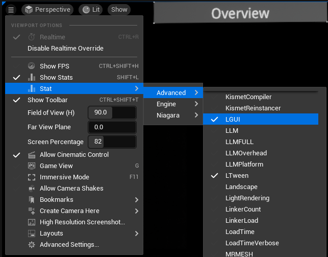
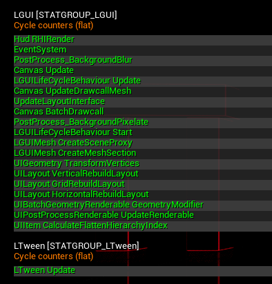

# LGUI Stat
LGUI provide some stat info for quike performance check: *Stat->Advanced->LGUI* and *Stat->Advanced->LTween*:  
  
When it is on, the stat info will show:  
  
There are 4 main items that you should check first, they contains almost all LGUI's cost: **Hud RHIRender**， **Canvas Update**, **EventSystem**, **UpdateLayoutInterface**.

- ## Hud RHIRender
All cost of LGUI Renderer in render thread, contains render mode of ScreenSpaceOverlay and WorldSpace-LGUIRenderer. Not contains WorldSpace-UERenderer, because in WorldSpace-UERenderer mode, LGUI just generate render data (mesh, material) and leave them for UE to render it as normal scene object.

### PostProcess_BackgroundBlur
Render cost of UIBackgroundBlur component.
### PostProcess_BackgroundPixelate
Render cost of UIBackgroundPixelate component.
### LGUIMesh CreateSceneProxy
This happens when LGUIMeshComponent is creating SceneProxy.  
### LGUIMesh CreateMeshSection
This happens when LGUIMeshComponent's SceneProxy is creating mesh section, means LGUI is rebuilding drawcall.  

- ## CanvasUpdate
All cost of LGUI Renderer in game thread, no matter what render mode it is. In game thread, LGUI generate mesh & texture atlas & material & other render resource.

### Canvas BatachDrawcall
LGUICanvas do sort depth, calculate overlap, and batch drawcall.
### UIGeometry TransformVertices
LGUI will collect all created geometry, and transform it's vertices & normals & tangents from UI element's local space to LGUICanvas's local space.  
### UIBatchGeometryRenderable GeometryModifier
GeometryModifier (UIEffectXXX, include TextAnimation) update render geometry in game thread.
### UIPostProcessRenderable UpdateGeometry
UIPostProcessRenderable (UIBackgroundBlur & UIBackgroundPixelate) update render geometry in game thread.

- ## UpdateLayoutInterface
Update all layout object which inherit interface ILGUILayoutInterface, such as UIHorizontalLayout, UIVerticalLayout, UIText...  
### UILayout HorizontalRebuildLayout
UIHorizontalLayout calculation.  
### UILayout VerticalRebuildLayout
UIVerticalLayout calculation.  
### UILayout GridRebuildLayout
UIGridLayout calculation.  

- ## EventSystem
All cost of LGUI's EventSystem in game thread. LGUI will use ray and do raycast, execute event on hit object.

- ## Others
### LGUILifeCycleBehaviour Start
### LGUILifeCycleBehaviour Update
All cost of LGUILifeCycleBehaviour's Update function in game thread.  
