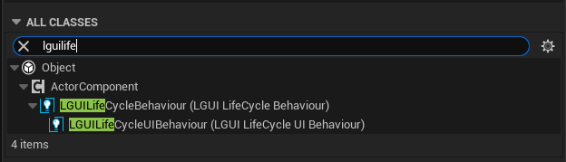

# LGUILifeCycleBehaviour
Since LGUI use a workflow like Unity does, it is recommanded to use LGUILifeCycleBehaviour as base ActorComponent class for most case, espacially in LGUIPrefab.  

When create a Blueprint, typein "LGUILifeCycle" then two class showup, one is LGUILifeCycleBehaviour and the other is LGUILifeCycleUIBehaviour:  

Normally just use LGUILifeCycleBehaviour class, it can fit in most use case. LGUILifeCycleUIBehaviour contains some function/ event just for UI elements.  

## LGUI LifeCycle Behaviour
The life cycle functions of LGUILifeCycleBehaviour are managed uniformly by LGUIManagerActor, and the execution sequence is as follows:  
**Awake -> OnEnable -> Start -> Update -> OnDisable -> OnDestroy**  
**Awake**: LGUILifeCycleBehaviour is executed once when it is loaded into the scene and the IsUIActive of UIItem is true. If LGUILifeCycleBehaviour is created from Prefab, then **initialization work needs to be placed in Awake (not BeginPlay)**, because Awake will execute after all prefab deserialization work is completed.  
**OnEnable**: Execute when GetIsActiveAndEnable of LGUILifeCycleBehaviour changes from false to true.  
**Start**: Execute Start before the first Update is executed.  
**Update**: When GetIsActiveAndEnable is true, it will be executed once every frame.  
**OnDisable**: Execute when GetIsActiveAndEnable of LGUILifeCycleBehaviour changes from true to false, or execute once before OnDestroy and OnEnable has been executed.  
**OnDestroy**: Execute once when LGUILifeCycleBehaviour is destroyed (EndPlay) and Awake has been executed.  
Awake/Start/OnDestroy can be executed only once in the whole life cycle, and OnEnable/OnDisalbe/Update may be executed multiple times.  
GetIsActiveAndEnable: Returns true when IsUIActive of UIItem is true and enable of LGUILifeCycleBehaviour is true.  

Execute order with the UnrealEngine's built-in life cycle function: BeginPlay -> Awake ... OnDestroy -> EndPlay, the Tick function has nothing to do with the Update function.  

### Other functions
**GetRootSceneComponent**: Shotcut and cache for GetOwner->GetRootComponent.  

## LGUI LifeCycle UI Behaviour
**OnUIActiveInHierarchy**: Called when RootUIComp IsActiveInHierarchy state is changed.
**OnUIDimensionsChanged**: Called when RootUIComp->AnchorData is changed.
**OnUIChildDimensionsChanged**: Called when RootUIComp's attachchildren->AnchorData is changed.
**OnUIChildAcitveInHierarchy**: Called when RootUIComp's attachchildren IsActiveInHierarchy state is changed.
**OnUIAttachmentChanged**: Called when RootUIComp attach to a new parent.
**OnUIChildAttachmentChanged**: Called when RootUIComp's attachchildren is attached to RootUIComp or detached from RootUIComp.
**OnUIInteractionStateChanged**: Called when RootUIComp's interaction state changed (when UICanvasGroup component allow interaction or not).
**OnUIChildHierarchyIndexChanged**: Called when RootUIComp's attachchildren->SetHierarchyIndex() is called, usually used for layout to sort children.
### Other functions
**GetRootUIComponent**: Shotcut and cache for GetOwner->GetRootComponent->ConvertTo UIItem

