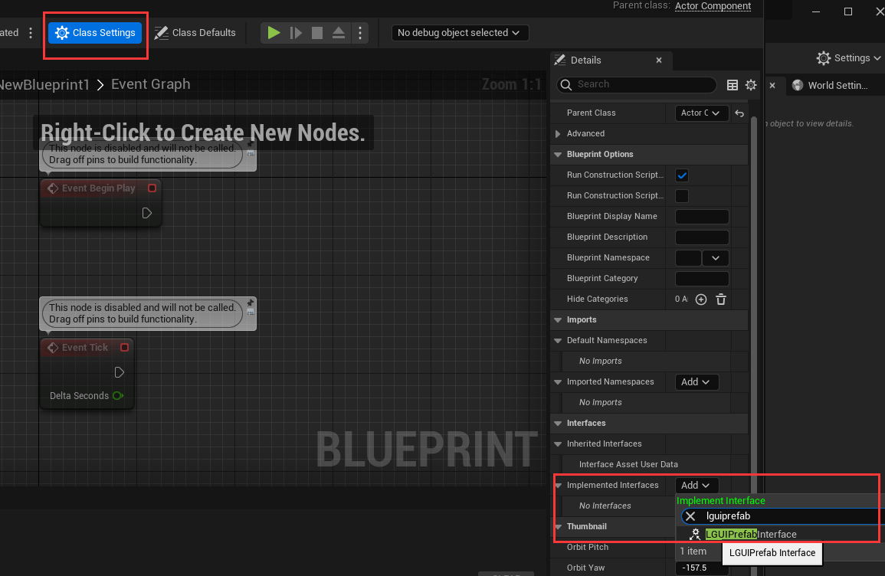
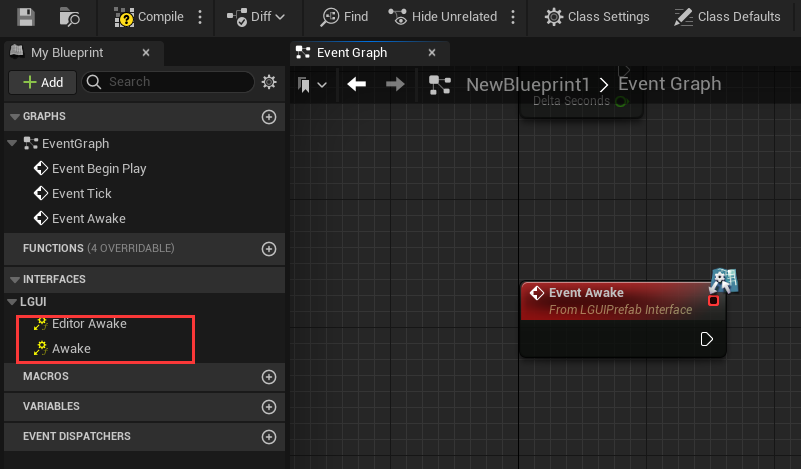

# LGUIPrefabInterface
This interface provide **Awake** function for Actor and ActorComponent that managed inside LGUIPrefab.  
Open a blueprint Actor or ActorComponent, click on "Class Settings", in the "Implemented Interfaces" area click "Add" button and typein *LGUIPrefabInterface*:

Then two functions will appear on "Interfaces" area:  
**Awake**: Called when LGUIPrefab finish load. This is called late than BeginPlay. 
**EditorAwake**: Same as *Awake* function but only execute in edit mode.

**NOTE!!!**
Awake execute order in prefab: deeper and lower in hierarchy will execute earlier, so scripts on root actor will execute latest. Actor execute first, then execute on component. And this Awake is execute later than LGUILifeCycleBehaviour's Awake when in same prefab.