# LGUI Prefab
Prefabs are collections of actors that can be stored in an asset and instanced into a level, it is not limited on UI element, you can use almost all actor types in LGUIPrefab.

Quite often when constructing a level you want to create some arrangement of actors, and then re-use that collection in the same or other levels. An example might be a torch, which consists of some static meshes and some lights. Prefabs allows you to create this kind of collection once, and then save it in as a Prefab asset. You can then select the Prefab in the Content Browser, and add it many times through the level.

Prefabs can have changes made to them in a level, and those changes can then be propagated to all existing instances of that Prefab. Because this uses Unreal's property system, only properties still at their original prefab defaults will be updated when the Prefab changes. For example, imagine you have a Prefab that contains a yellow light, and you then change one instance of the Prefab to have a blue light. Then you change the Prefab itself to have a green light. Only instances who's light is still yellow will have the color changed to green. This is very useful, as it allows you modify, or even remove, parts of a Prefab instance to make it fit a particular usage, but also receive updates to the Prefab.

## Create a Prefab
To create a new Prefab, first attach the actors to a single root actor in the level:  

Then select the root actor, right-click on LGUI column and choose **Create Prefab** from the context menu.  

Then a dialog window will show, you can choose a place and name to save the asset:  

Click "Save" and then a Prefab asset will appear in content folder, and the actors of this prefab will show "Prefab" icon on the LGUI column:  
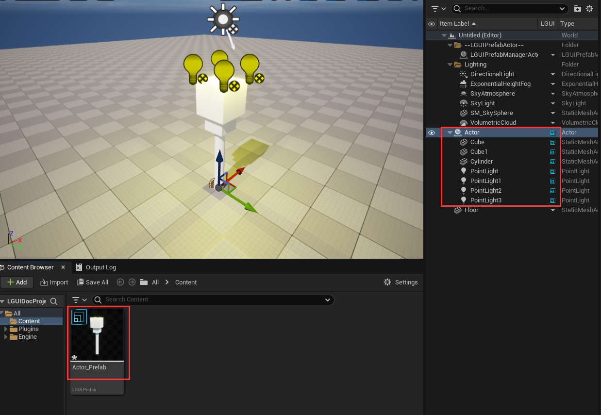
Now we can delete the actors in level. Right-click on LGUI column of root actor and choose "Destroy Actors":  
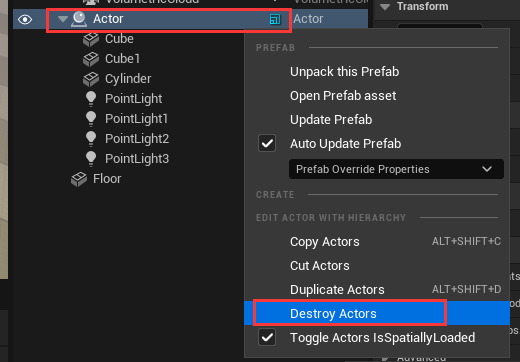

## Edit Prefab
There are two ways to eidt/modify existing prefabs.  

### Edit Prefab in LGUI-Prefab-Editor
Just double-click the Prefab asset and will bring-up a LGUI-Prefab-Editor window:
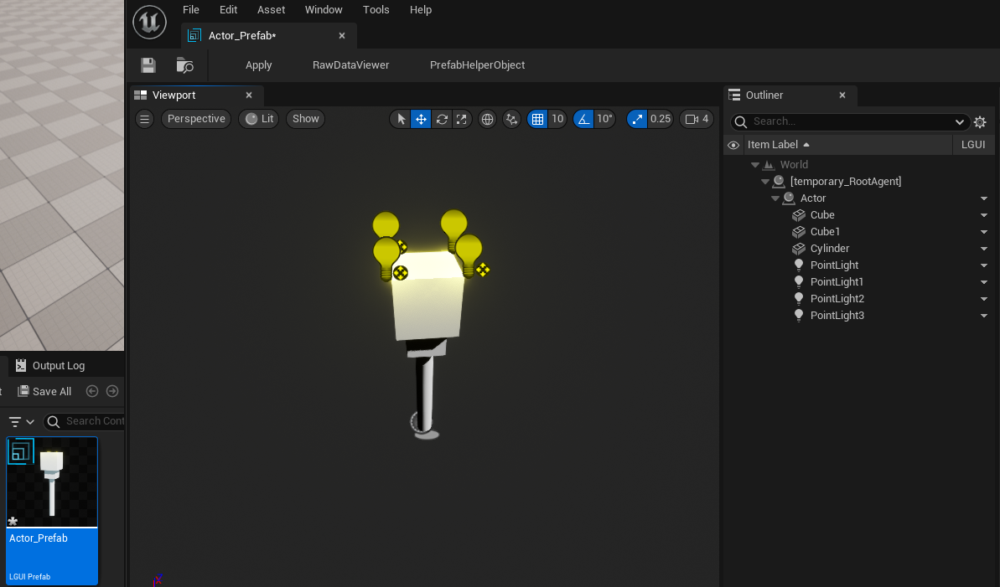
*LGUI will automatically create a root actor named "[temporary_RootAgent]", as the name means this actor is temporary created just as a root holder.*  
In the LGUI-Prefab-Editor window, you can do anything you want to edit/modify the prefab. Lets edit something for example.  

Select "Cube" actor and right-click on LGUI column then select "Create Actor"->"All Actors" then typein "StaticMesh", this will create a StaticMeshActor under "Cube" actor:  
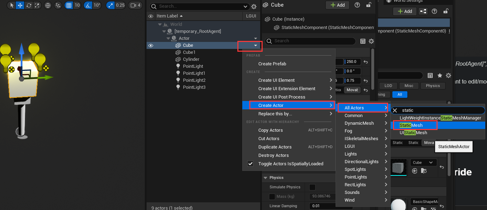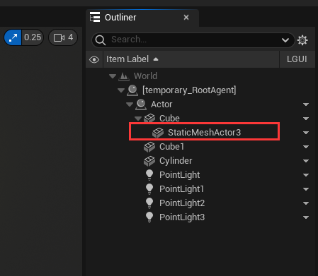
Rename the actor to "Sphere" and assign a sphere static mesh to it:  
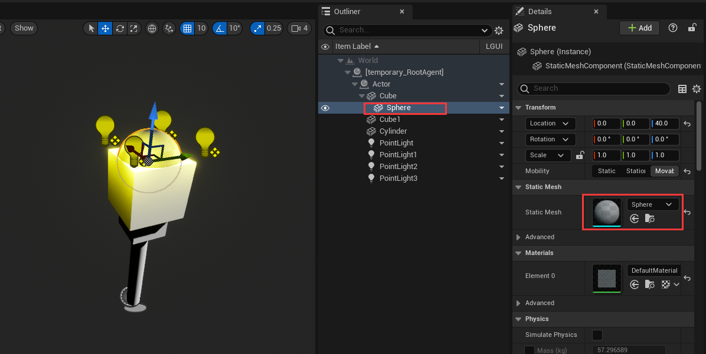

Now the important part, click-on "Apply" button on the left-top size of the editor window:  
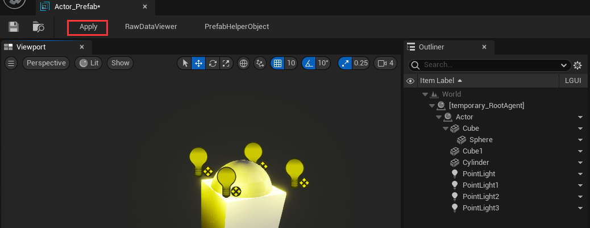

The "Apply" button will save your changed properties to Prefab asset, so always rememeber to hit it.  

See [PrefabEditor](./../PrefabEditor/)

### Edit Prefab in Level-Editor
Drag your Prefab asset and drop it in Level-Editor's viewport, this will create an instance of the Prefab asset:
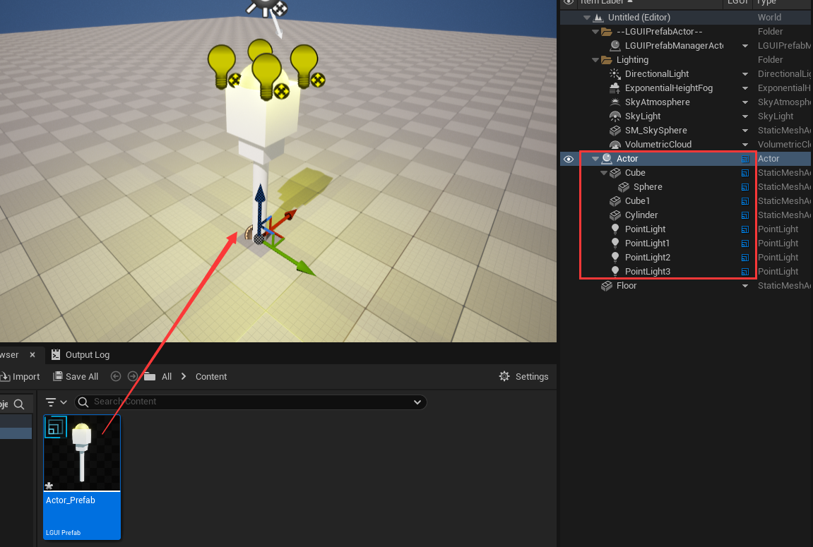
*Note, if you select an actor in Level-Editor then drag-drop the Prefab, then the created Prefab instance will attach to the selected actor.*

When edit a Prefab instance in Level-Editor, LGUI actually consider it as a Sub-Prefab, so features and limititions are same, see *Nested Prefab and Property Override* section below.

### Delete Prefab in Level-Editor
Select the root actor of your Prefab instance in Level-Editor, then right click on LGUI column in outliner, and click "Destroy Actors":  
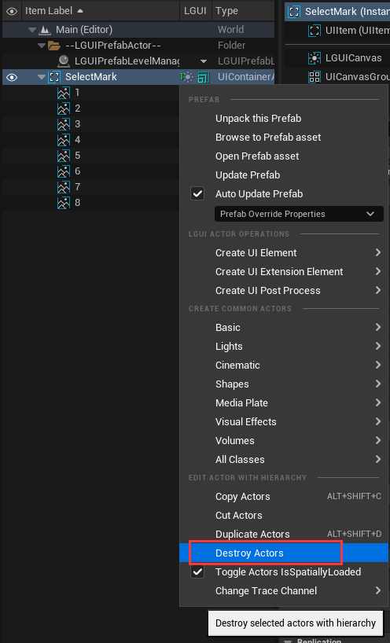

**NOTE!!! The "Destroy Actors" can destroy selected actors with it's attached children actors.**  

## Load Prefab at runtime
LGUIPrefab provide a some function to load it at runtime, you can easily call it in Blueprint and c++:
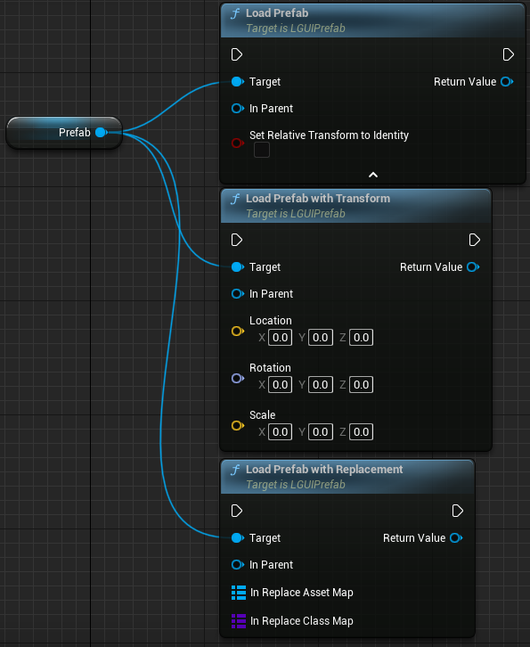
**LoadPrefab**: Most commonly used function
- InParent: Provide a SceneComponent as parent, so the loaded Prefab's root actor will attach to the parent.
- SetRelativeTransformToIdentity: true- Reset the loaded Prefab's root actor's transform value; false- Keep origin value.
**LoadPrefabWithTransform**: Replace the loaded Prefab's root actor's transform value with provided one.  
**LoadPrefabWithReplacement**: This function give us an opportunity to replace the Prefab's referenced assets or class before load the Prefab. Useful in the case that, we create a PrefabA, and a component CompA at the root actor to manage the PrefabA, then we create a CompB which have the same properties as CompA, but with different function implementation, then we can use this function to load PrefabA and replace class from CompA to CompB; But remember, Prefab serialize depend on UProperty, so CompA and CompB must have same UProperty.  
- InReplaceAssetMap: Map from asset to another, maybe a static mesh.  
- InReplaceClassMap: Map from class to another, in the above example, we can map CompA to CompB.

Lets have a test. Create a ActorBlueprint with name "TestLoad", open it in BlueprintEditor, add variable with name "Prefab" and type "LGUIPrefab", assign the Prefab asset we just created above, link the node like the shot:
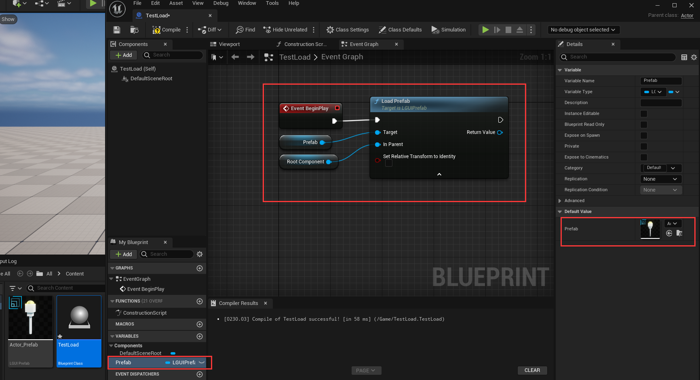
Now drag the actor "TestLoad" to LevelEditor's viewport then hit play, you will see the Prefab is successfully loaded and attach to "TestLoad" actor:
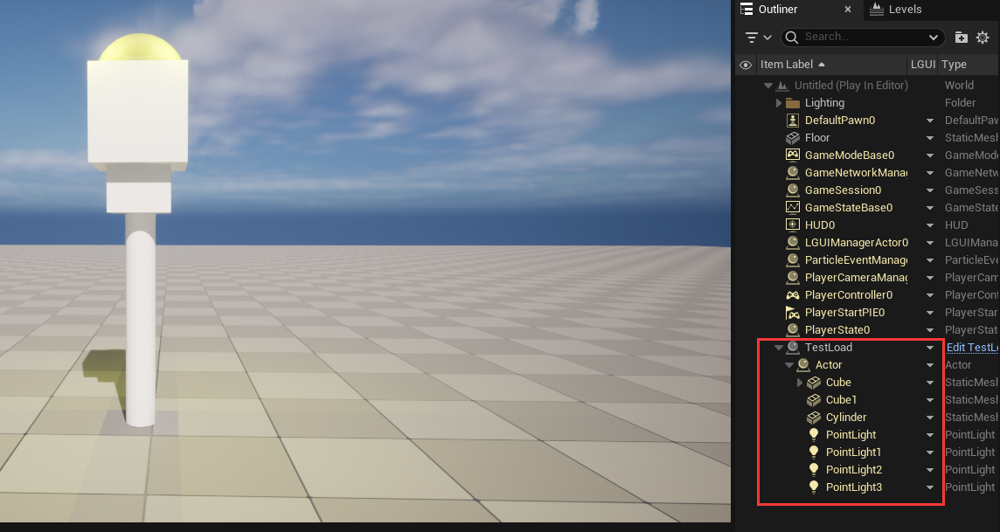

### Initialize when load Prefab at runtime
LGUIPrefab use it's own serialization policy and it is late than "BeginPlay" execution, so properties are not ready when "BeginPlay", so a replacement for "BeginPlay" must use to do the initialization job.  
LGUIPrefab provide two ways to achieve this: 
- [**LGUILifeCycleBehaviour**](./../LGUILifeCycleBehaviour/): You can create a ActorComponent extend from LGUILifeCycleBehaviour, and attach the component to your actor inside Prefab.
- [**LGUIPrefabInterface**](./../LGUIPrefabInterface/): Both Actor and ActorComponent can implement this interface.

Lets have a test. Create a ActorComponent implement from LGUILifeCycleBehaviour with name "TestInitialize", open it in BlueprintEditor, you will see "Awake" event is created by default:
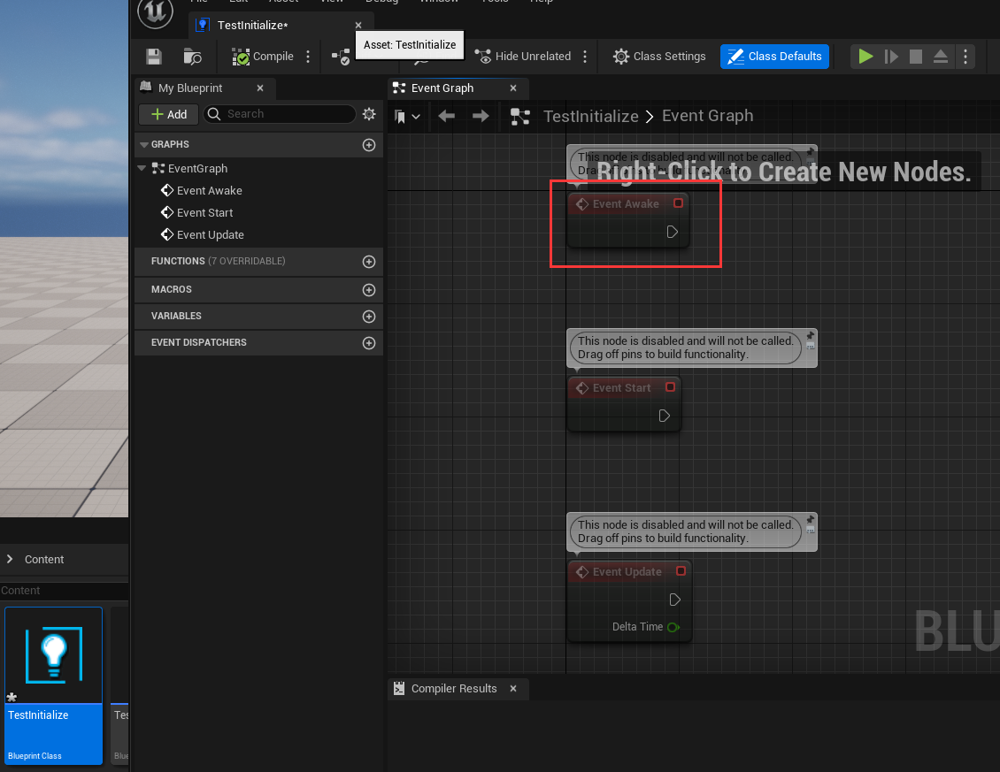
Drag out from "Awake" and link a "PrintString" node:
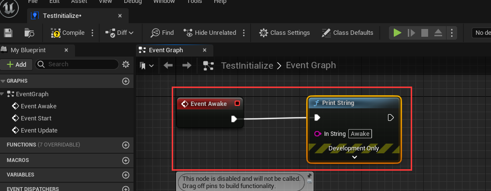
Double click on your Prefab asset to open LGUI-Prefab-Editor, and drag TestInitialize component to any actor in prefab, then hit "Apply":
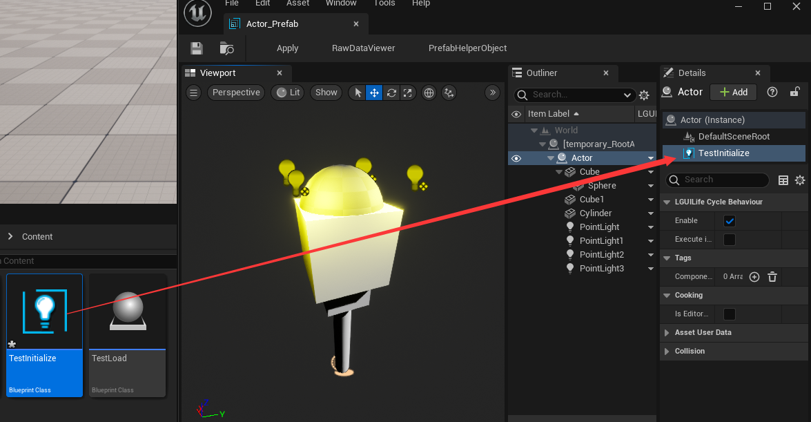
Now hit play and you will see printed info right after the Prefab is loaded.  

### Delete Prefab instance at runtime
Prefab instance is just a collection of actors, so all we need to do is delete these actors. LGUI provide a simple function to do it "Destroy Actor with Hierarchy", just use it with the loaded prefab's root actor:
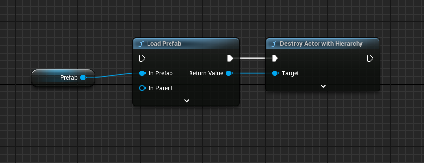

## Nested Prefab and Property Override
Nested Prefab means you can include Prefab instances inside other Prefabs. Nested Prefabs retain their links to their own Prefab Assets, while also forming part of another Prefab Asset.  
How to create a nested Prefab? This is simple, double click on Prefab asset to open a LGUI-Prefab-Editor, click a actor to select it as parent, then drag another prefab to the LGUI-Prefab-Editor's viewport, then you will find a instance of Prefab is created inside LGUI-Prefab-Editor:
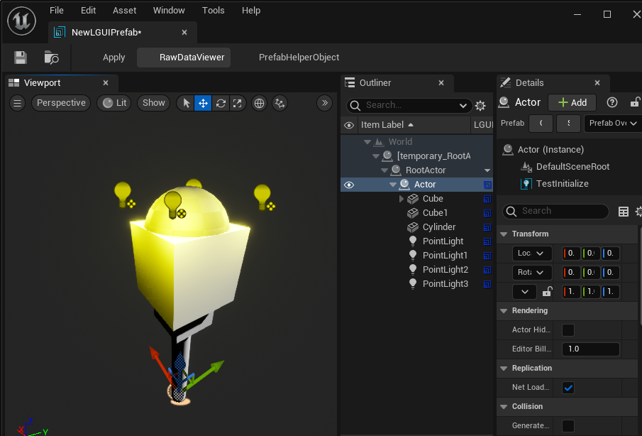
Prefab can maintain it's default property, and track changed property values for later *Apply* or *Revert*. 
For example, if I change the light color to red:
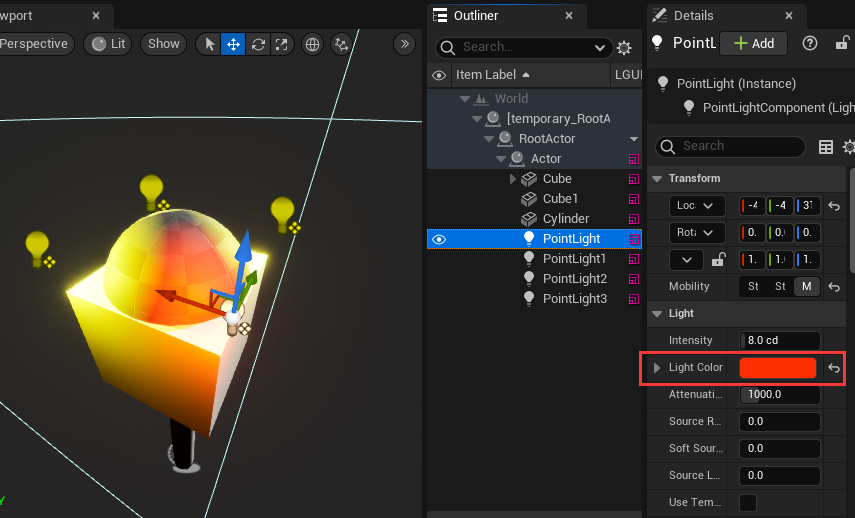
Goto Sub-Prefab's root Actor and right click LGUI column in outliner, you will find "Prefab Override Properties", click it and you can see the modified property:
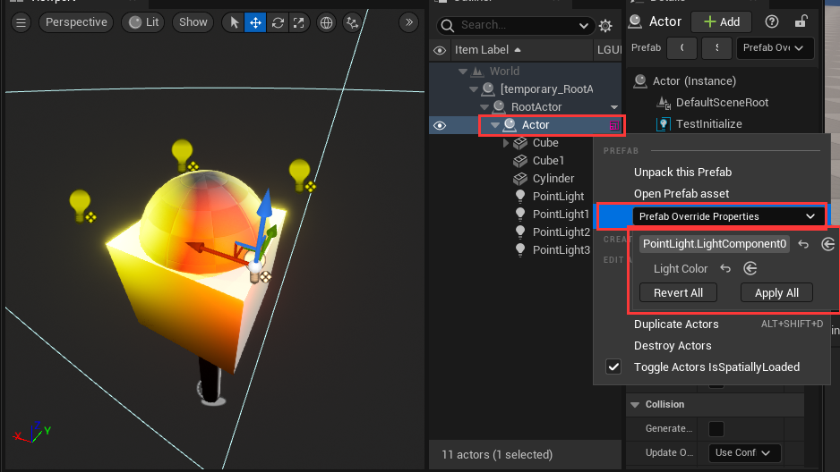
You can *Revert* the modified property to Sub-Prefab's default value, or *Apply* the value to change the Sub-Prefab's default value.  

There are some limitations when edit Sub-Prefab:
- Can't delete or remove Actor.
- Can't delete or remove ActorComponent.
- Can't change Actor's attachement.

If we try to attach a actor to another, a message will showup to prevent it:
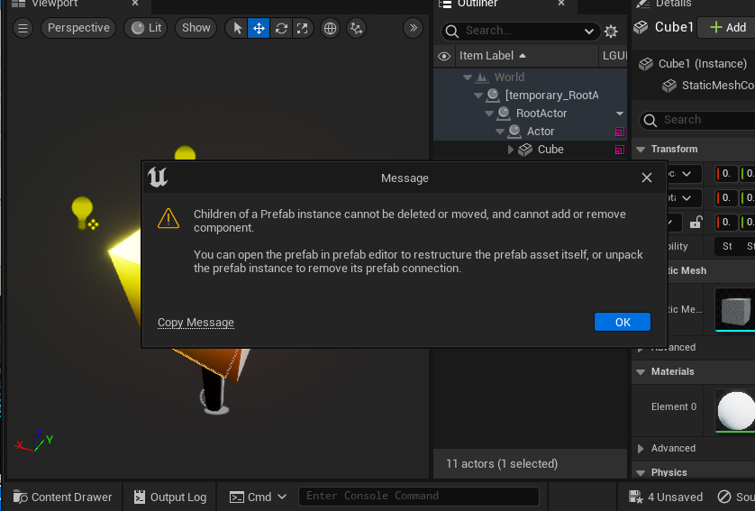
