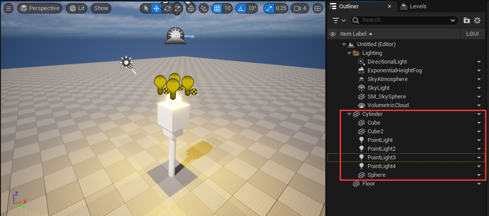
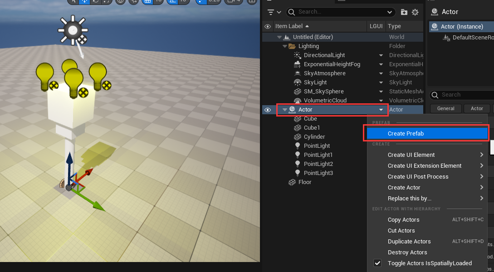

# LGUI Prefab
Prefabs are collections of actors that can be stored in an asset and instanced into a level, it is not limited on UI element, it use almost all actor types in LGUIPrefab.

Quite often when constructing a level you want to create some arrangement of actors, and then re-use that collection in the same or other levels. An example might be a torch, which consists of some static meshes and some lights. Prefabs allows you to create this kind of collection once, and then save it in as a Prefab asset. You can then select the Prefab in the Content Browser, and add it many times through the level.

Prefabs can have changes made to them in a level, and those changes can then be propagated to all existing instances of that Prefab. Because this uses Unreal's property system, only properties still at their original prefab defaults will be updated when the Prefab changes. For example, imagine you have a Prefab that contains a yellow light, and you then change one instance of the Prefab to have a blue light. Then you change the Prefab itself to have a green light. Only instances who's light is still yellow will have the color changed to green. This is very useful, as it allows you modify, or even remove, parts of a Prefab instance to make it fit a particular usage, but also receive updates to the Prefab.

## Create a Prefab
To create a new Prefab, first attach the actors to a single root actor in the level:  

Then select the root actor, right-click and choose **LGUI Editor Tools -> Create Prefab** from the context menu.

Then a dialog window will show, you can choose a place and name to save the asset:  

## Nested Prefab and Property Override
