# LGUICanvas

The **LGUICanvas** is the area that all LGUI's elements should be inside. LGUICanvas is a UIContainerActor with a LGUICanvas component on it, all UI elements must be children of LGUICanvas in hierarchy.  

## Draw order of elements
All UI elements have property **HierarchyIndex**, which represent the draw order of it. By default a *InfoColumn* named "LGUI" should appear in *Outliner* (if not appear, make sure the **Show LGUI column in SceneOutliner** is checked in "LGUI Editor Tools"), when click it the order in *Outliner* will sorted as LGUI's definition, which is LGUI's render order.
So UI elements in LGUICanvas are drawn in the same order they appear in the *SceneOutliner*. The first child is drawn first, the second child next, and so on. If two UI elements overlap, the later one will appear on top of the earlier one.  

To change which element appear on top of other elements, simply reorder the elements in the *SceneOutliner* by change the **HierarchyIndex** property (directly set the value, or click "+"/"-" button beside it). The order can also be controlled from scripting by using these methods on the UIItem component: **SetAsFirstHierarchy**, **SetAsLastHierarchy**, and **SetHierarchyIndex**.  

There is a **SortOrder** property on LGUICanvas, which always have greater priority then HierarchyIndex. If you want to change it, simply check **OverrideSorting** property and set the value. The **SortOrder** can also be controlled from scripting by using these methods on LGUICanvas component: **SetSortOrderToHighestOfHierarchy**, **SetSortOrderToLowestOfHierarchy**, and **SetSortOrder**.  
  
## Create a LGUICanvas
LGUICanvas must stay on a actor which have a UIItem as RootComponent, UIContainer actor is good to use. 
Create a new empty level, drag a UIContainerActor to viewport:
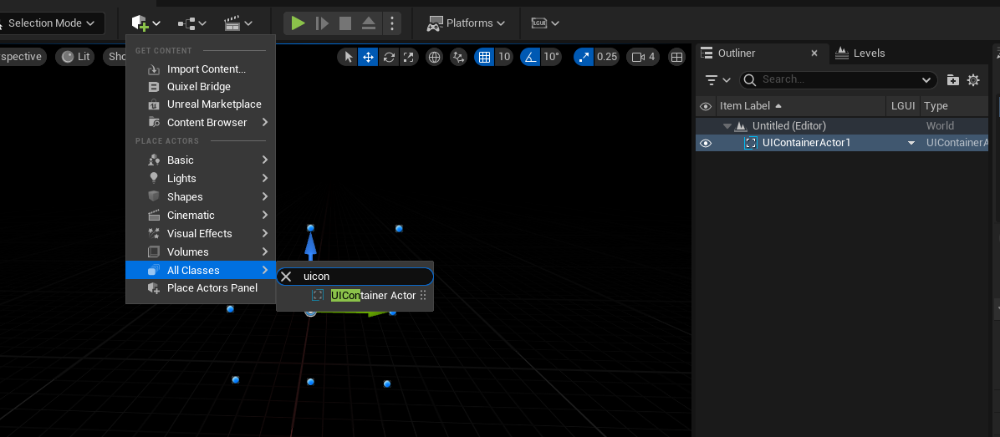

Rename the UIContainer to "RootCanvas", set the "LGUI Transform" parameters like this (Width: 1280, Height: 720):
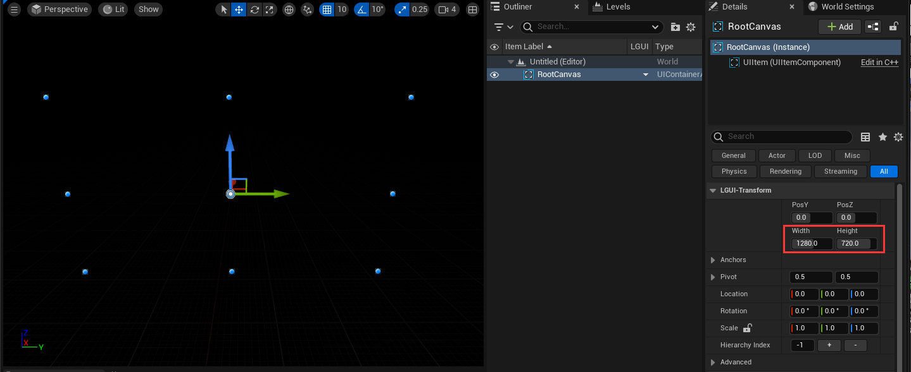

Add a LGUICanvas component to "RootCanvas", notice a icon and a text "0" appear beside "RootCanvas" in Outliner:
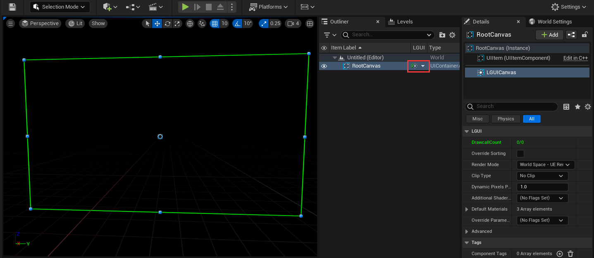
Move your mouse over the icon, a tooltip will appear:
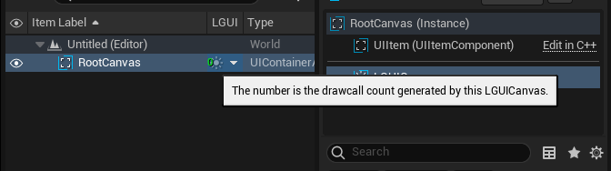

Right click on the down arrow button right beside "RootCanvas" and choose "Create UI Element"->"UISprite":
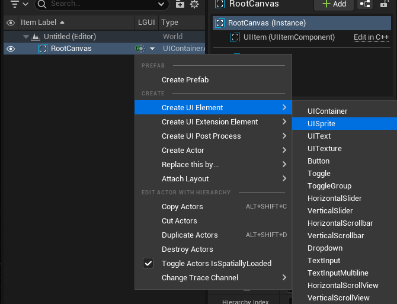

A new UISpriteActor will be created, see a green rectangle appear in viewport, and number of drawcall become 1 in "RootCanvas". Rename the UISpriteActor to "Sprite":
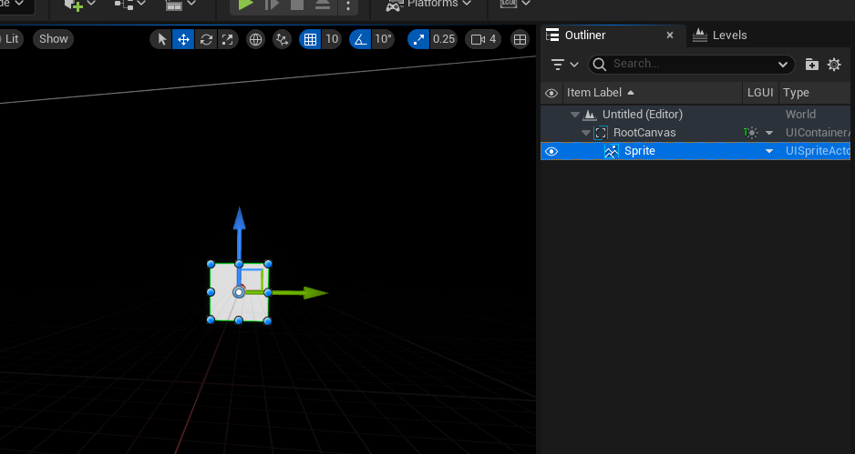

Right click on the down arrow button right beside "RootCanvas" and choose "Create UI Element"->"UIText":
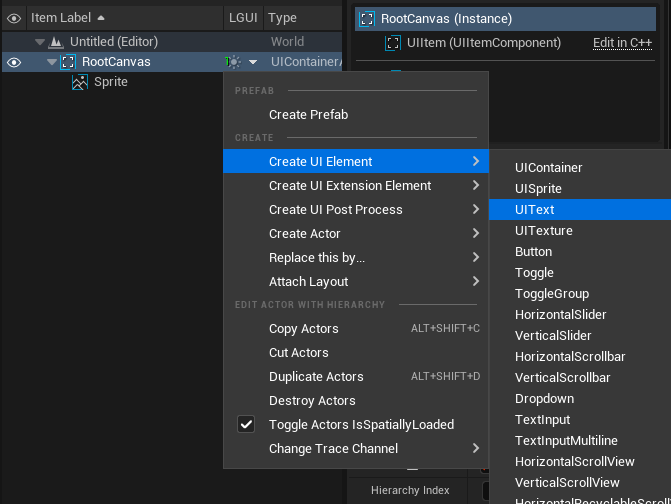

Rename the UITextActor to "Text", "Color" to black. See "New Text" appear on viewport, and drawcall count become 2:
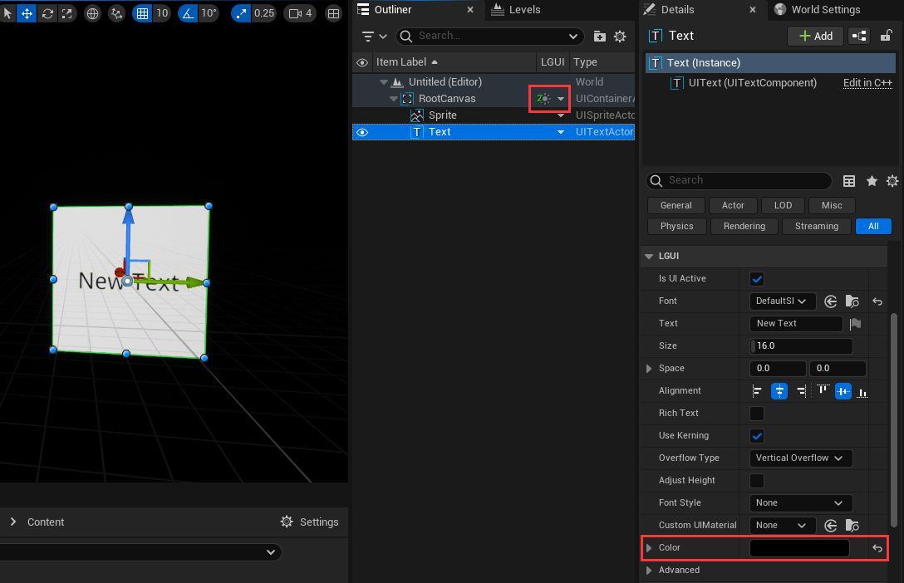

## Use rect clip
Select "Sprite", change width to 1920, height to 1080, see the white rectangle exceed canvas area:
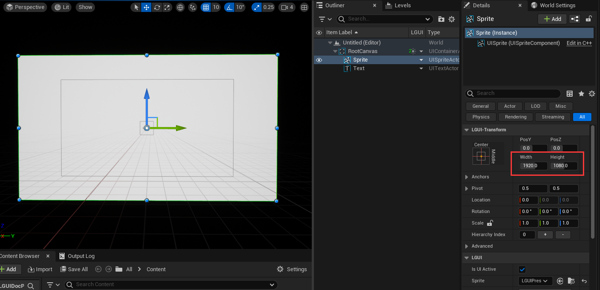

Select LGUICanvas component from "RootCanvas" actor, change "Clip Type" to "Rect", see the Sprite being clipped by canvas's rect area:
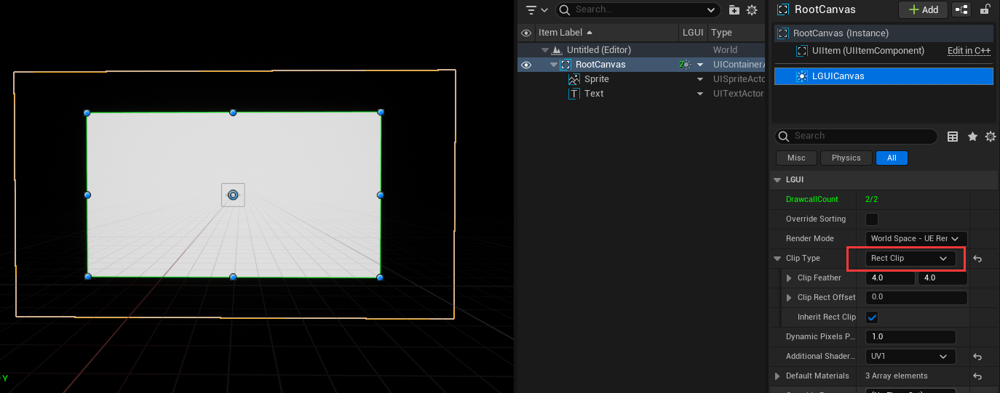

**LGUICanvas support hierarchy nested RectClip**  
Lets add a sub canvas: create a UIContainer, name it "SubCanvas", add a LGUICanvas component to it. Then drag "Sprite" and "Text" to "SubCanvas" as children, now the hierarchy should be like this:
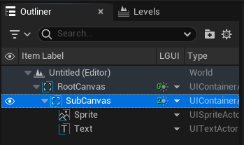

Select LGUICanvas component on "SubCanvas", click on "Override Parameters" and check on "Clip Type", then "Clip Type" parameter will appear. Since the default parameter is "No Clip", the while area of "Sprite" is fully appear without clip effect:
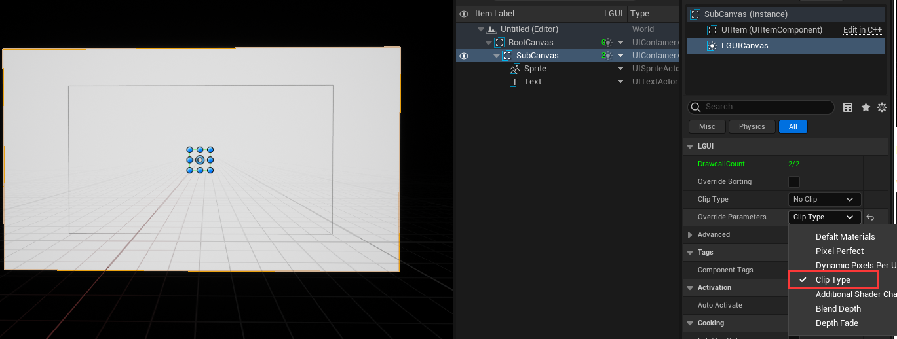

Select LGUICanvas component on "SubCanvas", change "Clip Type" to "Rect Clip", then select UIItem component and change with to 640 height to 360:
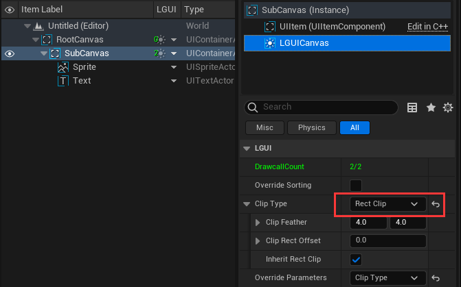 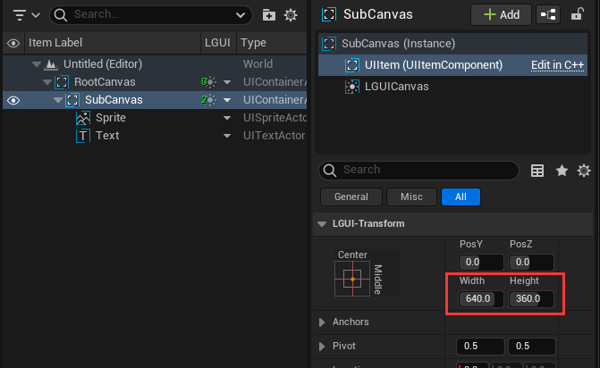

Drag the "SubCanvas" around to see the clip effect:
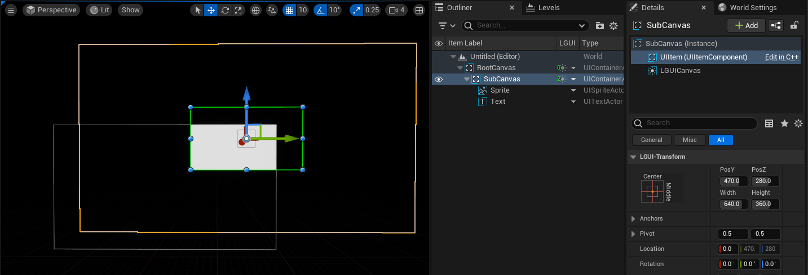
