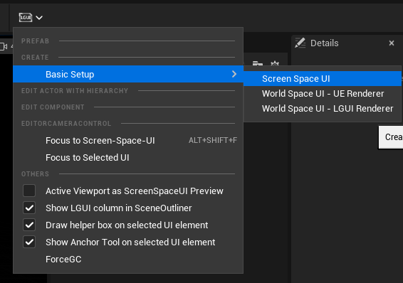
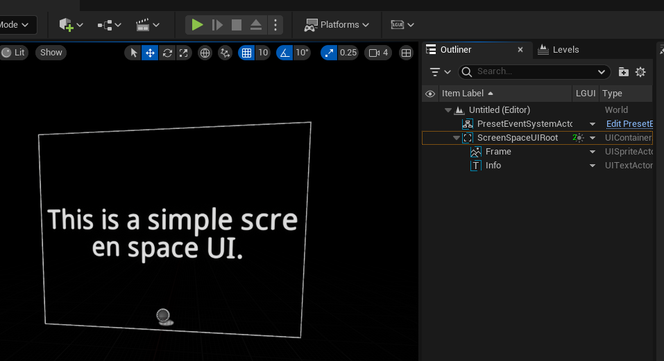
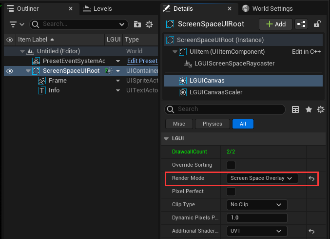
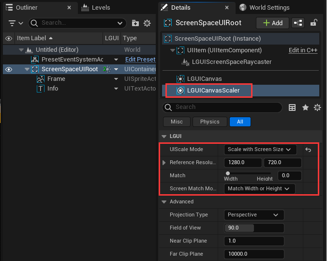
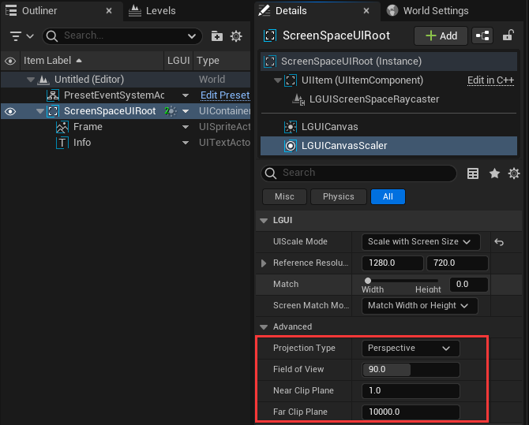

# Screen Space Overlay

LGUI render **Screen Space Overlay** UI direct to viewport after UnrealEngine render the world.

## Create
Select "LGUI Editor Tools"->"Basic Setup"->"Screen Space UI":

Then a "ScreenSpaceUIRoot" will be created, along with some default actor (PresetEventSystemActor, Frame, Info):

Select LGUICanvas component, you will see the "Render Mode" is "Screen Space Overlay":

## LGUICanvasScaler
There is another important component on "ScreenSpaceUIRoot" is the "LGUICanvasScaler" component, you can change these parameters of LGUICanvasScale to make the UI fit different resolutions:

And these parameters can change camera parameters that render the ScreenSpaceUI:

## NOTE!!!
Only one "Screen Space UI Root" can exist in one world.
