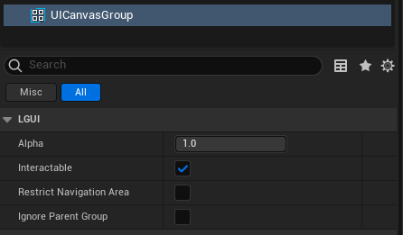

# UICanvasGroup

The **UI Canvas Group** can be used to control certain aspects of a whole group of UI elements from one place without needing to handle them each individually. The properties of the UICanvasGroup affect the UI element it is on as well as all children.  

## Properties
|Property:|Function:
|-|-
|Alpha|The opacity of the UI elements in this group. The value is between 0 and 1 where 0 is fully transparent and 1 is fully opaque. Note that elements retain their own transparency as well, so the UICanvasGroup alpha and the alpha values of the individual UI elements are multiplied with each other.
|Interactable|Determines if this component will accept input. When it is set to false interaction is disabled.
|RestrictNavigationArea|When use navigation input (keyboard or gamepad navigation), restrict navigation area to only children of this UI element when navigate out.
|IgnoreParentGroup|Will this group also be affected by the settings in UICanvasGroup components further up in the UI element hierarchy, or will it ignore those and hence override them?

## Details
Typical uses of UICanvasGroup are:

- Fading in or out a whole window by adding a UICanvasGroup on the UI actor of the Window and control its Alpha property.
- Making a whole set of controls non-interactable ("grayed out") by adding a UICanvasGroup to a parent UI actor and setting its Interactable property to false.
