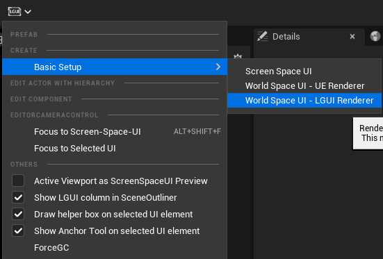
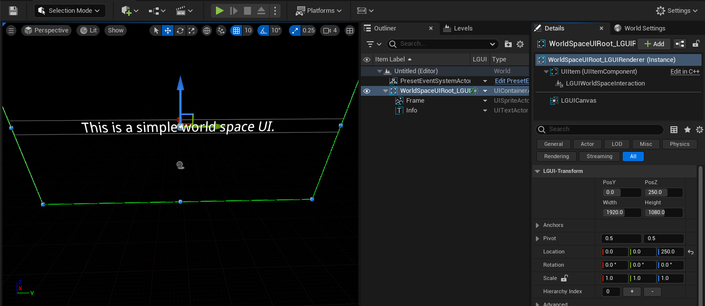
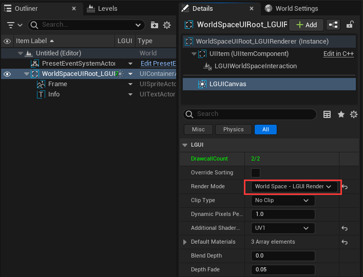
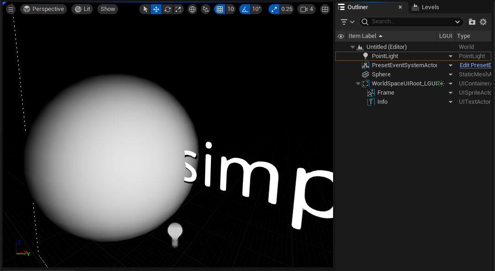
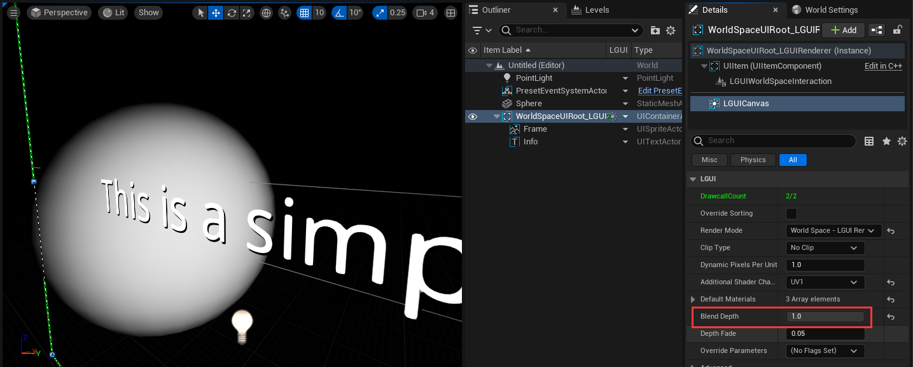

# World Space - LGUI Renderer

**World Space - LGUI Renderer** use LGUI's render pipeline, elements render direct to viewport after UnrealEngine render the world, not affected by post-process. 

## Create
Select "LGUI Editor Tools"->"Basic Setup"->"World Space - LGUI Renderer":

Then a "WorldSpaceUIRoot_LGUIRenderer" will be created.:

Select LGUICanvas component, you will see the "Render Mode" is "World Space - LGUI Renderer":

## Blend depth with existing scene objects
LGUI can take depth buffer texture, sample it and compare with current rendering UI elements's depth value, and do depth blend.
Create a Sphere object, move and scale it so that it can occlude with existing UI elements, and create a light to make the level look better.
By default this feature is enabled, so you can see the UI is occluded by the sphere:

Select LGUICanvas component, change "Blend Depth" parameter value to 1.0:

So the "Blend Depth" parameter can control how much visible if UI elements is occluded by a scene object.
**This feature only support opaque object, and not work on mobile platform.**
