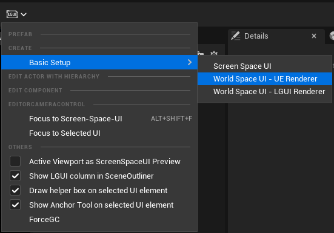
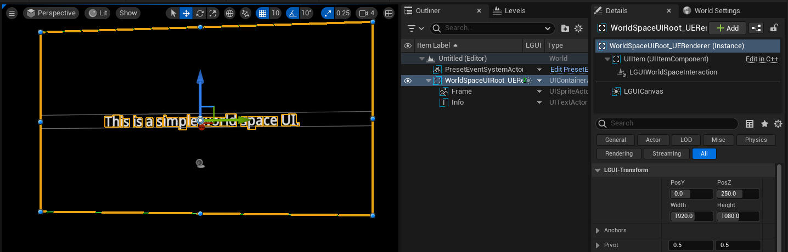
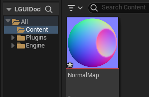
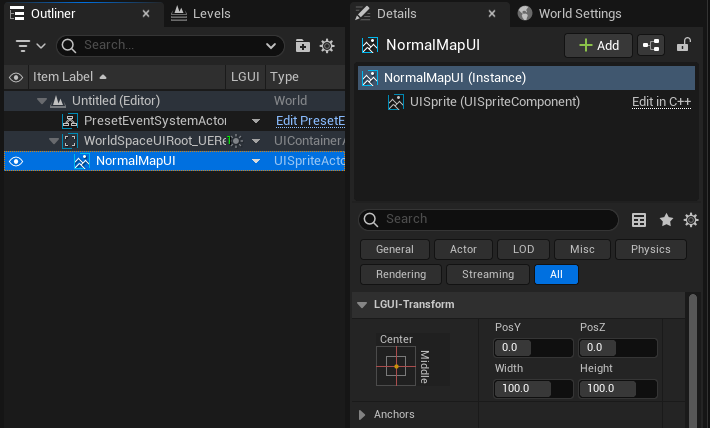
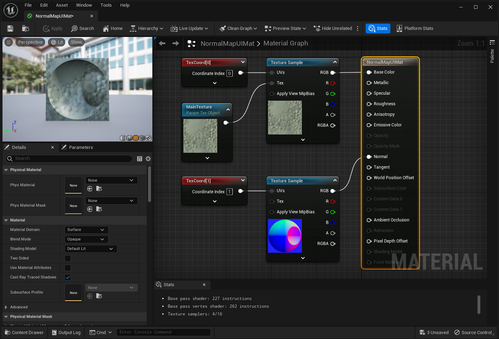
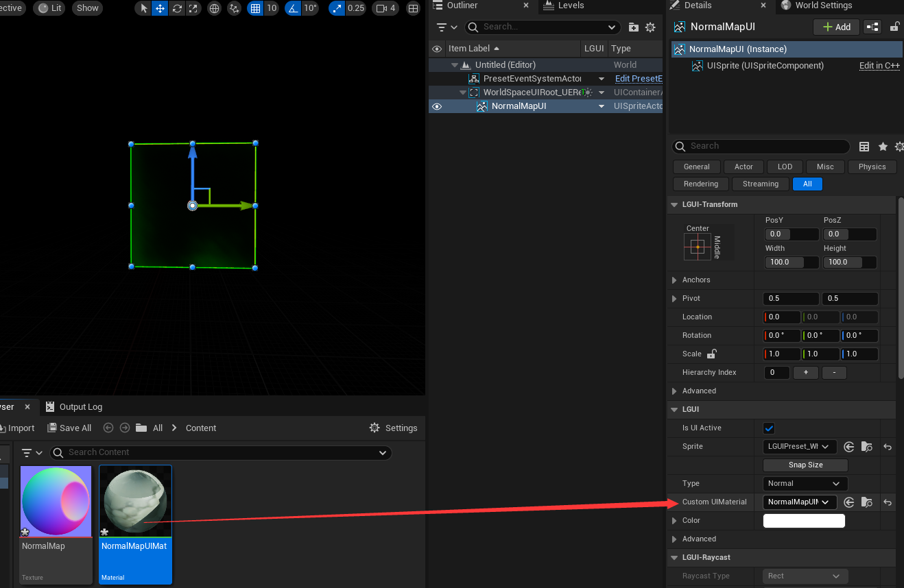
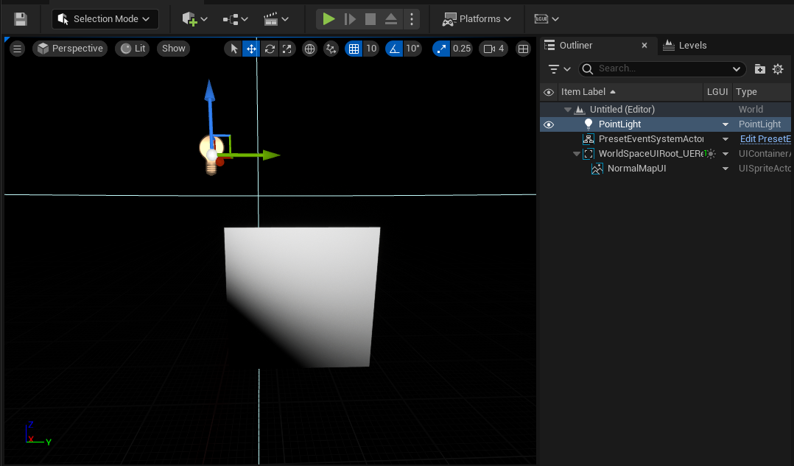
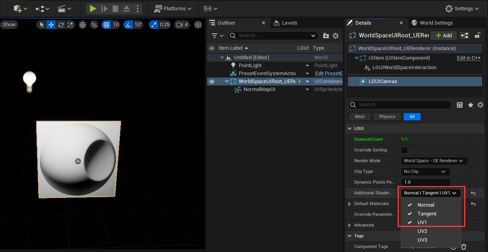
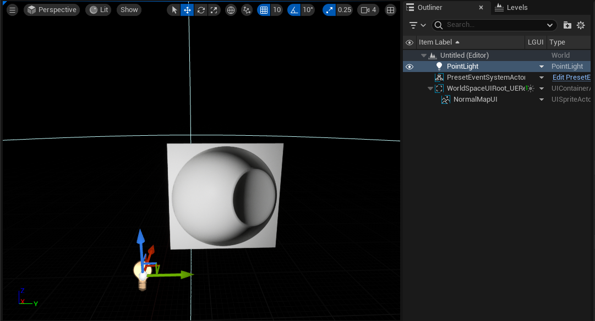

# World Space - UE Renderer

**World Space - UE Renderer** use engine's default render pipeline to render UI elements. By default UI elements will be treated as transparent meshes, so the UI will be affected by post-process.  

## Create
Select "LGUI Editor Tools"->"Basic Setup"->"World Space - UE Renderer":

Then a "WorldSpaceUIRoot_UERenderer" will be created:

## Use lighting and normalmap
Prepare a normal map:

Drag the normal map to content folder:

Delete "Frame" and "Info" actor, right click the down arrow button and choose "Create UI Element"->"UISprite", and name it "NormalMapUI":

Create a new material, name it "NormalMapUIMat", make it a very simple material like this:

**UISprite take texcoord0 as packed atlas uv**, so we use texcoord1 as uv input.  
**UISprite will use the atlas texture and set to MainTexture parameter in material**.

Select "NormalMapUI" actor, find "Custom Material" property, and drag the "NormalMapUIMat" to "Custom Material":

Create a light in the level if these is no one present:

The "NormalMapUI" looks not correct in the viewport. Because by default, LGUI only set the first texcoord and no normal or tangent data, so we need to tell LGUICanvas to provide more data, by check the "Additional Shader Channels" flags:

Now adjust light angle and position, see the bumped surface on UI:

Check [SampleProject](https://github.com/liufei2008/LGUISampleProject) on github, you will find more infomation about lighing on 3D UI:
