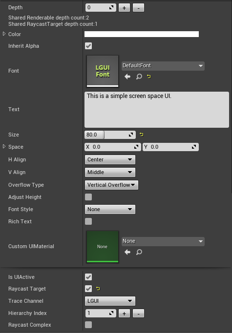
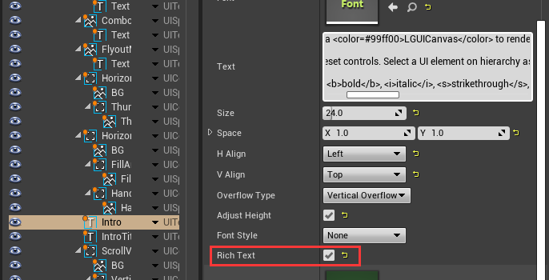

# UIText

UIText can render UE4's text/string with LGUIFont.
**Properties**

|Property:|Function:|
|:-|:-|
|Font|The Font used to display the text.|
|Text|The text displayed by the control.|
|Size|The size of the displayed text.|
|Space|The horizontal and vertical separation between characters.
|H Align|The horizontal alignment of the text.
|V Align|The vertical alignment of the text.
|Overflow Type|The method used to handle the situation where the text is too wide or too tall to fit in rectangle. The options are *Horizontal Overflow* and *Vertical Overflow* and *Clamp Content*.
|Adjust Width|Valid when *Overflow Type* is *Horizontal Overflow*. Set the rectangle's width to real with of text content.
|Adjust Height|Valid when "Overflow Type* is *Vertical Overflow*. Set the rectangle's height to real height of text content.
|Font Style|The style applied to the text. The options are *None*, *Bold*, *Italic*, *Bold and Italic*.
|Rich Text|Should markup elements in the text be interpreted as Rich Text styling?

## RichText reference

Check "Rich Text" property in UIText to make it work:

### Suported tags
|Tag|Description|Example
|-|-|-
|b|Renders the text in boldface.|This is a &#60;b&#62;LGUI&#60;/b&#62; example.
|i|Renders the text in italics.|This is a &#60;i&#62;LGUI&#60;/i&#62; example.
|u|Renders the text with underline.|This is a &#60;u&#62;LGUI&#60;/u&#62; example.
|s|Renders the text with strikethrough.|This is a &#60;s&#62;LGUI&#60;/s&#62; example.
|size|Sets the size of the text according to the parameter value.|This is a &#60;size=18&#62;LGUI&#60;/size&#62; example. This is a &#60;size=+4&#62;LGUI&#60;/size&#62; example. This is a &#60;size=-4&#62;LGUI&#60;/size&#62; example.
|color|Sets the color of the text according to the parameter value. The color can be specified in the traditional HTML format. #rrggbbaa ...where the letters correspond to pairs of hexadecimal digits denoting the red, green, blue and alpha (transparency) values for the color. For example, cyan at full opacity would be specified by color=#00ffffff...  Another option is to use the name of the color, This is easier to understand but naturally, the range of colors is limited and full opacity is always assumed. The sheet blow shows supported color name.|This is a &#60;color=#ff000000&#62;LGUI&#60;/color&#62; example. This is a &#60;color=red&#62;LGUI&#60;/color&#62; example.
|sup|Renders the text with superscript.|This is a &#60;sup&#62;LGUI&#60;/sup&#62; example.
|sub|Renders the text with subscript.|This is a &#60;sub&#62;LGUI&#60;/sub&#62; example.
|CustomTag|This is useful when you need to select a range of text.|This is a &#60;MyTag&#62;LGUI&#60;/MyTag&#62; example.

### Suported color names
|Collor name|Hex value|Swatch
|-|-|-
|black|#000000ff|

|white|#ffffffff|

|gray|#808080ff|

|silver|#c0c0c0ff|

|red|#ff0000ff|

|green|#008000ff|

|blue|#0000ffff|

|orange|#ffa500ff|

|purple|#800080ff|

|yellow|#ffff00ff|

