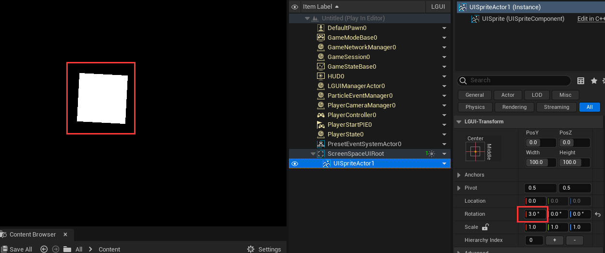
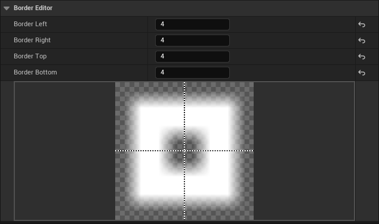
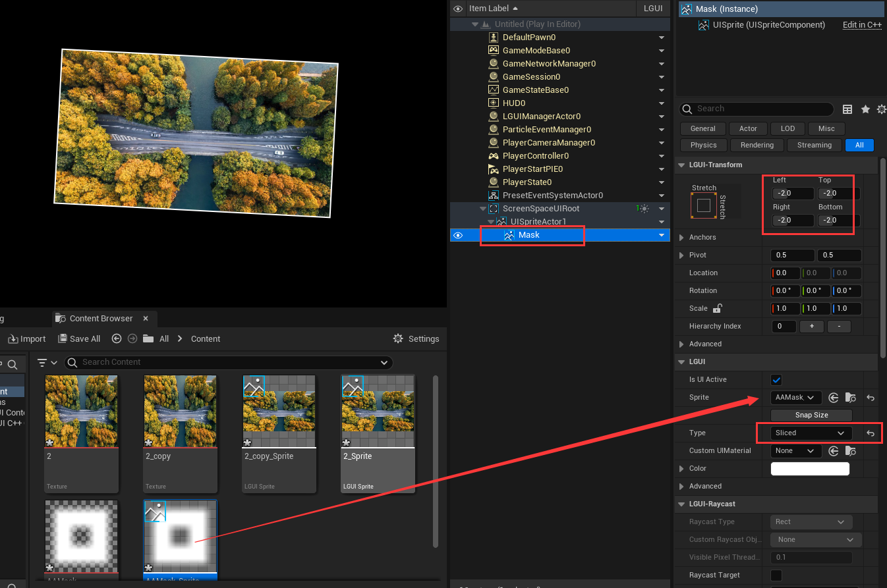

# 抗锯齿
锯齿总是在几何体的边缘出现，所以抗锯齿就是把几何体的边缘变成透明，这样边缘的锯齿就不会显示了。
怎么做呢？最简单的方式就是在几何体上用个贴图，把贴图上在几何体边缘的像素的alpha值改为0。我们来试试看。

## 让旋转的UISprite和UITexture看起来更平滑
在ScreenSpaceUI（屏幕空间UI）中，创建个默认的UISprite，修改X轴旋转为3°，可以看到边缘已经出现了难看的锯齿：
  

准备个图片，图片不要有透明，或者用这张图：

图片导入到Content文件夹，创建个sprite：

把刚才创建的sprite拖拽到UISpriteActor上，点击运行可以看到边缘还是有锯齿：

我们来把贴图的边缘像素变成透明。用PhotoShop打开原始的图片（或者用其他图片编辑工具打开），修改画布的长宽比原来大2个像素，我把这张图片的尺寸从419x234改为了421x236，PhotoShop会自动把边缘像素改为透明。然后把图片保存为副本：

把修改的图片导入到Content文件夹，创建sprite，拖拽到UISpriteActor，点击运行，可以看到边缘锯齿消失了：

UITexture也是同样的接近办法。

但是如果我们不能修改图片呢？如何让我们的UISprite和UITexture显示得没有锯齿呢？

有个曲线救国的方法，我们可以用个遮罩贴图盖在UISprite和UITexture的边缘。
遮罩贴图可以是这样：
  
把遮罩贴图导入到Content目录并创建sprite，然后把sprite的border属性改为这样：
  

最终结果看起来这样：

