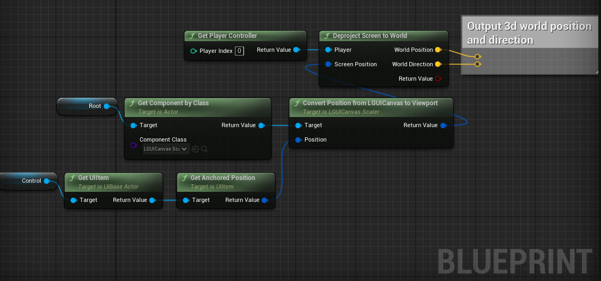

# LGUI的屏幕空间位置投射到世界空间
假如我们想让一个世界空间的Actor随着一个UI元素的位置来变化，那么这个知识点就很有用了。

主要有两个节点：一个是**Convert Position from LGUICanvas to Viewport**，这是LGUICanvasScaler类提供的节点：
  
|属性：|方法：|
|:-|:-
|Target|LGUICanvasScaler组件物体。
|Position|LGUI屏幕空间的位置。注意左下角是0点，所以提供这个位置的UI元素需要把锚点设置为左下角，并且父物体需要是全屏幕尺寸。
|Return Value|需要使用的屏幕空间位置，左上角是0位置。

还有一个节点是**Deproject Screen to World**，这是引擎自带的节点：
  

我们可以把这些节点连成下图的样子：
  
我们可以用计算结果的*World Position*和*World Direction*参数来做LineTrace。*Control*是个UIBaseActor，代表的是屏幕上的UI元素；*Root*是ScreenSpaceUIRoot的Actor，并且必须要有LGUICanvasScaler组件。