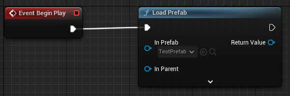
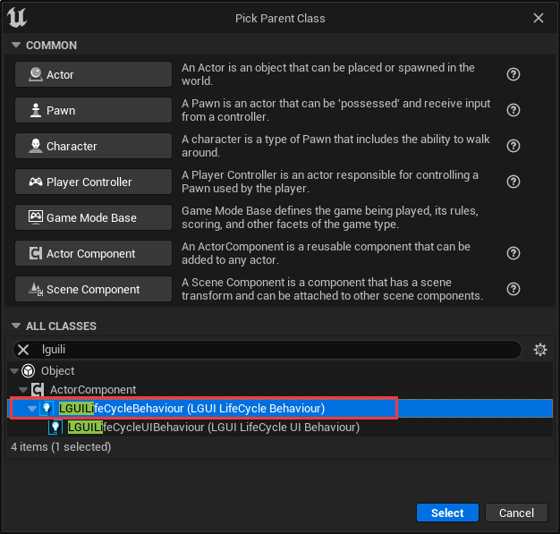
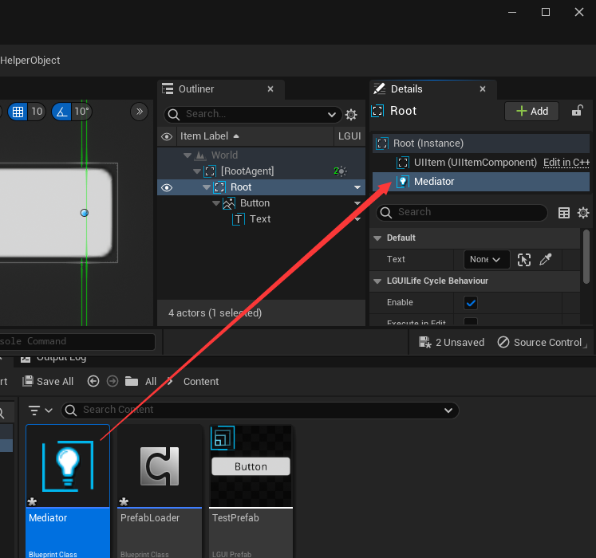
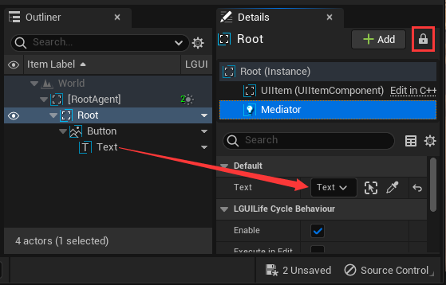
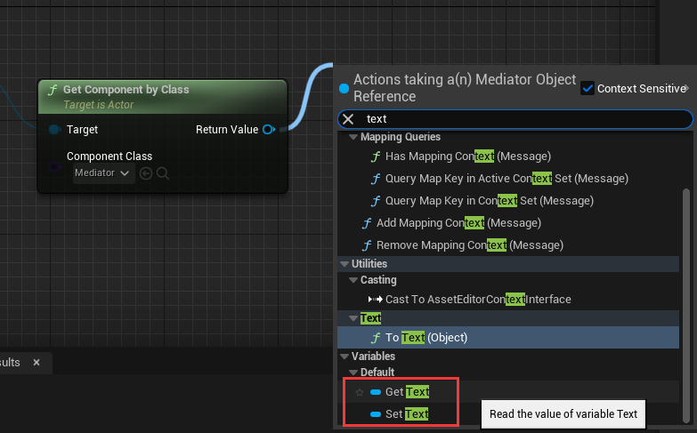
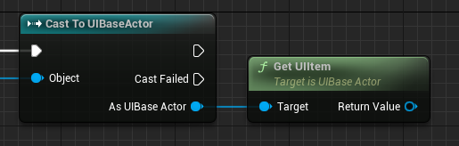
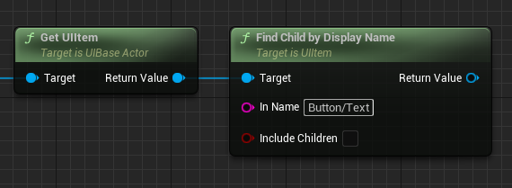
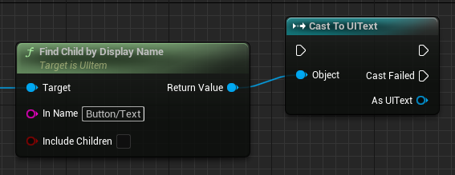

# 如何获取预制体中的Actor或Component

创建个UI预制体并命名为"TestPrefab"，预制体中的内容应该像这样：
  
"Root"是个UIContainerActor，"Button"是"Root"的子物体，"Text"是"Button"的子物体。
如果我们想修改"Text"物体，如何获取这个物体的引用呢？
有两种方式可以做到，我们来试试。

首先我们需要加载这个预制体，我们可以创建个ActorComponent并命名为"PrefabLoader"，然后把"LoadPrefab"节点连接到"BeginPlay"，并且把"TestPrefab"预制体拖拽到"InPrefab"输入端上，这样预制体就会在运行的时候加载：

## 使用ActorComponent作为媒介
创建另一个ActorComponent，这次我们用个LGUILifeCycleBehaviour作为父类，命名为"Mediator"：
（推荐在预制体中用LGUILifeCycleBehaviour）

添加个"UITextActor"类型的变量，名字是"Text"，勾上"Instance Editable"：

打开"TestPrefab"并把"Mediator"拖拽到"Root"的组件列表：

在"Root"组件列表里选择"Mediator"组件，勾选"Details"面板的锁定按钮，然后把"Text"Actor拖拽到变量"Text"：

然后应用预制体修改，那么"Text"变量就可以指代actor引用了。

打开"PrefabLoader"组件，从"Load Prefab"节点的"Return Value"拖拽出线并选择"Get Component by Class"节点，把"Component Class"选择为"Mediator"：

从"Get Component by Class"节点的"Return Value"拖拽出线，找到"Text"属性变量，这就是"Text"Actor的引用，我们就可以用这个Actor来做下一步工作了：

## 通过名字路径查找

在"PrefabLoader"中，从头"Load Prefab"节点的"Return Value"拖拽出线并选择"Cast To UIBaseActor"：

从"As UIBase Actor"拖拽出线并选择"Get UIItem"节点：

从"Get UIItem"节点的"Return Value"拖拽出线并选择"Find Child by Display Name"节点，在"In Name"参数中输入"Button/Text"：

从"Find Child by Display Name"节点的"Return Value"拖拽出线并选择"Cast To UIText"：

这个"As UIText"就是我们要找的物体。
**注意** "FindChildByDisplayName"节点只能用于LGUI的UI元素，因为只有LGUI的UI元素有固定的"DisplayName"。详细内容可看[这篇](../FindChildByDisplayName)。
