# 自定义按钮
在这篇文档里我们将学习用UISprite来制作个自定义的按钮。
在开始之前，请先完成[HelloWorld](./../HelloWorld/index.md)学习如何创建并使用默认按钮。
默认按钮有点丑，我们可以用个好看的图。

## 准备个贴图
用photoshop或者其他软件来创建个图片，也可以直接用这张图片:  

拖拽图片到Content文件夹，命名为 "Button":  
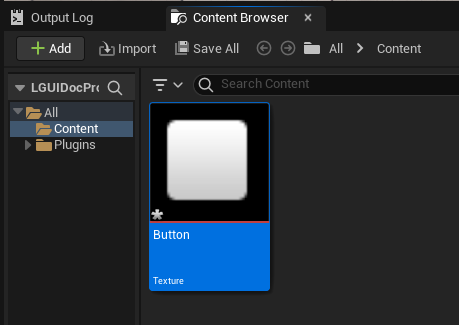

## 创建 UISpriteData
选择 "Button" 资产, 右键点击并在弹出菜单上选择 "LGUISprite"->"Create Sprite":  

然后一个新的资产就创建了，名为 "Button_Sprite":  

双击 "Button_Sprite" 打开编辑器:  

修改 "Border Left" 和 "Border Top" 值为 14, "Border Right" 和 "Border Bottom" 值为 15:  
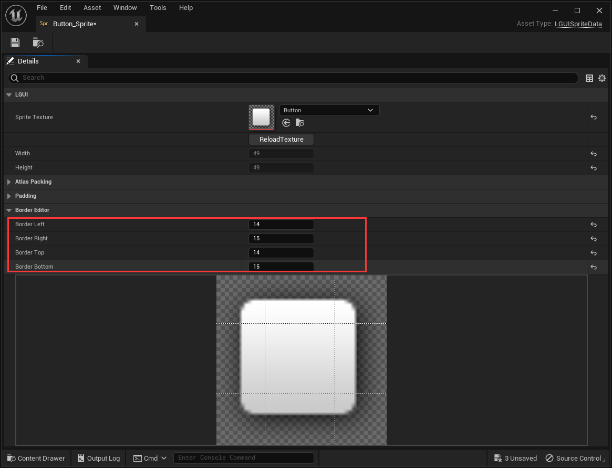
完成后关闭编辑器。

## 准备个屏幕空间的UI
按照 [HelloWorld](./../HelloWorld/index.md) 教程来创建个屏幕空间UI “ScreenSpaceUIRoot”:  

## 创建 UISprite and UIText.
选择 "ScreenSpaceUIRoot" actor, 右键点击向下箭头按钮并选择 "Create UI Element"->"UISprite", 这样来创建个 UISprite actor:  
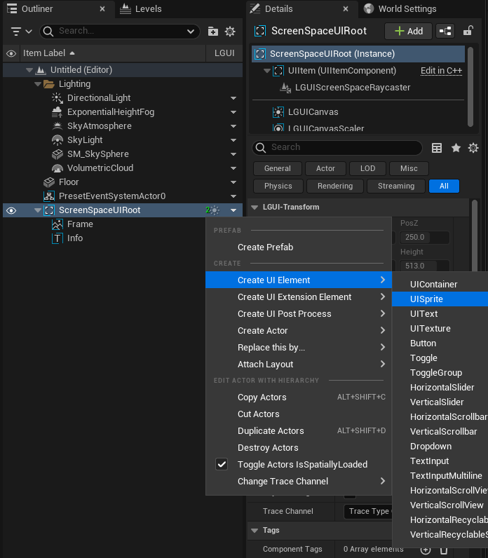

把刚创建的 UISprite actor 命名为 "MyButton", 然后修改 "PosZ" 为 -120:  
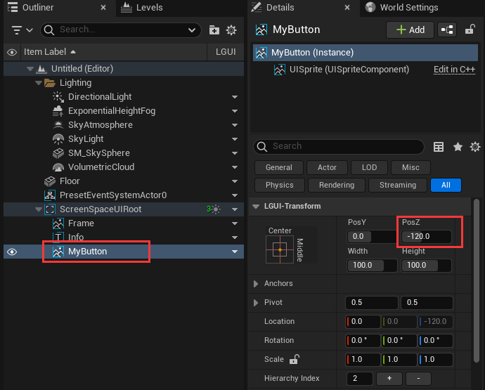

选择 "MyButton" actor, 拖拽 "Button_Sprite" 资产到 "Sprite" 属性, 可以看到视口中的按钮发生变化:  
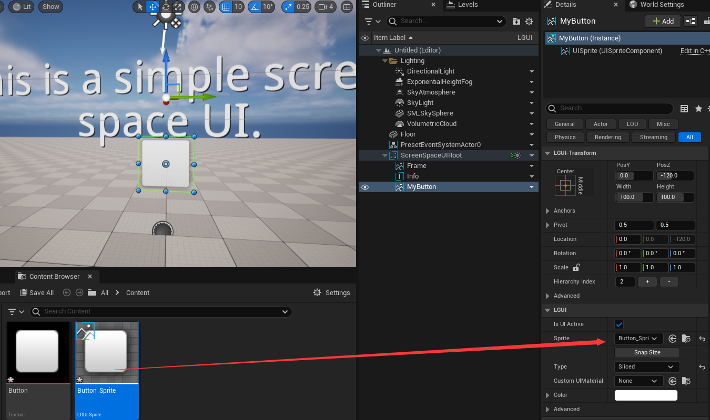

选择 "MyButton" actor, 右键点击向下箭头按钮并选择 "Create UI Element"->"UIText", 这样来创建个 UIText actor:  

把刚才创建的 UIText actor 命名为 "MyButtonText", 然后修改 "Color" 属性为黑色, "Text" 属性为 "I'm a button", "Size" 属性为 24, "Font Style" 属性为 "Bold":  

## 调整按钮尺寸
选择 "MyButton" actor, 修改 "Width" 属性为 240, "Height" 属性为 60:  
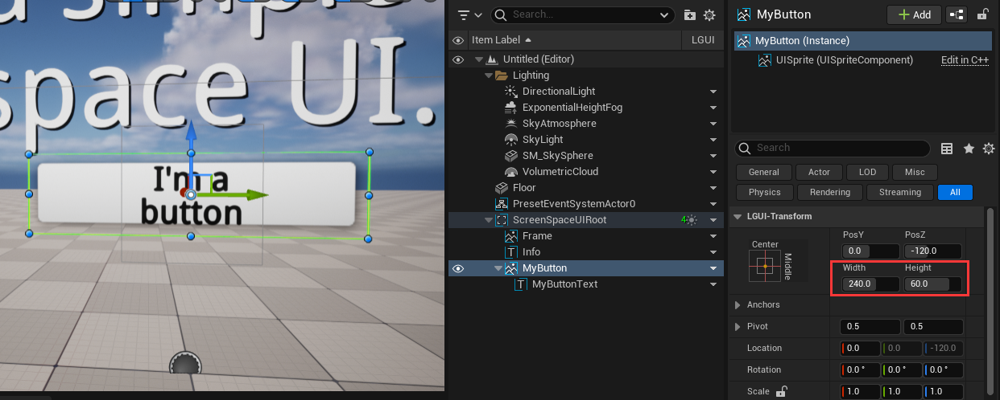

选择 "MyButtonText" actor, 点击锚点按钮弹出锚点预设菜单:  
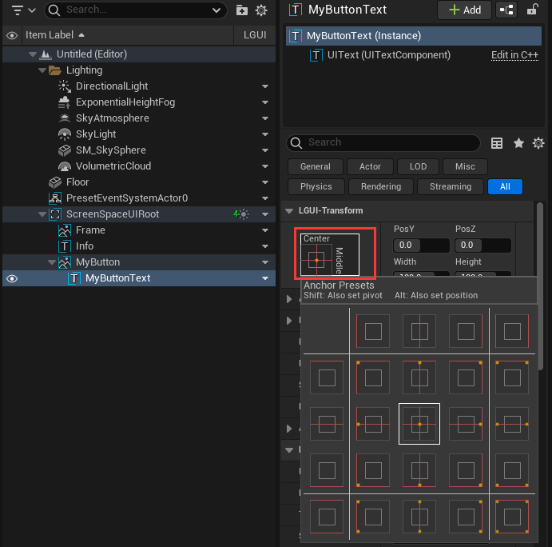

按住键盘的 "Alt" 按钮并右键点击锚点预设菜单右下角的锚点, 可以看到场景里的锚点变化:  
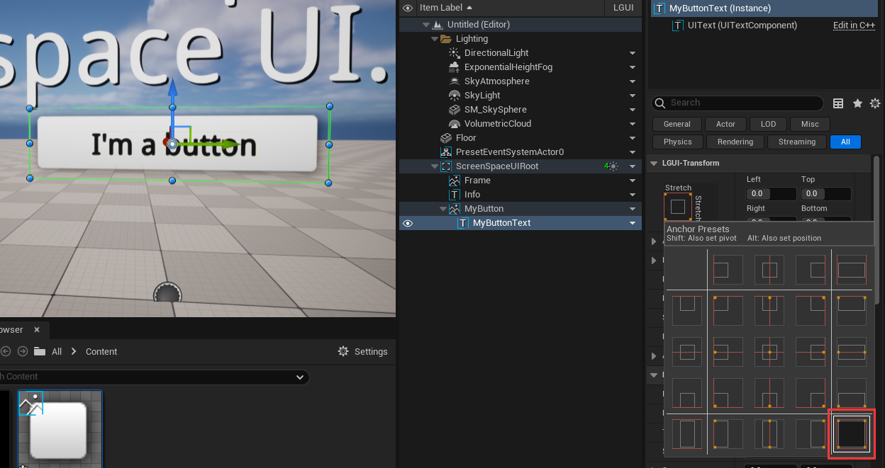

## 添加 UIButton 组件.
选择 "MyButton" actor, 点击 "+Add Component" 天津个 "UIButton" 组件:  
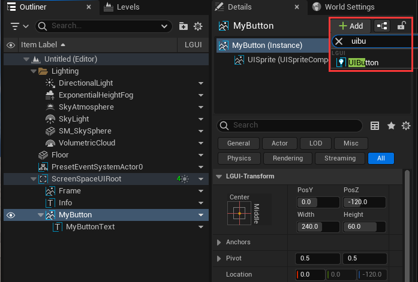

选择刚刚添加的 "UIButton" 组件, 修改 "Transition" 属性为 "ColorTint":  
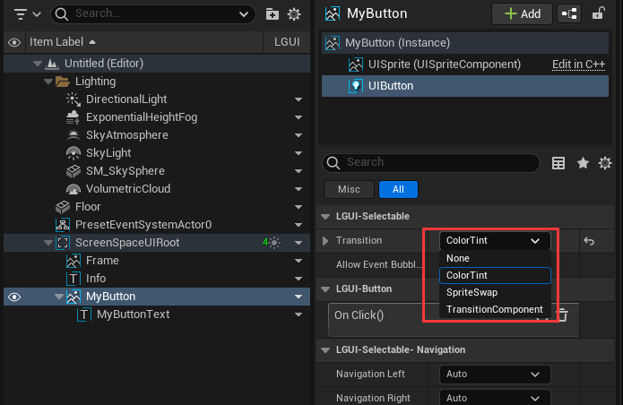

点击 "Transition" 左边的箭头展开:  
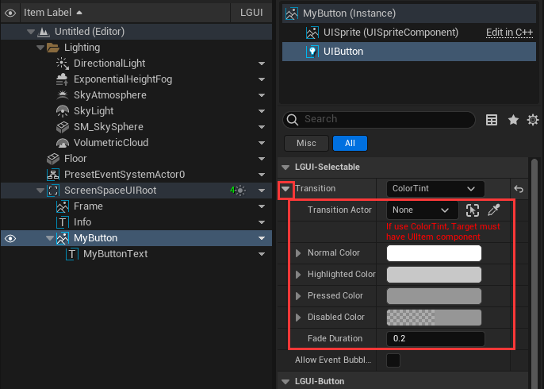

拖拽 "MyButton" actor 到 "Transition Actor":  

## 激活 RaycastTarget.
选择 "MyButton" actor, 选择 "UISprite" 组件, 在 "LGUI-Raycast" 分类里勾选 "Raycast Target" 属性:  

## 天津按钮事件:
选择 "MyButton" actor, 选择 "UIButton" 组件, 找到 "On Click()" 属性并点击 "+" 按钮:  
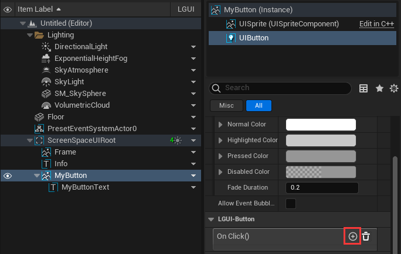

像这样设置事件:  
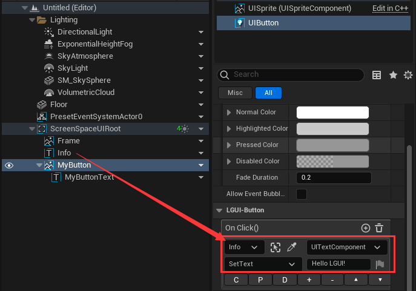

现在点击 Play 然后把鼠标移动到按钮上方, 然后点击按钮，可以看到场景里发生变化:  

