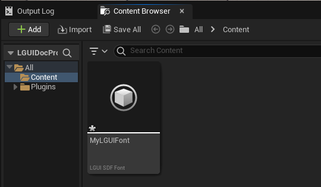
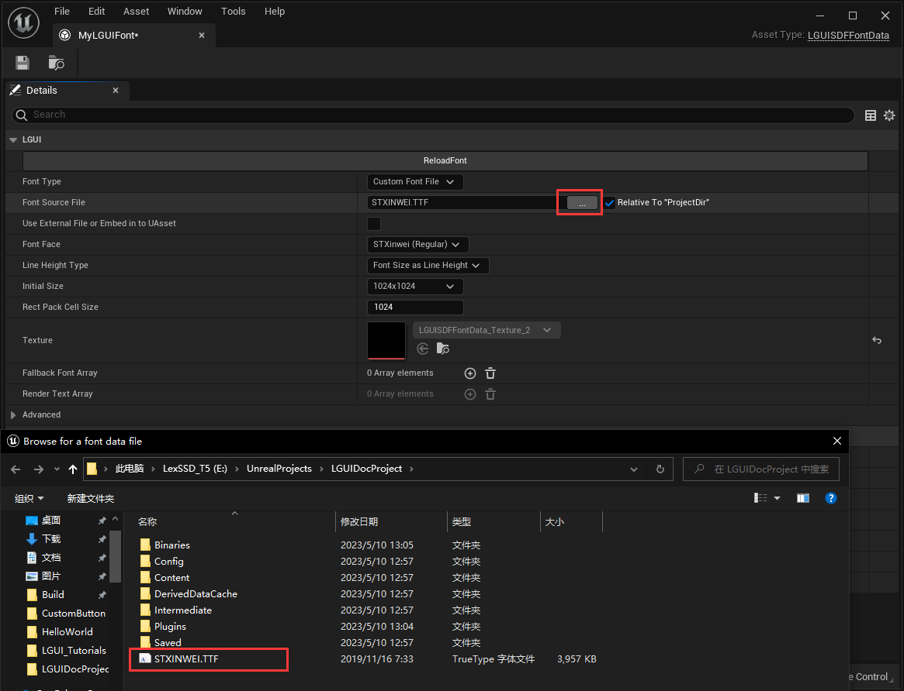
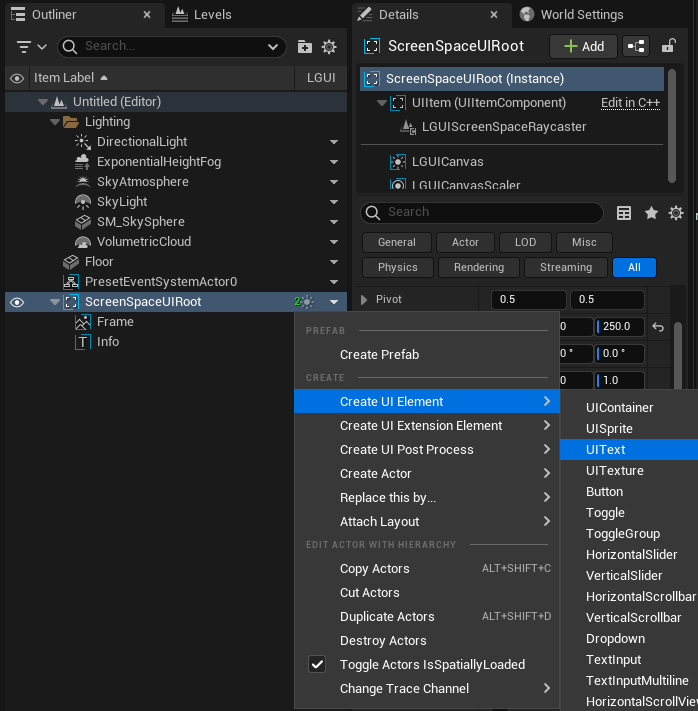
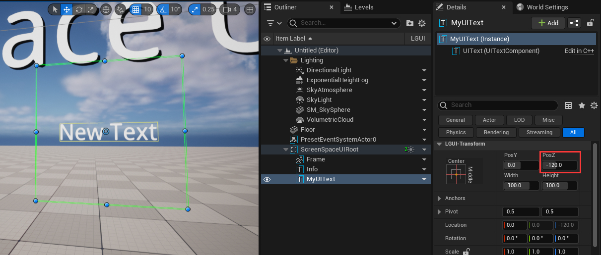

# 使用自定义字体
在这篇文档里, 我们将使用字体文件(ttf, ttc, otf)来创建自定义字体并用于 UIText.
LGUI提供里两种类型的字体:
 - LGUI Font - 位图字体, 针对不同属性的文字生成不同的像素并写入贴图.
 - LGUI SDF Font - 这是默认的字体类型, 使用有向距离场 (signed distance field) 技术渲染, 可以用最小的贴图尺寸来渲染超大的平滑的文字.

## 准备个字体文件
LGUI 使用 [freetype](./https://www.freetype.org/) 来渲染字体, 所以我们需要用 freetype 支持的字体文件格式 (ttf, ttc, otf). 下载个字体文件或者用系统目录中的字体文件. 我用 "华文新魏" 字体:  

复制字体文件到你的虚幻项目目录 (就是.uproject文件同一个目录).

## 创建 LGUI 资产asset.
鼠标右键点击 Content 目录的空白区域, 在弹出菜单中选择 "LGUI"->"LGUI SDF Font", 这样创建个 LGUI SDF Font 资产:  

重命名刚才创建的资产为 "MyLGUIFont":

双击打开字体编辑器窗口, 点击 “FontSourceFile” 后面的 "..." 按钮, 然后选择刚才准备好的字体文件:  

## 创建 UIText
按照文档 [HelloWorld](./../HelloWorld/index.md) 来创建个 "Screen Space UI" .

选择 "ScreenSpaceUIRoot", 右键点击向下箭头按钮, 选择 "Create UI Element"->"UIText":  

重命名刚才创建的 UIText 为 "MyUIText":  

## 修改 UIText 属性.
选择 "MyUIText", 修改 "PosZ" 属性为 -120, 这样把文字挪开偏离视口中心的位置:  

选择 "MyUIText", 修改 "Size" 属性为 40, "Color" 属性为黑色, 在 "Text" 属性中输入 "中国智造":  

## 使用自定义的字体
**重要部分**, 选中 "MyUIText" 并把 "MyLGUIFont" 资产拖拽到 "Font" 属性上, 可以看到视口中渲染的文字发生变化:  

