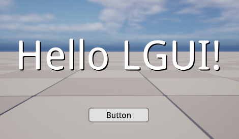
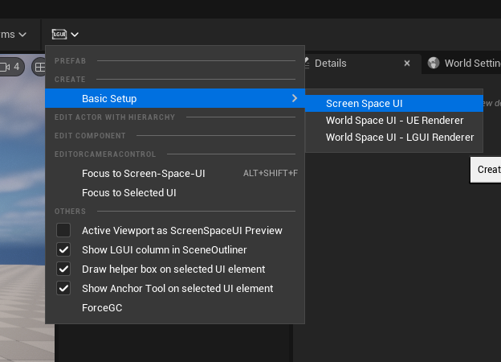
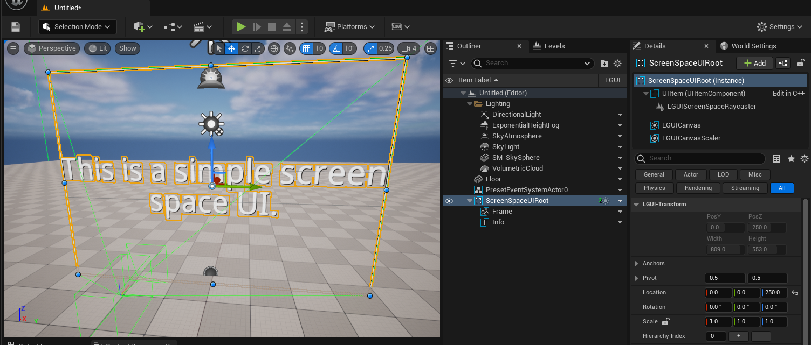
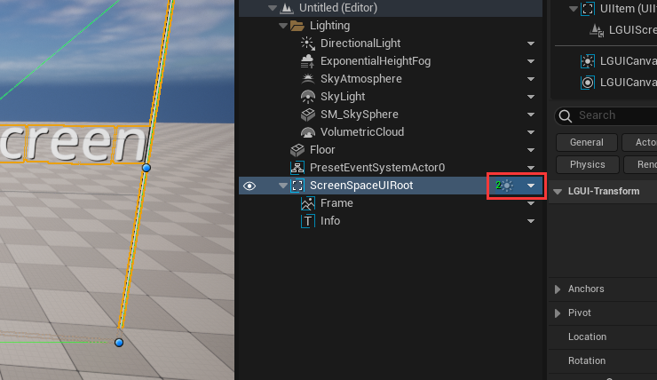
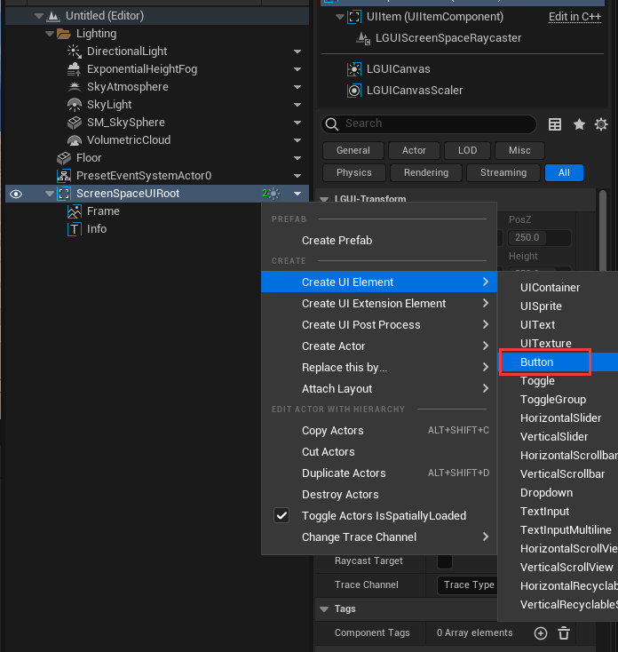
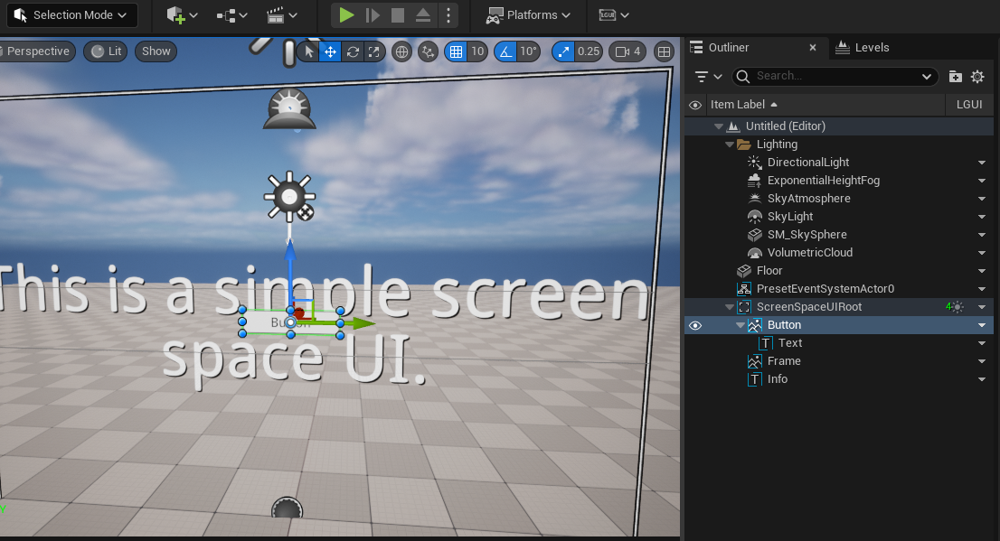
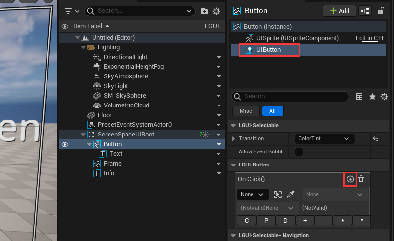
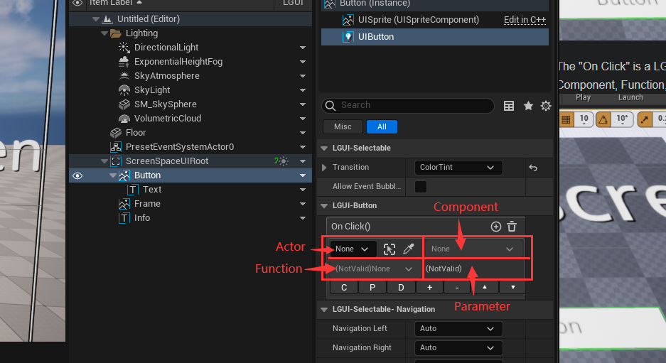
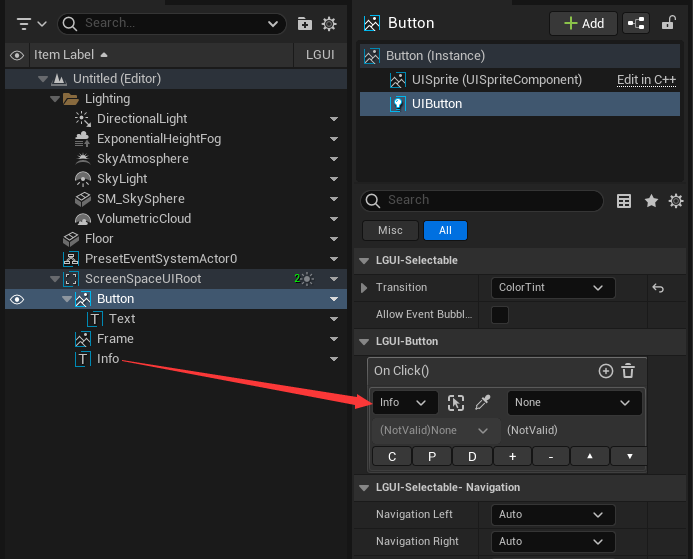
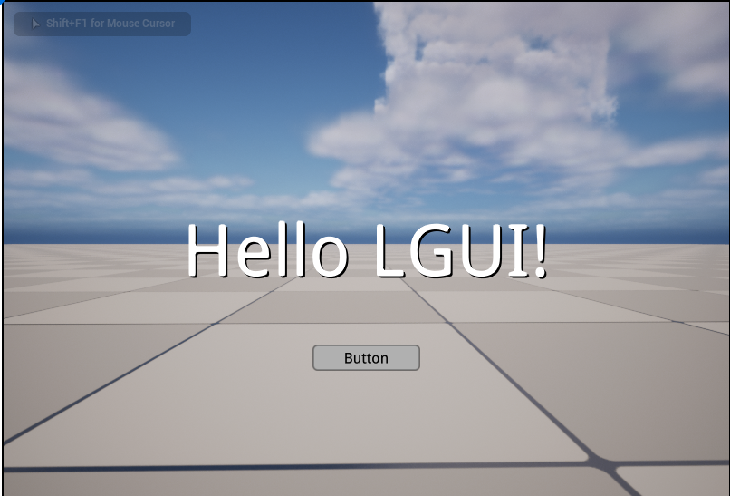

# Hello LGUI
在这篇文档里，我们将一步步创建一个简单的UI来显示"Hello LGUI"。  

## 创建屏幕空间UI
创建个默认场景，点击"LGUI Editor Tools"->"Basic Setup"->"Screen Space UI"：  

然后一个预设的屏幕空间UI就会出现在场景里：  

## 创建个按钮
选择"ScreenSpaceUIRoot"，右键点击“LGUI"列上的向下箭头按钮：  

点击"Create UI Element"->"UIButton"：  
 

然后一个按钮会出现在场景里：  

## 调整按钮
在Outlinter中选择"Button"，修改"PosZ"为 -120，这样会把按钮往下移动偏离中心位置：  

## 添加点击事件
在 "Button" Actor上选择 "UIButton"组建，找到"OnClick()"属性并点击"+"按钮：  

这个 "On Click" 类型是 LGUIEventDelegate (请看 [LGUIEventDelegate](./../LGUIEventDelegate/index.md)), 它有四个参数(Actor, Component, Function, Parameter):  

在 "Actor" 参数上, 选择 "Info" 物体：  

点击 "Component" 并选择 "UITextComponent":  

点击 "Function" 并选择 "SetText(Text)":  

现在 "Parameter" 变成个输入框，输入 "Hello LGUI":  

点击 Play, 然后把鼠标移动到按钮上，可以看到按钮有高亮显示:  
  
点击按钮，文字就变了：  

