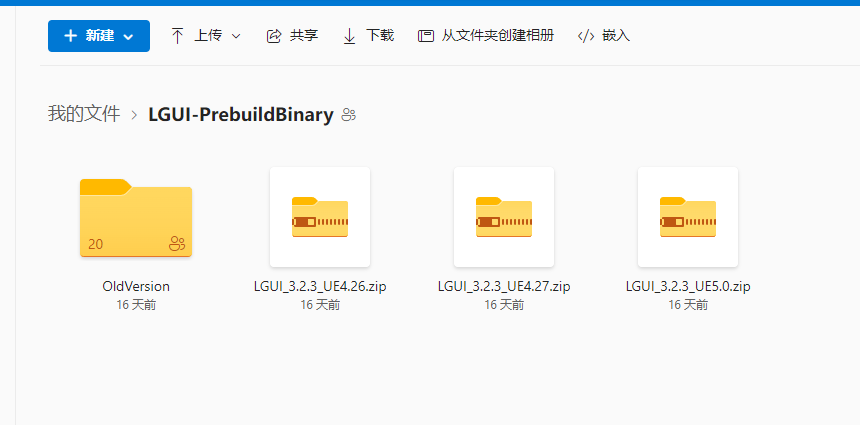
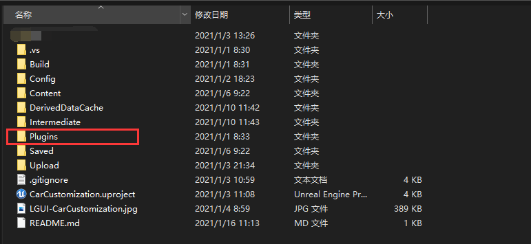

# 安装

## 从虚幻引擎商店安装 (包含所有源代码)

访问页面 https://www.unrealengine.com/marketplace/en-US/product/lgui-lex-gui-3d-ui-system-for-ue4 :
    

安装完毕之后，创建个空的项目，打开Plugins菜单然后勾选LGUI插件的"Enabled" (可能需要重启引擎).

## 从微软OneDrive获取试用版

这是个预编译的版本，只能用于编辑器中，不包含源代码。  

访问页面 https://1drv.ms/u/s!AvirIdGUD62un01B1O4v3BGSMWxN?e=aZbgmO 
选择你的引擎版本对应的LGUI版本然后下载：
    

创建个空白项目（试用版只能用于**蓝图项目**），在你的项目目录，创建"Plugins"文件夹，并把刚才下载的zip压缩包解压到"Plugins"文件夹内。完成后像这样：
    
    

如果LGUI已成功安装，那么菜单栏上就会出现"LGUI Editor Tools"按钮：

