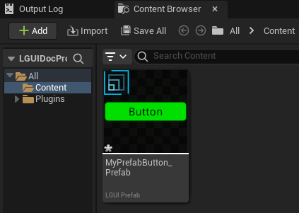
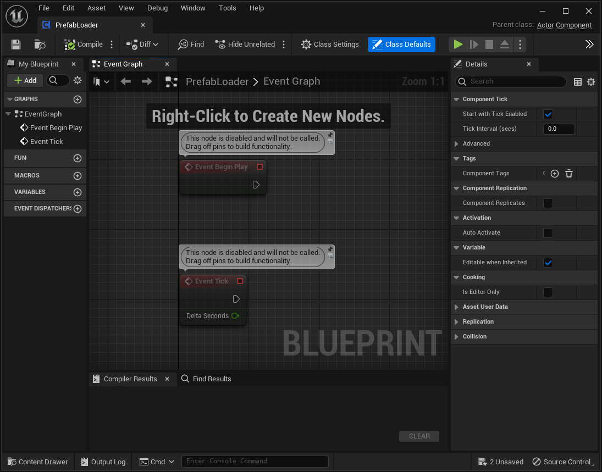
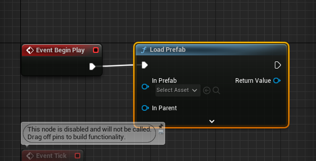
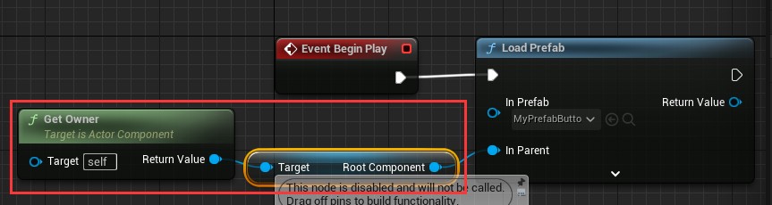
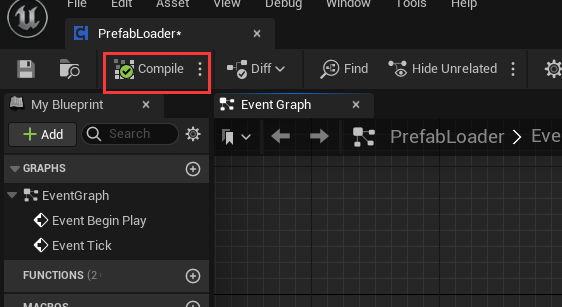
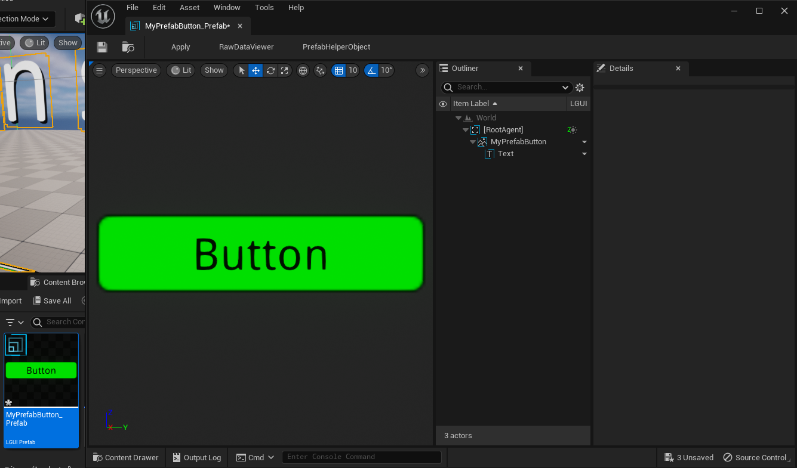
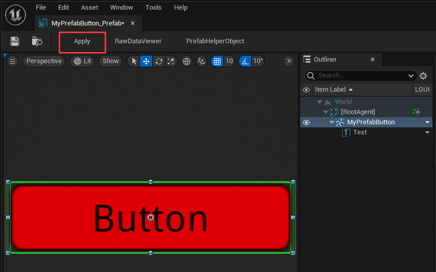
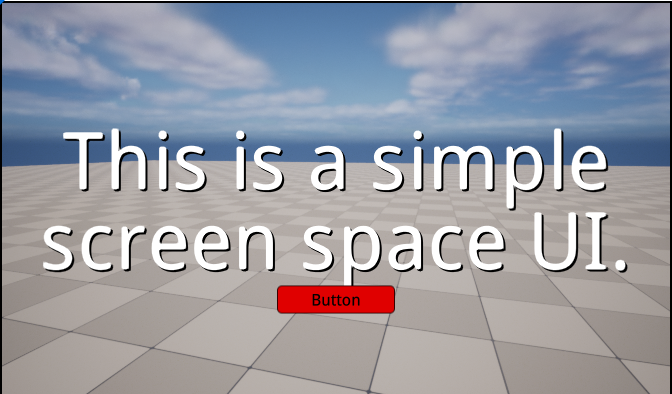

# 预制体工作流
在这篇文档里，我们将学习如何使用LGUIPrefab来重复利用我们的UI.
从根本上来说，LGUIPreafb 只是个**有嵌套层级的actor序列化**工具.  

## 准备个屏幕空间UI (ScreenSpaceUI).
跟着文档 [HelloWorld](./../HelloWorld/index.md) 来创建个 ScreenSpaceUI.

## 创建个按钮作为预制体的原始物体
选择 "ScreenSpaceUIRoot" actor, 右键点击向下箭头按钮, 并选择 "Create UI Element"->"Button":  

把刚才创建的按钮重命名为 "MyPrefabButton", 设置 "PosZ" 属性值为 -100, "Color" 属性值为 绿色:  

## 创建预制体
选择 "MyPrefabButton" actor, 右键点击向下箭头按钮, 在弹出菜单上选择 "Create Prefab":  

然后会弹出保存文件窗口:  

点击 "保存" 按钮, 然后一个预制体资产就会出现在 "Content" 文件夹里:  

可以看到 "Outliner" 的 "MyPrefabButton" actor 右边的向下箭头按钮变成了预制体图标, 并且有个 LGUIPrefabManagerActor 出现在 "--LGUIPrefabActor--" 文件夹里:  

选择 "MyPrefabButton" actor, 右键点击预制体按钮并选择 "Destroy Actors", 这样就把预制体 "MyPrefabButton" 及其下的子物体都删除了:  

## 在编辑器里复用预制体
选择 "ScreenSpaceUIRoot" actor, 拖拽 "MyPrefabButton_Prefab" 资产到视口的任意位置:  

可以看到有个 "MyPrefabButton" actor 创建在场景里:  

选择 "Info" actor, 拖拽 "MyPrefabButton_Prefab" 资产到视口的任意位置, 这样另一个 "MyPrefabButton" 就会被创建 (你可能需要把创建出来的actor移动一些才能看见，因为两个预制体实例可能会重合在一起):  

可以看到在 "Outliner" 中不同的预制体有不同的图标颜色:  

按住 "Ctrl" 键并分别点击两个 "MyPrefabButton" actor 来选择它们, 然后点击菜单 "LGUI Editor Tools"->"Destroy Actors" 删除这些预制体实例:  

## 在运行时服用预制体
右键点击 "Content" 目录的空白区域然后选择 "Blueprints"->"BlueprintClass":  

选择 "Actor Component":  

把刚创建的 ActorComponent 命名为 "PrefabLoader":  

双击 "PrefabLoader" 打开蓝图编辑器:  

从 "Event Begin Play" 拖拽连线然后选择 "Load Prefab" 节点:  

从 "MyPrefabButton_Prefab" 资产拖拽到 "Load Prefab" 节点的 "In Prefab":  

连接 "Get Owner" 和 "Root Component" 节点到 "Load Prefab" 节点的 "In Parent":  

点击 "Compile" 然后关闭蓝图编辑器:  

选择 "ScreenSpaceUIRoot" actor, 然后拖拽 "PrefabLoader" 组件到actor的组件栏里:  

点击 Play, 可以看到预制体被创建了:  

注意到按钮的颜色变成了白色, 因为这个颜色被 UIButton 组件覆盖重写了, 我们来修复这个错误.

## 修改预制体
点击 Stop 按钮退出运行模式. 双击 "MyPrefabButton_Prefab" 资产来打开 PrefabEditor(预制体编辑器):    

选择 "MyPrefabButton" actor, 选择 "UIButton" 组件. UIButton 组件的 "Transition" 属性上使用 "ColorTint" 方式, 这种方式将会覆盖目标物体的颜色为 "Normal Color":  

修改 "Normal Color" 值为红色, 可以看到场景里的按钮的颜色也变成了红色:  

在预制体编辑的左上方点击 "Apply" 按钮来应用修改, 这样我们的修改才会保存到预制体资产里:  

现在关闭预制体编辑器, 然后点击 Play, 可以看到加载出来的按钮变成了红色:  

